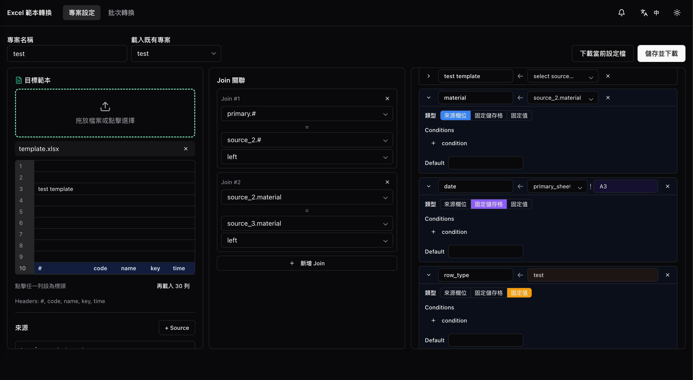
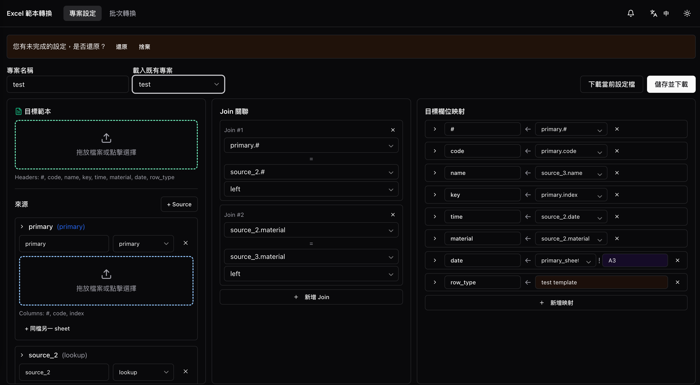
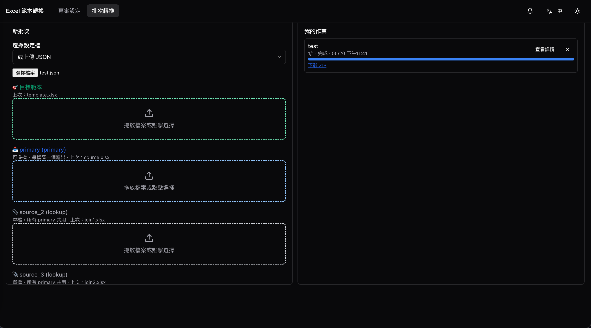
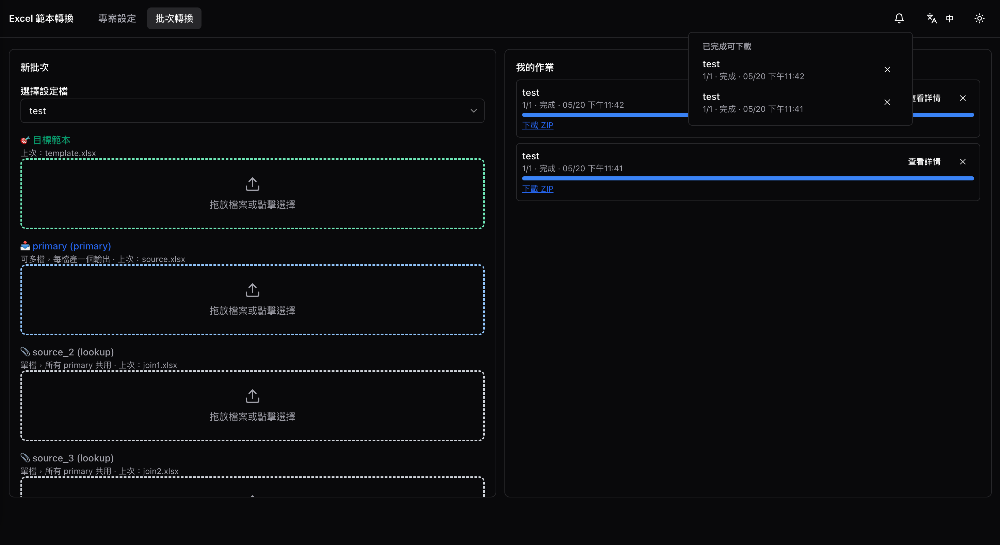
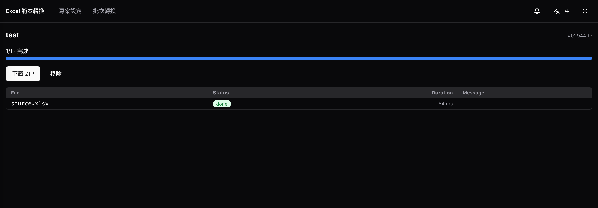
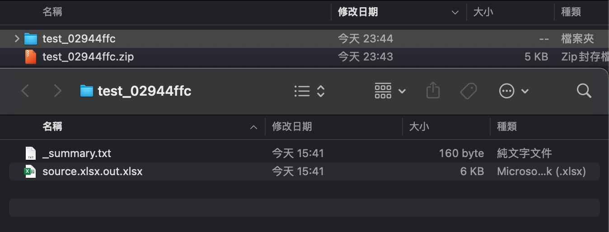

# excelTemplateParser

**English** · [繁體中文](README.zh-TW.md)

Batch-convert many Excel files of the same format into another format. Author the mapping once, reuse forever. Single-machine Docker deployment, no login required. UI supports zh-TW / English and light / dark mode, both persisted locally.

---

## Contents

- [Features](#features)
- [Quick start](#quick-start)
- [How it works](#how-it-works)
- [Walkthrough](#walkthrough)
- [Examples](#examples)
- [Architecture](#architecture)
- [Design docs](#design-docs)
- [Out of scope](#out-of-scope)
- [Contributing](#contributing)
- [Changelog](#changelog)
- [License](#license)

---

## Features

- **Subtask-level resume** — each primary file = one task; if a worker crashes mid-batch, completed `out/*.xlsx` files are skipped on restart (idempotent recovery via `recovery_service.scan_and_resume()`).
- **Live progress that survives reloads** — SSE per-subtask updates; the top-bar badge + localStorage track running jobs across page reloads, so you can close the tab and come back.
- **Reliable downloads** — HTTP Range / partial content on the result ZIP; one-hour grace window for re-download after the first stream.
- **Disaster recovery** — Redis is a cache; `/data/` on disk is the source of truth. Wiping the Redis volume rehydrates jobs from `state.json` on next startup.
- **Preflight validation** — bad xlsx / missing sheet / missing columns rejected at the API boundary (~5 s for 50 files) instead of crashing mid-batch in the worker.
- **Boundary-only error handling** — every error response carries a `request_id`; `docker compose logs api | grep <id>` finds the full traceback. User-facing messages and engineer-facing tracebacks never mix.
- **i18n + dark mode** — zh-TW / English, light / dark theme; both persisted in localStorage with no flash on reload.
- **Autosave + draft restore** — ConfigBuilder autosaves to localStorage and offers an explicit Restore / Discard prompt on revisit; the storage is only mutated by explicit user actions, never auto-purged.

---

## Quick start

```bash
bash scripts/up.sh
```

- UI: http://localhost:5173
- API: http://localhost:8000

Full setup, dev workflow, environment variables, and CI: [`docs/setup.md`](docs/setup.md).

---

## How it works

Two tabs, two user modes:

| Tab | Purpose | Frequency |
|---|---|---|
| **Project Settings** | Author column mappings, join rules, conditions once → download `{name}.json` | Rare, deliberate |
| **Batch Convert** | Upload config + target template + source files → server packages a ZIP | Frequent, frictionless |

A configuration has three parts:

- **target_template** — the output workbook (its styling is preserved)
- **sources** — one `primary` (the per-row transactional file, batched) plus N `lookup` files (master data, shared across the whole batch)
- **joins / mappings** — multi-hop joins plus per-target-column mappings with three value modes:
  - **column reference** (`alias.col`) — pulled per row from the joined DataFrame
  - **absolute cell reference** (`alias!A3`) — fixed value read straight from the source xlsx via openpyxl, bypassing the header abstraction
  - **literal** — a constant string
  - All three modes support conditions (`>=, <=, ==, !=, contains, regex, in`) and default values.

Each primary file = one subtask = one output xlsx. Lookups are shared across all subtasks. When every subtask finishes, the outputs are packed into a single ZIP, which also contains a `_summary.txt` manifest listing each subtask's status, duration, and any errors.

---

## Walkthrough

End-to-end flow in six steps:

### 1. Author the config



Three-pane workbench: left = sources tree (target template + each source's xlsx with sheet & header-row picker). Middle = join rules. Right = mappings with inline condition chips and the source / source_cell / literal toggle. Save → download `{name}.json`.

### 2. Restore unsaved draft



On revisit, if a previous-session draft exists, a non-intrusive banner offers Restore / Discard. The banner only goes away on explicit choice; autosave never touches an empty form, so first-time visitors don't see it.

### 3. Batch convert — upload inline config



If the config isn't saved on the server, upload `{name}.json` directly. The form parses the JSON, dynamically expands upload slots by source alias, and shows the last-used sample filename as a hint per slot.

### 4. Pick saved config + live progress



For configs already saved on the server (from Project Settings → Save), the dropdown lists them by name (loaded from Redis / `/data/configs/`). Subtask-level progress streams via SSE; the top-bar badge tracks running jobs across page reloads, and the right-rail pulls recent jobs from localStorage so you can revisit any past job.

### 5. Job detail



Stable URL `/jobs/:id` for sharing. Shows per-subtask status, errors with `request_id` for grep-from-logs, a Cancel button for in-flight jobs, and a Download button that streams the result ZIP (supports HTTP Range / resume).

### 6. Result ZIP



The ZIP contains one xlsx per primary input (`{source_filename}.out.xlsx`, style preserved from the target template) plus `_summary.txt` — a per-job manifest listing each subtask's status, duration, and any errors. The manifest doubles as a quick audit trail when batching dozens of files.

---

## Examples

End-to-end scenarios live under [`examples/`](./examples). Each one ships with `config.json`, source xlsx files, a target template, and the expected output — run the tool on the inputs and you should get the same output.

- [**01_product_pricing**](./examples/01_product_pricing) — master catalog × three suppliers' monthly quotes, each using different column names (`貨號` / `SKU` / `商品編號`). Demonstrates **outer join** to surface products nobody quoted.
- [**02_agri_market_report**](./examples/02_agri_market_report) — Taiwan MOA open-government data: 1000 daily wholesale trade rows joined against market-code and TcType lookups. Demonstrates a **real-world data mashup** with cross-language column names.

---

## Architecture

```
┌──────────────┐    REST + SSE    ┌──────────────┐
│ React SPA    │ ───────────────▶ │ FastAPI      │
│ (Vite + TS)  │                  │ + APScheduler│
│ shadcn/ui    │ ◀─────────────── │ (lifespan:   │
└──────────────┘   /api/* proxy   │  recovery +  │
       │                          │   cleanup)   │
       │ nginx serve              └──────┬───────┘
       │                                 │
       │                       ┌─────────┴────────────┐
       │                       │                      │
       ▼                       ▼                      ▼
   localhost:5173        Redis (AOF)            RQ Worker × N
                              │                       │
                              └──────────┬────────────┘
                                         │
                            ┌────────────▼─────────────┐
                            │ /data/  (DATA_DIR)        │
                            │  redis/, configs/,        │
                            │  jobs/{id}/{state.json,   │
                            │            uploads/, out/,│
                            │            result.zip}    │
                            └───────────────────────────┘
```

**Storage strategy** — Redis is a cache; `/data/` on disk is the source of truth. Every mutation writes both. If the Redis volume is lost, workers rebuild from `state.json` on startup.

**Failure recovery** — Subtask-level resume. When workers crash or restart, `recovery_service.scan_and_resume()` re-enqueues unfinished subtasks; outputs that already exist at `out/{primary}.out.xlsx` are skipped (idempotent).

**Error handling** — Boundary-only. Core functions only `raise`; the worker and FastAPI layers catch at their respective edges, persist to `state.json` and emit structured `structlog` JSON. Every error response carries a `request_id` so `docker compose logs api | grep <id>` finds the full traceback.

Repository layout: see [docs/setup.md](docs/setup.md#repository-layout).

---

## Design docs

Full design narrative and decision log:

- [`docs/plan.md`](docs/plan.md) — final plan (architecture, flows, schema)
- [`docs/case_study.md`](docs/case_study.md) — seven-round design dialogue + a post-launch round of eight user-reported iterations
- [`docs/decisions_log.md`](docs/decisions_log.md) — 37 entries spanning the full arc: 22 design-phase turning points + 9 post-launch iterations + 6 UX-overhaul entries, in three parts
- [`docs/learnings.md`](docs/learnings.md) — ten cross-decision distillations (six design + four iteration)
- [`docs/setup.md`](docs/setup.md) — setup, dev workflow, environment variables, CI

OpenSpec spec layer (mirrored from the parent monorepo; design-phase snapshot, code is authoritative):

- [`docs/spec/proposal.md`](docs/spec/proposal.md)
- [`docs/spec/design.md`](docs/spec/design.md)
- [`docs/spec/tasks.md`](docs/spec/tasks.md)
- [`docs/spec/spec.md`](docs/spec/spec.md)

---

## Out of scope

- User accounts, multi-tenancy, permissions
- Excel formula re-evaluation (formulas are preserved as-is; Excel recomputes on open)
- Cloud deployment, CI/CD
- Template version control (saving with the same name overwrites; UI prompts for confirmation)

---

## Contributing

See [`CONTRIBUTING.md`](CONTRIBUTING.md) for setup, style, error-handling
conventions, and the PR checklist.

## Changelog

[`CHANGELOG.md`](CHANGELOG.md) tracks user-facing changes following
[Keep a Changelog](https://keepachangelog.com/).

## License

[MIT](LICENSE) © 2026 twjohnwu
