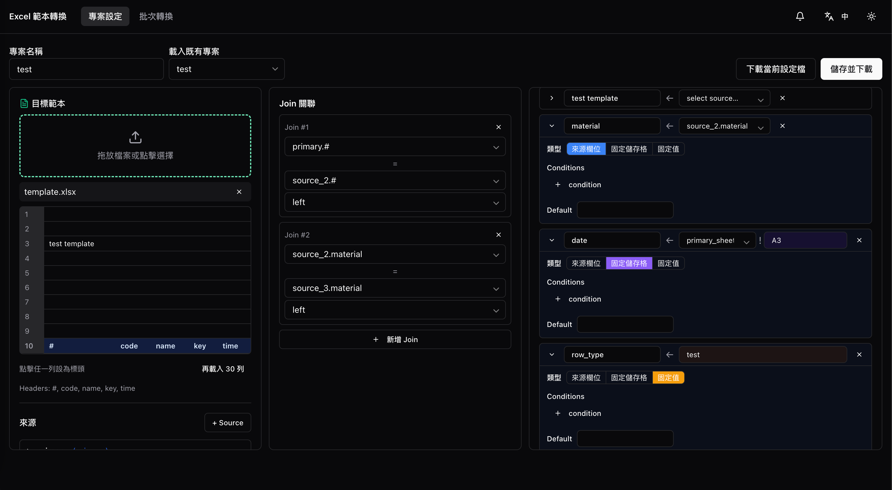
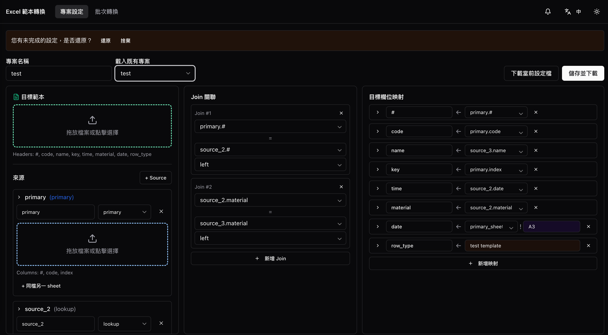
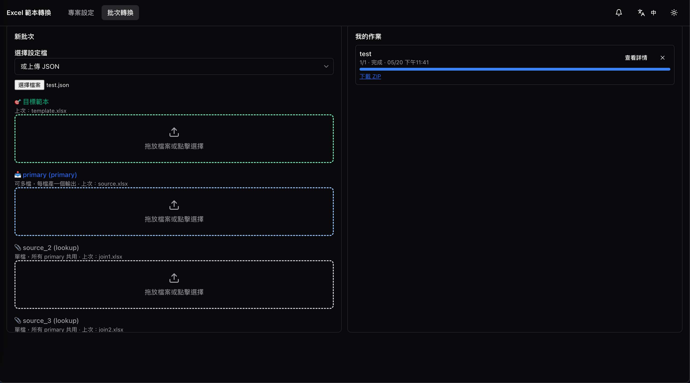
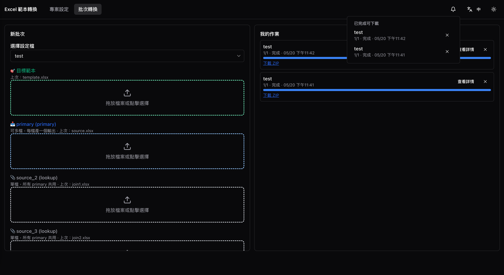
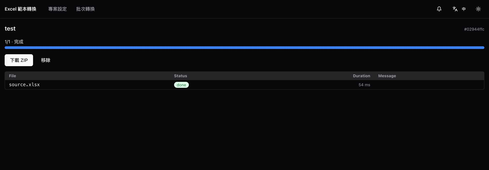
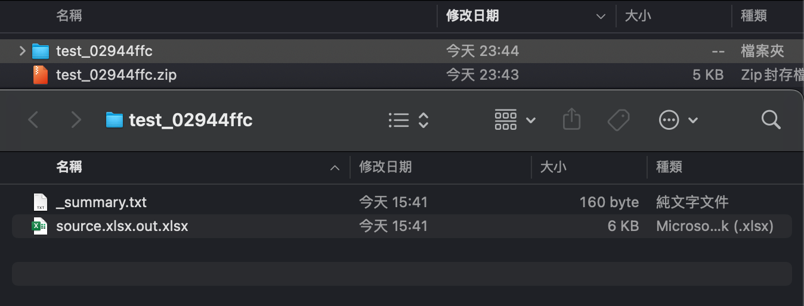

# excelTemplateParser

[English](README.md) · **繁體中文**

把同一格式的多份 Excel 批次轉換為另一種格式。設定一次、重複套用；單機 Docker 部署，不需登入。UI 支援繁中／英文與淺色／黑暗模式，皆會持久化於瀏覽器。

---

## 特色

- **Subtask 級續傳**——每份 primary 檔 = 一個 task；worker 中途崩潰，重啟後既存的 `out/*.xlsx` 直接跳過（透過 `recovery_service.scan_and_resume()` idempotent 還原）。
- **跨重整都保留的進度顯示**——SSE 逐 subtask 即時推送；上方徽章 + localStorage 跨 reload 追蹤進行中任務，關掉分頁回來也找得到。
- **可靠下載**——下載 ZIP 支援 HTTP Range / 部分內容；首次下載後 1 小時內可重新下載。
- **災難復原**——Redis 是快取，`/data/` 才是真相。即使 Redis volume 整個損毀，下次啟動會從 `state.json` 重建任務狀態。
- **Preflight 驗證**——壞 xlsx / 缺 sheet / 缺欄位在 API 邊界就攔截（50 份檔 ~5 秒），不會跑到 worker 才崩潰。
- **邊界式錯誤處理**——每個錯誤回應都附 `request_id`；`docker compose logs api | grep <id>` 直接找到完整 traceback。使用者訊息與工程師 traceback 從不混在一起。
- **i18n + 黑暗模式**——繁中／英文、淺色／黑暗，皆持久化於 localStorage、reload 不閃白。
- **Autosave + 草稿還原**——ConfigBuilder 自動存草稿到 localStorage，再次進入時跳出明示的「還原 / 捨棄」選擇；localStorage 只被使用者明示操作改動，autosave 不自作主張清理。

---

## 一鍵啟動

```bash
bash scripts/up.sh
# → http://localhost:5173
```

`scripts/up.sh` 偵測 `frontend/dist/` 是否過期，需要才本機跑 `npm run build`，然後 `docker compose up -d` 起 4 個服務（redis / api / worker / frontend）。

要重新整理特定服務：

```bash
docker compose restart worker            # 套用 backend 程式變更（volume 掛 ./backend）
cd frontend && npm run build && docker compose up -d --force-recreate frontend
```

---

## 系統概念

兩個分頁、兩種角色：

| 分頁 | 用途 | 頻率 |
|---|---|---|
| **專案設定** | 一次性設定欄位映射、join 規則、條件 → 下載 `{name}.json` | 偶爾、需謹慎 |
| **批次轉換** | 上傳 config + 目標範本 + 多份來源檔 → 後端產 ZIP | 高頻、需順手 |

設定檔含三類組件：

- **target_template**：輸出範本（保留樣式）
- **sources**：1 個 `primary`（被批次處理的交易檔）+ N 個 `lookup`（master data，整個批次共用）
- **joins / mappings**：多階層 join + 欄位映射，映射值有三種模式：
  - **欄位引用**（`alias.col`）——逐列從 join 後的 DataFrame 取值
  - **絕對儲存格引用**（`alias!A3`）——透過 openpyxl 直接讀 source xlsx 的指定位址，跳過 header 抽象
  - **固定值**——常數字串
  - 三種模式都支援條件（`>=, <=, ==, !=, contains, regex, in`）與預設值。

批次轉換：每份 primary 檔 = 一個 subtask = 一份輸出 xlsx；lookup 檔被所有 subtask 共用；全部完成後打包成 ZIP，並附 `_summary.txt`——逐筆列出每個 subtask 的狀態、耗時與錯誤訊息的清單檔。

---

## 操作流程

端到端流程六步驟：

### 1. 建立 config



三欄式工作台：左欄為資料來源樹（目標範本 + 每個 source 的 sheet 與 header 選擇器），中欄為 join 規則，右欄為映射列表（含 inline 條件 chip 與 來源欄位／固定儲存格／固定值 三選一）。儲存 → 下載 `{name}.json`。

### 2. 還原未存檔草稿



再次進入頁面時，若上次的草稿仍在，會跳出非侵入式 banner 詢問「還原 / 捨棄」。banner 只能由明示操作清除；autosave 不會對空白表單寫入，所以全新使用者不會看到。

### 3. 批次轉換 — 上傳 JSON 設定



若 config 不在伺服器上已儲存清單裡，直接上傳 `{name}.json` 檔。表單解析 JSON 後依 source alias 動態展開 upload slot，並在每個 slot 下方顯示上次上傳的檔名提示。

### 4. 選既有設定 + 即時進度



對已儲存到伺服器的 config（從「專案設定 → 儲存」），下拉選單列出名稱（從 Redis / `/data/configs/` 載入）。subtask 級進度透過 SSE 即時推送；上方徽章記錄進行中任務、跨重整不丟；右欄從 localStorage 取近期任務，任何過往任務都能回去看。

### 5. 任務詳情頁



穩定 URL `/jobs/:id` 可分享。顯示每個 subtask 狀態、失敗訊息附 `request_id`（直接 grep server log 找 traceback）、進行中任務的 Cancel 按鈕、以及串流回傳 ZIP 的 Download 按鈕（支援 HTTP Range / resume）。

### 6. 結果 ZIP



ZIP 內每個 primary 輸入對應一份 xlsx（`{原始檔名}.out.xlsx`，樣式從目標範本保留），另含 `_summary.txt`——任務清單檔，逐項列出每個 subtask 的狀態、耗時與錯誤訊息。批次跑幾十個檔案時、這份 summary 就是稽核軌跡。

---

## 架構

```
┌──────────────┐    REST + SSE    ┌──────────────┐
│ React SPA    │ ───────────────▶ │ FastAPI      │
│ (Vite + TS)  │                  │ + APScheduler│
│ shadcn/ui    │ ◀─────────────── │ (lifespan:   │
└──────────────┘   /api/* proxy   │  recovery +  │
       │                          │   cleanup)   │
       │ nginx serve              └──────┬───────┘
       │                                 │
       │                       ┌─────────┴────────────┐
       │                       │                      │
       ▼                       ▼                      ▼
   localhost:5173        Redis (AOF)            RQ Worker × N
                              │                       │
                              └──────────┬────────────┘
                                         │
                            ┌────────────▼─────────────┐
                            │ /data/  (DATA_DIR)        │
                            │  redis/, configs/,        │
                            │  jobs/{id}/{state.json,   │
                            │            uploads/, out/,│
                            │            result.zip}    │
                            └───────────────────────────┘
```

**儲存策略**：Redis 是快取、`/data/` 是真相來源。雙寫；Redis volume 損壞時 worker 啟動會從 `state.json` 重建。

**故障復原**：subtask 級續傳。Worker 崩潰 / 重啟後，`recovery_service.scan_and_resume()` re-enqueue 未完成的 subtask；已寫出 `out/{primary}.out.xlsx` 的不重做（idempotent）。

**錯誤處理**：邊界式。Core 純函式只 raise；worker 與 FastAPI 兩個邊界各自 catch、寫 `state.json` 與結構化 log（`structlog` JSON），錯誤回應帶 `request_id` 方便 `docker compose logs api | grep <id>`。

---

## 專案結構

```
excelTemplateParser/
├── docker-compose.yml
├── README.md            ← 本檔
├── AGENTS.md            ← 給協作 agent 讀的英文版說明
├── scripts/
│   ├── up.sh            ← 一鍵啟動腳本
│   ├── smoke_test.py    ← §8 自動驗證端到端場景
│   ├── resume_test.py   ← §8.9 重啟續傳驗證
│   └── VERIFICATION_REPORT.md
├── backend/
│   ├── pyproject.toml   ← Python 3.12+, FastAPI, RQ, openpyxl, structlog, APScheduler
│   ├── Dockerfile
│   └── app/
│       ├── main.py              ← FastAPI entry + lifespan
│       ├── settings.py          ← env config
│       ├── schemas.py           ← Pydantic ConfigSchema
│       ├── logging_config.py    ← structlog JSON
│       ├── api/{templates,configs,jobs}.py
│       ├── services/{config,job,recovery,cleanup}_service.py + scheduler.py
│       ├── core/{parser,joiner,mapper,writer,zipper,preflight,exceptions}.py
│       ├── middleware/{request_id,upload_limit}.py
│       └── workers/{queue,tasks,run}.py
├── frontend/
│   ├── package.json     ← React 18 + Vite + TS + shadcn/ui + zod + TanStack Query
│   ├── Dockerfile       ← 單階段 nginx:alpine（serve dist/）
│   ├── nginx.conf       ← / static + /api/ proxy to api:8000
│   └── src/
│       ├── pages/{ConfigBuilder,BatchRunner,JobDetail}.tsx
│       ├── features/config-builder/{SourcesTree,JoinsEditor,MappingsList,MappingRow}.tsx
│       ├── features/batch-runner/{NewBatchForm,JobsList}.tsx
│       ├── components/{TopMenuBar,JobsPanel,FileDropzone,SheetHeaderPicker,ConditionChip,ui/*}.tsx
│       ├── hooks/{useJobSnapshot,useConfigs}.ts
│       ├── lib/{api,recentJobs,schemas,utils}.ts
│       ├── i18n/{index.ts, zh-TW.json, en.json}
│       └── theme/ThemeProvider.tsx
└── data/                ← Runtime artefacts (git-ignored)
```

---

## 開發 / 測試

### Backend

```bash
cd backend
python3 -m venv .venv && source .venv/bin/activate    # 需要 Python 3.12+
pip install -e ".[dev]"
pytest                    # 單元測試（core / services / api / workers）
```

關鍵單元測試：

| 檔案 | 涵蓋 |
|---|---|
| `tests/test_parser.py` | xlsx → DataFrame、header_row、壞檔偵測 |
| `tests/test_joiner.py` | 多階層 join、missing key |
| `tests/test_mapper.py` | 7 個運算子、條件、預設值、自動 union mapping targets |
| `tests/test_writer.py` | 樣式保留、未知欄位 append |
| `tests/test_*_service.py` | Redis + 檔案雙寫、ETA、cancel、grace expire、recovery |
| `tests/test_api_*.py` | FastAPI 端點、422 / 409、SSE、multipart 結構 |
| `tests/test_worker_pipeline.py` | end-to-end pipeline（含 idempotent skip、cancel flag、partial failure） |

### Frontend

```bash
cd frontend
npm install
npm run typecheck         # tsc --noEmit
npm run build             # 產 dist/
npm run dev               # Vite dev server，HMR
```

### 端到端

```bash
bash scripts/up.sh                                  # 起服務
backend/.venv/bin/python scripts/smoke_test.py      # 端到端自動場景
backend/.venv/bin/python scripts/resume_test.py     # 重啟續傳場景
```

完整驗證對應 §8 22 個項目（§8.2–8.23），詳見 [`scripts/VERIFICATION_REPORT.md`](scripts/VERIFICATION_REPORT.md)。

---

## 環境變數

掛 `.env` 或 `docker-compose.yml` 都可。

| Var | Default | 用途 |
|---|---|---|
| `REDIS_URL` | `redis://redis:6379/0` | Redis 連線 |
| `DATA_DIR` | `./data` | 檔案系統根（configs / jobs / redis AOF）；可指 NAS / 外接硬碟 |
| `MAX_UPLOAD_MB` | `50` | 單檔上傳上限 |
| `RQ_WORKERS` | `4` | Worker 並行數 |
| `JOB_TIMEOUT_MIN` | `10` | 單 subtask 逾時 |
| `DOWNLOAD_GRACE_MINUTES` | `60` | ZIP 下載 grace period |
| `JOB_RETENTION_HOURS` | `24` | 未下載 job 保留時間 |
| `LOG_LEVEL` | `INFO` | structlog level |

---

## 設計文件

完整設計脈絡與決策記錄：

- [`docs/plan.md`](docs/plan.md) — 最終 plan（架構、流程、schema）
- [`docs/case_study.md`](docs/case_study.md) — 七輪設計對話實況 + 上線後使用者實測的第八輪（八個 sub-round）
- [`docs/decisions_log.md`](docs/decisions_log.md) — 30 條跨越整段歷程：22 條設計轉折 + 8 條上線後迭代，以分隔線區隔
- [`docs/learnings.md`](docs/learnings.md) — 10 條跨 decision 提煉（6 條設計 + 4 條迭代）

OpenSpec 規格層（自上層 monorepo 同步）：

- [`docs/spec/proposal.md`](docs/spec/proposal.md)
- [`docs/spec/design.md`](docs/spec/design.md)
- [`docs/spec/tasks.md`](docs/spec/tasks.md)
- [`docs/spec/spec.md`](docs/spec/spec.md)

---

## Out of Scope

- 使用者帳號 / 多租戶 / 權限
- Excel 公式重算（保留原樣由 Excel 開檔時計算）
- 雲端部署 / CI/CD
- 範本版本控制（覆蓋同名專案即取代，UI 二次確認）

---

## 貢獻

[`CONTRIBUTING.md`](CONTRIBUTING.md) 說明開發環境、程式風格、錯誤處理慣例與 PR checklist。

## Changelog

[`CHANGELOG.md`](CHANGELOG.md) 記錄面向使用者的版本變更（Keep a Changelog 格式）。

## License

[MIT](LICENSE) © 2026 twjohnwu
