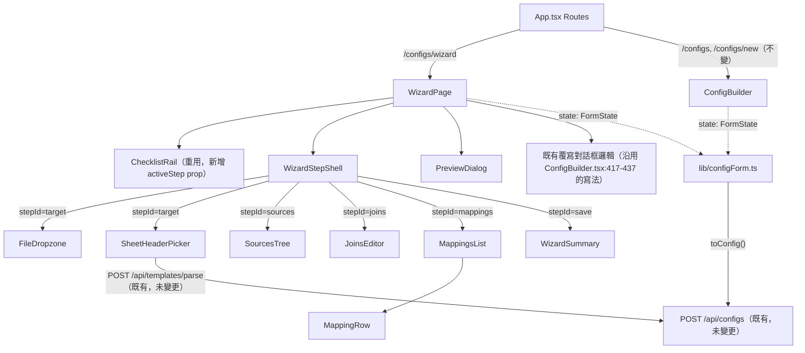

# Design FE — create-project-wizard

本次變更沒有 `design-be.md`、沒有 `api.yml`：零新增/修改後端程式碼、零 API
contract 變更——`WizardPage` 用到的每一個端點都已存在於
`backend/app/api/configs.py`（`POST /api/configs`、`POST
/api/templates/parse`，經 `frontend/src/lib/api.ts` 呼叫，見下方各節）。後續
讀者不需要去找那兩份檔案。

## 檔案清單（新增／修改，逐一附一句話變更說明）

| 檔案 | 動作 | 一句話說明 |
|---|---|---|
| `frontend/src/lib/configForm.ts` | 新增 | REQ-11 純模組：`FormState`、`emptyState`、`toPersistable`、`isPristineState`、`toConfig`、`DRAFT_KEY`、草稿讀寫 helper、`formatSaveError`，行為原樣從 `ConfigBuilder.tsx` 抽出 |
| `frontend/src/lib/configForm.test.ts` | 新增（未來 TDD 任務所有，本次不寫） | S-05～S-07、S-12～S-17、S-20 對應的單元測試 |
| `frontend/src/pages/ConfigBuilder.tsx` | 修改 | 刪除本檔內定義的 `DRAFT_KEY`/`FormState`/`emptyState`/`toPersistable`/`EMPTY_PERSISTABLE_JSON`/`isPristineState`/`ToConfigResult`/`toConfig`/`restoreDraft`，改為 `import` `configForm.ts`；`restoreDraft` 改用 `readDraft()` 的回傳結果 |
| `frontend/src/pages/ConfigBuilder.test.ts` | 修改 | `:3` 的 `import { isPristineState } from "./ConfigBuilder"` 改為 `import { isPristineState } from "@/lib/configForm"` |
| `frontend/src/pages/WizardPage.tsx` | 新增 | 精靈頁面主體，路由 `/configs/wizard`；狀態擁有者、步驟選擇、草稿讀寫接線、存檔/覆寫流程 |
| `frontend/src/pages/WizardPage.test.tsx` | 新增（未來 TDD 任務所有，本次不寫） | S-01、S-02、S-03、S-08、S-09、S-10、S-11、S-19 對應的整合測試 |
| `frontend/src/features/config-wizard/WizardStepShell.tsx` | 新增 | 每步驟共用外殼：常駐說明句、範例句、inline 名詞定義、內容插槽 |
| `frontend/src/features/config-wizard/WizardStepShell.test.tsx` | 新增（未來 TDD 任務所有，本次不寫） | S-04 對應的單元測試 |
| `frontend/src/features/config-wizard/WizardSummary.tsx` | 新增 | `save` 步驟唯讀摘要（四段 + 修改連結） |
| `frontend/src/features/config-wizard/wizardCopy.ts` | 新增 | 純資料模組：五步驟的說明句/範例句/inline 名詞定義結構化資料（沿用 `design-ux.md` Layout 節文案，不重寫內容，只是把文案接到 i18n key），不含 React／不含 side effect |
| `frontend/src/features/config-builder/ChecklistRail.tsx` | 修改 | 新增可選 prop `activeStep?: StepId`（目前步驟高亮）與可選 `className?: string`；既有呼叫端 `ConfigBuilder.tsx:533` 不需修改 |
| `frontend/src/components/FileDropzone.tsx` | 修改 | 根元素（`:42-49`）新增 `focus-visible:ring-2 focus-visible:ring-ring` class（S-18） |
| `frontend/src/components/FileDropzone.test.tsx` | 新增（未來 TDD 任務所有，本次不寫） | S-18 對應的 fail-then-pass 測試 |
| `frontend/src/App.tsx` | 修改 | `Routes` 內新增 `<Route path="/configs/wizard" element={<WizardPage />} />`（`:41-42` 之間），並新增對應 `import` |
| `frontend/src/i18n/zh-TW.json` | 修改 | 新增 `wizard.*` 命名空間：五步驟說明句/範例句/inline 定義字串、摘要標籤、草稿還原提示的「精靈／工作台」寫入者字串 |
| `frontend/src/i18n/en.json` | 修改 | 同上，補齊 `wizard.*` 對應鍵（`i18nGuard.test.ts` 會比對兩份檔案的 key 是否一致，已讀 `frontend/src/lib/i18nGuard.test.ts` 存在此守門測試，須同步新增） |

`frontend/src/features/config-builder/SourcesTree.tsx`、`JoinsEditor.tsx`、
`MappingsList.tsx`、`MappingRow.tsx`、`components/SheetHeaderPicker.tsx`、
`features/config-builder/PreviewDialog.tsx`、`lib/configHelpers.ts`
（`mergeMappingsWithColumns`）**不修改**——精靈直接複用現有 props-in/
callback-out 介面（見「per-step 元件組成」節）。

## 純模組 `frontend/src/lib/configForm.ts`（REQ-11）

### 抽取來源（已逐一開檔確認的真實行號）

| 定義 | 現行位置 |
|---|---|
| `DRAFT_KEY` | `ConfigBuilder.tsx:43` |
| `FormState` type | `ConfigBuilder.tsx:56-68` |
| `emptyState()` | `ConfigBuilder.tsx:70-78` |
| `toPersistable()` | `ConfigBuilder.tsx:82-88` |
| `EMPTY_PERSISTABLE_JSON` sentinel | `ConfigBuilder.tsx:94` |
| `isPristineState()`（目前已 `export`） | `ConfigBuilder.tsx:96-101` |
| `ToConfigResult` type | `ConfigBuilder.tsx:103-105` |
| `toConfig()` | `ConfigBuilder.tsx:107-137` |
| 草稿偵測（掛載時讀一次） | `ConfigBuilder.tsx:222-228` |
| `restoreDraft()` | `ConfigBuilder.tsx:287-308` |
| debounced autosave effect（誠實成本，留在頁面） | `ConfigBuilder.tsx:270-279` |
| debounced 即時驗證 memo（誠實成本，留在頁面） | `ConfigBuilder.tsx:189-195` |
| 409 儲存失敗訊息設定（未做空字串防範） | `ConfigBuilder.tsx:328-334`，訊息 fallback 來源 `frontend/src/lib/api.ts:36`（`resp.statusText`，非 2xx 且無 JSON 錯誤內容時可為空字串） |
| `ConfigBuilder.test.ts:3` 現有 `import { isPristineState } from "./ConfigBuilder"` | 需改指向 `@/lib/configForm` |

`FormState` 依賴的 `SourceEntry`/`JoinRule`/`Mapping` 型別不搬動，`configForm.ts`
以 `import type` 從 `@/features/config-builder/SourcesTree`（`SourceEntry`）與
`@/lib/schemas`（`JoinRule`、`Mapping`、`Config`、`z.ZodIssue`）取用——只匯入
型別，不產生執行期依賴，不違反「no React imports」的規則（`SourcesTree.tsx`
本身雖是 React 元件檔，但 `type SourceEntry = {...}` 這個型別宣告不依賴
React，`import type` 在編譯後會被完全抹除）。

### 匯出介面（完整簽名）

```ts
// ---- 型別 ----
export type FormState = {
  name: string;
  target: {
    file: File | null;
    sheet: string;
    header_row: number;
    columns: string[];
    sample_filename?: string;
  };
  sources: SourceEntry[];
  joins: JoinRule[];
  mappings: Mapping[];
};

export type PersistableFormState = Omit<FormState, "target" | "sources"> & {
  target: Omit<FormState["target"], "file"> & { file: undefined };
  sources: (Omit<SourceEntry, "file"> & { file: undefined })[];
};

export type ToConfigResult =
  | { ok: true; config: Config }
  | { ok: false; issues: z.ZodIssue[] };

export type DraftWriter = "wizard" | "workbench";

export type DraftMeta = { version: number; writer: DraftWriter };

export type DraftReadResult =
  | { ok: true; state: FormState; meta: DraftMeta | null }
  | { ok: false; raw: string };

// ---- 常數 ----
export const DRAFT_KEY: string; // "etp.configDraft.v1"
export const DRAFT_META_VERSION: number; // 1
export const EMPTY_PERSISTABLE_JSON: string; // JSON.stringify(toPersistable(emptyState()))
export const DEFAULT_SAVE_ERROR_MESSAGE: string; // "儲存失敗，請重試"（S-12 範例文案，硬編碼——本模組依既有先例不含 i18n）

// ---- 函式 ----
export function emptyState(): FormState;
export function toPersistable(state: FormState): PersistableFormState;
export function isPristineState(state: FormState): boolean;
export function toConfig(state: FormState): ToConfigResult;
export function formatSaveError(rawMessage: string): string;
export function readDraft(): DraftReadResult | null;
export function writeDraft(state: FormState, writer: DraftWriter): void;
export function draftWriterLabel(writer: DraftWriter): string; // "精靈" | "工作台"
```

行為說明（behavior-preserving，逐項對照現行程式碼）：

- `emptyState()`／`toPersistable()`／`isPristineState()`／`toConfig()`：邏輯與
  `ConfigBuilder.tsx:70-137` 現行實作逐行相同，只是搬到新檔、加上匯出。
- `formatSaveError(rawMessage)`（S-12）：`rawMessage.trim().length > 0 ?
  rawMessage : DEFAULT_SAVE_ERROR_MESSAGE`；呼叫端（`ConfigBuilder.tsx:333`
  的 `setSaveError(e instanceof Error ? e.message : String(e))`）改為
  `setSaveError(formatSaveError(e instanceof Error ? e.message : String(e)))`。
- `readDraft()`（S-15）：內部執行 `localStorage.getItem(DRAFT_KEY)`；
  - 沒有任何值：回傳 `null`（對應現行 `ConfigBuilder.tsx:224` 的
    `if (draft && !loadName)` 判斷——沒有草稿不是失敗）。
  - 有值但 `JSON.parse` 失敗：回傳 `{ ok: false, raw }`（S-15 明訂：不得是
    `undefined`、不得拋出未捕捉例外、不得清除 localStorage 中的草稿）。
  - 有值且能解析：依現行 `restoreDraft()`（`ConfigBuilder.tsx:290-304`）同一套
    欄位補齊規則（`target.file`/`sources[].file` 恆為 `null`，其餘欄位
    `parsed.xxx ?? 預設值`）組出 `FormState`，回傳
    `{ ok: true, state, meta }`；`meta` 從解析結果的 `_draftMeta` 欄位取出，
    若該欄位不存在或格式不符則為 `null`（相容尚未帶 meta 的舊草稿）。
- `writeDraft(state, writer)`（S-08 存檔清草稿之外的一般寫入路徑；S-14／
  S-16／S-20 的 anti-clobber 不變量）：
  1. `payload = toPersistable(state)`，`json = JSON.stringify(payload)`。
  2. **pristine 略過寫入（REQ-08 anti-clobber 不變量，S-20）**：若
     `json === EMPTY_PERSISTABLE_JSON`，直接 return，不寫入也不清除
     `localStorage[DRAFT_KEY]`——這是 `ConfigBuilder.tsx:273`
     （`if (json === EMPTY_PERSISTABLE_JSON) return;`）既有 guard 的延續，
     搬進共用 helper 內部，不是要移除的實作細節。
  3. 非 pristine 狀態才真正寫入：`JSON.stringify({ ...payload, _draftMeta: {
     version: DRAFT_META_VERSION, writer } })`；`_draftMeta` 是 `payload`
     的 sibling 鍵，不是包一層 envelope。`try/catch` 吞掉 quota 例外
     （同 `ConfigBuilder.tsx:274-276`）。
  4. S-14「每一次寫入 SHALL 附加版本/寫入者標記」只約束「真的發生的寫入」
     ——步驟 2 略過的寫入不算一次寫入，不受 S-14 拘束，兩者不衝突。
- `draftWriterLabel(writer)`（S-14）：`writer === "wizard" ? "精靈" :
  "工作台"`，供呼叫端組出「這份草稿是從精靈/工作台寫入的」提示文字。

**S-14／S-16／S-20 的關係（已決議）**：`_draftMeta` 放置方式（sibling 鍵）
與「pristine 狀態該不該被寫入」是兩個獨立問題，不得合併成同一個判準
（REQ-08 明文）——前者是 S-16 的欄位形狀問題，後者是 S-20 鎖死的
write-side anti-clobber 不變量。`writeDraft` 對 pristine 狀態的寫入請求
一律略過（步驟 2），因此：

- S-16 的逐字元比對場景 GIVEN 條件本身就要求「非 pristine 狀態」——因為
  pristine 狀態根本不會走到「寫入 payload 裡有哪些鍵」這一步，S-16 檢查的
  是「寫入真的發生時」的鍵集合，與 pristine 是否寫入無關，兩者正交。
- S-14 的「每一次寫入」同理限定在非 pristine 狀態的寫入上；一次被 step 2
  略過的呼叫不是一次寫入，`_draftMeta` 也就無從附加，這不是缺陷。
- S-20 直接鎖死步驟 2 本身：pristine 狀態掛載、debounced 寫入路徑觸發，
  `localStorage[DRAFT_KEY]` 的既有內容 SHALL 逐字元不變，草稿也 SHALL NOT
  被清除——移除步驟 2 的實作下 S-20 為 RED，保留（或以呼叫端等效形式
  存在）下為 GREEN。

選擇「helper 內部略過」而非「呼叫端 gate」的理由：`writeDraft` 是精靈與
工作台共用的唯一寫入入口，把 guard 放在 helper 內部可以讓兩邊呼叫方不需要
各自記得在呼叫前先判斷 pristine，符合 REQ-08「由實作決定放哪裡，但不得
被合併成同一個判準」的授權範圍。連帶地，草稿偵測 effect（`:222-228` 現行
的 `if (draft && !loadName)`）改用 `readDraft()` 的回傳結果判斷是否顯示
還原橫幅（有 `ok: true` 或 `ok: false` 皆視為「有草稿」），這是讀取端的
互補保護，不是 anti-clobber 不變量本身——後者由步驟 2 的寫入端 guard
單獨保證，兩者不互相替代。

### `ConfigBuilder.tsx` 抽取後的樣貌

刪除：`:43`（`DRAFT_KEY`）、`:56-68`（`FormState`）、`:70-101`
（`emptyState`/`toPersistable`/`EMPTY_PERSISTABLE_JSON`/`isPristineState`）、
`:103-137`（`ToConfigResult`/`toConfig`）。新增於檔案頂部的 import：

```ts
import {
  DRAFT_KEY,
  type FormState,
  emptyState,
  toPersistable,
  isPristineState,
  toConfig,
  formatSaveError,
  readDraft,
  writeDraft,
  draftWriterLabel,
} from "@/lib/configForm";
```

`restoreDraft()`（`:287-308`）改寫為：草稿偵測 effect（`:222-228`）改成呼叫
`readDraft()`（保留掛載時機的 snapshot 語意：把 `readDraft()` 的回傳結果直接
存進 `draftSnapshotRef`，型別從 `string | null` 改為 `DraftReadResult | null`，
不再另外存原始字串），`restoreDraft()` 本體則變成：

```ts
const restoreDraft = () => {
  const result = draftSnapshotRef.current;
  if (!result) return;
  if (result.ok) setState(result.state);
  else setDraftParseError(true); // 新增一個 boolean state，顯示「草稿格式無法讀取，已略過」
  setDraftFound(false);
  draftSnapshotRef.current = null;
};
```

autosave effect（`:270-279`）改為呼叫 `writeDraft(state, "workbench")`（保留
`DEBOUNCE_MS = 1000` 的 `setTimeout` 包裹不變，這段 React 接線本身不搬——即
REQ-11「誠實的成本」段落點名的那 ~15 行）。`handleSave` 的 catch 分支
（`:328-334`）改為 `setSaveError(formatSaveError(e instanceof Error ?
e.message : String(e)))`。

`ConfigBuilder.test.ts:3` 的 `import { isPristineState } from
"./ConfigBuilder"` 改為 `import { isPristineState } from "@/lib/configForm"`
——`ConfigBuilder.tsx` 抽取後不再自行定義或重新匯出 `isPristineState`。

## 元件結構（REQ-01, REQ-06, REQ-09）



- `WizardPage`（新，`frontend/src/pages/WizardPage.tsx`，路由
  `/configs/wizard`）：整頁精靈的狀態擁有者。
- `ChecklistRail`（重用，`ChecklistRail.tsx:9-13` 的 `Props`）：新增
  `activeStep?: StepId`（有值時該列加上高亮 class，例如
  `bg-accent font-medium`）與 `className?: string`（精靈版面寬度可能與工作台
  不同）。均為可選，`ConfigBuilder.tsx:533` 現有呼叫
  `<ChecklistRail states={stepStates} errorCounts={issueCounts}
  onStepClick={scrollToStep} />` 不需要任何修改（已核對這是
  `ChecklistRail` 目前唯一的呼叫點，`grep -rn "ChecklistRail" src/` 只命中
  `ChecklistRail.tsx` 自身與 `ConfigBuilder.tsx:28,533`）。
- `WizardStepShell`（新，`frontend/src/features/config-wizard/
  WizardStepShell.tsx`）：見下節。
- `WizardSummary`（新，`frontend/src/features/config-wizard/
  WizardSummary.tsx`）：`save` 步驟的唯讀摘要，見「WizardSummary」節。
- 覆寫確認對話框：沿用 `ConfigBuilder.tsx:417-437` 的 `Dialog` 結構與
  `pendingOverwrite`/`handleSave(true)` 邏輯，`WizardPage` 內重新宣告一份
  （不是抽成共用元件——設計判斷：這段 15 行左右的 JSX 綁定的是
  `pendingOverwrite`/`setPendingOverwrite` 這組頁面自身 state，硬抽成共用元件
  只是把兩個 `useState` 換成 props drilling，換不到行為上的好處，`spec.md`
  REQ-11 也只點名抽取 `configForm.ts` 這個邏輯層，未要求抽取 JSX）。
- `PreviewDialog`（重用，`features/config-builder/PreviewDialog.tsx:15-19`
  的 `Props`：`open`/`onOpenChange`/`data`）：`save` 步驟可放預覽按鈕，接線
  方式與 `ConfigBuilder.tsx` 相同（`usePreviewConfig()` + `toConfig()` 產生
  `PreviewResult`）。

## `WizardPage` 狀態擁有與導覽（REQ-01, REQ-02, REQ-08, REQ-09）

`WizardPage` 是精靈唯一的 state 擁有者，職責與 `ConfigBuilder`
（`ConfigBuilder.tsx:163-176`）平行但獨立（兩者不共用 React state，只共用
`configForm.ts` 這個邏輯層與 `localStorage[DRAFT_KEY]` 這把 key）：

```ts
const [state, setState] = useState<FormState>(emptyState);
const [currentStep, setCurrentStep] = useState<StepId>("target"); // 純 UI 狀態，SHALL NOT 進入草稿 payload（S-16）
const [saveError, setSaveError] = useState<string | null>(null);
const [pendingOverwrite, setPendingOverwrite] = useState<Config | null>(null);
const [draftSnapshot, setDraftSnapshot] = useState<DraftReadResult | null>(null);
const [draftParseError, setDraftParseError] = useState(false);
const [name, setName] = useState(""); // save 步驟的名稱輸入，併入 state.name 提交前的暫存同 ConfigBuilder 作法（直接綁 state.name，不另開一份）
```

`currentStep` 是元件內部的 `useState`，**不透過 `configForm.ts` 的
`writeDraft`/`toPersistable` 序列化**——`FormState` 型別本身沒有步驟指標
欄位，`toPersistable(state)` 的輸出天生不含它，因此 S-16 的「不得夾帶精靈
專屬欄位」由型別層面直接保證，不需要額外的排除邏輯。

**步驟選擇（REQ-01）**：`STEP_IDS`（`import { STEP_IDS, type StepId } from
"@/lib/previewHelpers"`，定義於 `previewHelpers.ts:19`）直接驅動
`ChecklistRail` 的渲染順序與 `WizardStepShell` 的內容切換；`WizardPage`
不建立任何第二套步驟陣列或步驟列舉。

**導覽（REQ-02，硬性不封鎖）**：

- 左側 `ChecklistRail` 的 `onStepClick` 直接呼叫 `setCurrentStep(id)`——沒有
  任何前置條件檢查，任何 `id` 都會成功切換，`ChecklistRail` 本身也沒有
  `disabled` 邏輯（`ChecklistRail.tsx:26-44` 全文已讀，`<button>` 沒有
  `disabled` 屬性）。
- 底部「上一步」/「下一步」是 `STEP_IDS` 陣列上的純索引位移
  （`STEP_IDS[Math.max(0, idx - 1)]` / `STEP_IDS[Math.min(STEP_IDS.length -
  1, idx + 1)]`），同樣不檢查完成度；第一步「上一步」與最後一步「下一步」
  在陣列邊界直接 no-op（按鈕仍可點擊，只是不移動——不是 `disabled`，這與
  design-ux.md「硬性限制」節對「上一步」在第一步的定性一致：動作沒有目標，
  不是步驟未完成）。
- 每個步驟自己的內容（`SourcesTree`/`JoinsEditor`/`MappingsList` 等）維持
  它們現有的完整可操作性，`WizardStepShell` 不對子節點的 props 做任何
  「未完成就停用」的包裝。

**跨導覽維持掛載（S-19）**：`WizardPage` 的五個步驟內容**同時渲染**，用
`currentStep === id ? "block" : "hidden"`（Tailwind 的 `hidden` class）切換
可見性，而不是條件渲染/卸載——`SheetHeaderPicker` 的解析 effect 是
`useEffect(..., [file])`（`SheetHeaderPicker.tsx:32-57`），只要
`SheetHeaderPicker` 元件本身不被卸載，`file` 沒變就不會重新觸發
`POST /api/templates/parse`；五個步驟的 DOM 樹因此全部常駐在 `WizardPage`
底下，用 CSS 顯示/隱藏，不用 React key 或條件式 JSX 造成的 mount/unmount。

## `WizardStepShell`（REQ-03, REQ-04, REQ-10）

```ts
type TermDefinition = { term: string; definition: string };

type Props = {
  stepId: StepId;
  description: string;   // 恰一句說明句
  example: string;       // 恰一句「例如：」開頭的範例句
  terms: TermDefinition[]; // 依 Domain Language 表「首次定義步驟」欄，本步驟需定義的名詞
  children: React.ReactNode; // 該步驟的實際內容（FileDropzone/SourcesTree/... 或 WizardSummary）
};

export function WizardStepShell({ stepId, description, example, terms, children }: Props) { ... }
```

- `description`/`example`/`terms` 由 `WizardPage` 從新增的純資料模組
  `frontend/src/features/config-wizard/wizardCopy.ts` 取得（`Record<StepId,
  { descriptionKey: string; exampleKey: string; terms: TermDefinition[] }>`
  結構，內容對照 `design-ux.md` 的「Glossary 機制」表與「Layout」節五步驟
  文案——本檔不重寫那份文案，只是把它接上 `i18n` key，實際字串進
  `i18n/zh-TW.json`/`en.json` 的 `wizard.*` 命名空間）。`wizardCopy.ts`
  本身不呼叫 `useTranslation()`（它是純資料結構，不是元件），`i18n` key
  的實際查表發生在 `WizardPage`／`WizardStepShell` 內部（有 React context）。
- 渲染規則（REQ-03）：`description`、`example` 固定顯示在步驟標題正下方，
  不放進 `<details>`/`Popover`/`Tooltip` 等需要互動才可見的容器——直接是
  兩個 `<p>`，滿足「恰一句 + 恰一句」以句數判定、不是行數判定（design-ux.md
  「每步驟說明格式」節）。
  `test`（未來 `WizardStepShell.test.tsx`）可以用 `getByText` 分別斷言
  `description` 與 `example` 兩個字串都在畫面上、都不在 `hidden`/`display:
  none` 祖先內。
- 渲染規則（REQ-04）：對 `terms` 陣列逐項渲染一個 `<dfn title={definition}
  className="underline decoration-dotted">{term}</dfn>` 內嵌在
  `description`/`example` 的文案裡（`wizardCopy.ts` 的文案字串本身用
  `{{term}}` 佔位符標記名詞位置，`WizardStepShell` 用一個小型 template
  函式把 `<dfn>` 插入對應位置——這個 template 函式本身可以是
  `wizardCopy.ts` 匯出的一個 pure helper，不歸入 `configForm.ts`，因為它是
  wizard 專屬的文案渲染邏輯，不是 `ConfigBuilder`/`WizardPage` 共用的表單
  邏輯）。測試斷言方式：對每個 `stepId`，逐一核對 Domain Language 表「首次
  定義步驟」欄指定給該步驟的名詞，`terms` 陣列都要有對應項目、且
  `definition` 非空字串。

## `WizardSummary`（REQ-06）

```ts
type Props = {
  state: FormState;
  onEdit: (step: StepId) => void; // 點擊「修改」→ setCurrentStep(step)，由 WizardPage 傳入
};

export function WizardSummary({ state, onEdit }: Props) { ... }
```

四段內容，逐段一個「修改」連結（`variant="link"` 的 `Button`，`onClick={() =>
onEdit(stepId)}`）：

1. **目標範本**：`state.target.file?.name ?? state.target.sample_filename ??
   "（尚未上傳，草稿還原後需重新上傳）"`、`state.target.sheet`、
   `state.target.header_row`、`state.target.columns.filter(Boolean).length`
   欄位數——`onEdit("target")`。
2. **來源清單**：`state.sources.map(s => \`${s.alias} / ${s.role} /
   ${s.file?.name ?? s.sample_filename ?? "（未知檔名）"}\`)`——`onEdit
   ("sources")`。
3. **串接**：`state.joins.length === 0 ? "無串接" :
   state.joins.map(j => \`${j.left} = ${j.right} (${j.type})\`)`——`onEdit
   ("joins")`。
4. **對應**：`state.mappings.map(m => \`${m.target} ← ${modeOf(m) === "literal"
   ? "固定值" : modeOf(m) === "source_cell" ? m.source_cell 摘要 : m.source}\`)`
   ——重用 `MappingRow.tsx:38-42` 匯出的 `modeOf()` 判斷填值模式，不重寫一份
   判斷邏輯——`onEdit("mappings")`。

**草稿還原後的檔名顯示（S-17）**：`target.file` 與 `sources[i].file` 還原後
恆為 `null`、`target.sample_filename` 恆為 `undefined`（`configForm.ts` 的
`readDraft()` 行為，見上節），因此「目標範本」段落的檔名欄位在還原後會落到
上面 `??` 鏈的最後一個字串常數；`WizardSummary` 不對此拋錯或顯示過期檔名，
直接顯示這個提示字串。

## Per-step 元件組成（現有元件，props-in/callback-out，皆已讀 props 定義）

| 步驟 | 元件 | Props 來源 |
|---|---|---|
| `target` | `FileDropzone`（`accent="target"`）+ `SheetHeaderPicker` | `FileDropzone` Props：`FileDropzone.tsx:8-14`；`SheetHeaderPicker` Props：`SheetHeaderPicker.tsx:19-23` |
| `sources` | `SourcesTree` | Props：`SourcesTree.tsx:27-43` |
| `joins` | `JoinsEditor` | Props：`JoinsEditor.tsx:14-24` |
| `mappings` | `MappingsList`（內部渲染 `MappingRow`） | `MappingsList` Props：`MappingsList.tsx:13-27`；`MappingRow` Props：`MappingRow.tsx:16-31` |
| `save` | `WizardSummary`（新）+ 名稱 `Input` + 「儲存並下載」`Button` + 覆寫 `Dialog` | 見上節 |

`WizardPage` 對這些元件的接線與 `ConfigBuilder.tsx:567-605` 幾乎一致（同一組
`onTargetFile`/`onTargetMeta`/`onSourcesChange`/`onChange` callback 落到同一個
`setState`），差異只在於 `ConfigBuilder` 用 `setStateAndDismissOnboarding`
包一層（精靈沒有 onboarding 卡片，`WizardPage` 直接用 `setState`）。
`target` 步驟的 `onTargetMeta` 沿用 `mergeMappingsWithColumns`
（`configHelpers.ts:9-24`，呼叫模式同 `ConfigBuilder.tsx:577-585`）灌 mapping
列（REQ-05）。

## FileDropzone 鍵盤 focus 樣式（S-18）

`FileDropzone.tsx:42-49` 目前的根元素：

```tsx
<div
  {...getRootProps()}
  className={cn(
    "flex flex-col items-center justify-center rounded-lg border-2 border-dashed p-6 text-center cursor-pointer transition-colors",
    ACCENT_CLASS[accent],
    isDragActive && "bg-accent/50"
  )}
>
```

變更：在 `cn(...)` 的第一個字串參數追加
`focus-visible:outline-none focus-visible:ring-2 focus-visible:ring-ring`
（`--ring` token 定義於 `index.css:23`；`focus-visible:ring-2
focus-visible:ring-ring` 的既有先例見 `button.tsx:8`）。不使用
`focus-within`——`getInputProps()`（`FileDropzone.tsx:50`）產生的隱藏
`<input>` 帶 `tabIndex: -1`（`react-dropzone` 原始碼賦值，已於
`node_modules/react-dropzone/dist/index.js` 對 `getRootProps`/`getInputProps`
的回傳物件確認 `tabIndex` 欄位存在），永遠不會透過 Tab 取得焦點，
`focus-within` 在此不成立。此變更影響 `SourcesTree.tsx:116-121,208-213`
兩處呼叫端（工作台），因為是共用元件；這是預期內、對工作台是純增益（工作台
目前同樣沒有這個 focus 樣式）。

## 錯誤 / 載入狀態（REQ-07, REQ-10, S-09～S-12）

沿用 `design-ux.md`「States」節逐步驟定義（不重複列表格），FE 層的落地方式：

- **存檔成功（S-09）**：`WizardPage` 的 `handleSave` 與
  `ConfigBuilder.tsx:316-327` 邏輯一致：`toConfig(state)` → 若
  `!result.ok` 則 `setSaveError(...)` 並中止 → `save.mutateAsync({config,
  overwrite})`（`useSaveConfig()`，同一個既有 hook）→ 成功後
  `localStorage.removeItem(DRAFT_KEY)` + `downloadJson(cfg)`（沿用
  `ConfigBuilder.tsx:615-625` 的 `downloadJson`，精靈直接 import 這個函式；
  若因抽取而需要匯出，見「Do NOT」——本次不把 `downloadJson` 移進
  `configForm.ts`，因為它操作 `document`/`URL`，屬於瀏覽器 DOM API，不是
  `configForm.ts` 想涵蓋的「不依賴 React」範疇，但一樣不依賴 React——設計
  判斷：把它從 `ConfigBuilder.tsx` 改成 `export`，兩邊 `import`，不重寫
  第二份）。
- **409 覆寫（S-10）**：`catch` 分支 `e instanceof ApiError && e.status ===
  409` 時 `setPendingOverwrite(cfg)`，對話框確認後呼叫
  `handleSave(true)`——這個 `handleSave(true)` 會從**當前** `state`
  重新呼叫 `toConfig(state)`，不是重送第一次呼叫時的 `cfg`（與
  `ConfigBuilder.tsx:316-334` 行為一致，`pendingOverwrite` 只控制對話框
  開關，不是第二次請求的 payload）。
- **NAME_PATTERN 就地錯誤（S-11）**：`toConfig()` 內部的
  `configSchema.safeParse` 已經涵蓋 `NAME_PATTERN`
  （`schemas.ts:93,98-101`）；`result.ok === false` 時，`formatIssues`
  （沿用 `ConfigBuilder.tsx:139-159` 現有函式，原樣複用不改寫）把
  `err.invalidName` issue 轉成人類可讀文字，顯示在名稱欄位旁——不呼叫
  `POST /api/configs`。
- **非 409 失敗一律非空訊息（S-12）**：`catch` 分支非 `ApiError` 409 時，
  `setSaveError(formatSaveError(e instanceof Error ? e.message :
  String(e)))`——`formatSaveError` 保證回傳值非空字串（見 `configForm.ts`
  節），`{saveError && <div className="text-sm text-destructive">
  {saveError}</div>}`（沿用 `ConfigBuilder.tsx:528` 的條件式渲染寫法）因此
  不會因為空字串是 falsy 而整段不顯示。
- **`target` 步驟載入中**：`SheetHeaderPicker` 本身有 `loading` state
  （`SheetHeaderPicker.tsx:28,87-89`），解析中顯示既有的
  `t("config.loadingPreview")` 文字列——精靈沿用，不新增。`FileDropzone`
  上傳中沒有任何 loading 視覺（已讀 `FileDropzone.tsx:1-68` 全文確認沒有
  `disabled` prop、沒有 loading state），精靈不新增這個機制（design-ux.md
  「States」節已載明此限制，本次不擴大範圍）。
- **`mappings` 步驟空狀態（S-01）**：`state.target.columns.length === 0`
  時顯示「尚未上傳範本，看不到可對應的欄位，先去 Step 1，或直接手動新增
  一列」+ 一個 `onClick={() => setCurrentStep("target")}` 的連結；「+ 新增
  映射」按鈕（`MappingsList.tsx:92-95` 的既有 `add()` 按鈕）不受這個空狀態
  影響、維持可點擊——空狀態文案與按鈕是同時存在的兩個獨立元素，不是互斥的
  `if/else` 分支。

## Responsive behavior

N/A —— 本產品桌面限定（`App.tsx:18` 於 `window.innerWidth < 640` 時整頁改
顯示提示，`design-ux.md`「可點擊目標尺寸（C2）」節已明說不支援窄螢幕/觸控
裝置），精靈頁面沿用同一個 `App.tsx` 層級的寬度守門，不另外設計響應式斷點。

## Design-as-code files

N/A —— 本變更未使用 `pencil.dev` 或其他 design-as-code 工具，`design-ux.md`
「Design-as-code files」節已聲明同一件事，本檔不重複產生新結論。

## Override 區塊

N/A —— 本檔只涉及新頁面 `WizardPage` 與其專屬子元件，沒有需要對 MASTER 設計
做例外的子頁面；`ConfigBuilder.tsx` 除 REQ-11 抽取造成的 import 改動外，
版面與行為不變。

## N/A：design-be.md / api.yml

N/A —— 見檔案開頭聲明。零新增/修改後端程式碼、零 API contract 變更；
`WizardPage` 使用的兩個端點（`POST /api/configs`、`POST
/api/templates/parse`）皆為既有端點，經既有 `frontend/src/lib/api.ts` 的
`api.post`/`api.postForm` 呼叫（`api.ts:46-53`），介面未變更。

## Requirements checklist（附錄）

- [x] REQ-01：`STEP_IDS` 直接匯入，見「`WizardPage` 狀態擁有與導覽」節
- [x] REQ-02：導覽無 disabled，見「`WizardPage` 狀態擁有與導覽」節
- [x] REQ-03：`WizardStepShell` 恰兩句渲染規則
- [x] REQ-04：`WizardStepShell` 的 `terms` prop + `wizardCopy.ts`
- [x] REQ-05：`toConfig()` 保留原有 `mappingTargets`/`orphanTemplateCols`
      邏輯，`target`/`mappings` 步驟文案由 `wizardCopy.ts` 承載
- [x] REQ-06：`WizardSummary`
- [x] REQ-07：存檔/409/非 409 流程，見「錯誤 / 載入狀態」節
- [x] REQ-08：`DRAFT_KEY` 沿用同一把 key，`readDraft`/`writeDraft`
- [x] REQ-09：`App.tsx` 新增路由，兩入口共用 `toConfig()`
- [x] REQ-10：見「錯誤 / 載入狀態」節 + S-18/S-19
- [x] REQ-11：`configForm.ts` 匯出介面已完整列出
