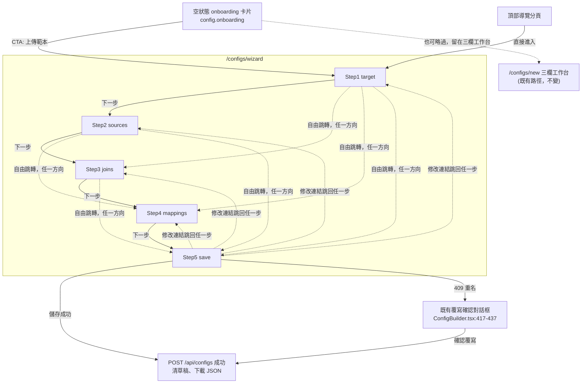

# Design UX — create-project-wizard

## 需求對照表（REQ）

| REQ | 一句話陳述 |
|---|---|
| REQ-01 | 精靈沿用既有 `STEP_IDS`（`previewHelpers.ts:19`）五步驟，不新增第三套步驟枚舉 |
| REQ-02 | 任何步驟皆可自由跳轉、不封鎖；未完成前置條件顯示空狀態而非阻擋 |
| REQ-03 | 每步驟常駐顯示說明段落 + 一個具體範例，共兩句（一句說明 + 一句以「例如：」開頭的範例），不藏在展開項後面 |
| REQ-04 | 每步驟說明定義它用到的每一個受控名詞，使用者無需離開精靈 |
| REQ-05 | 輸出欄位由範本標題列（template columns）與 mapping targets 共同決定，此行為在文案中明說 |
| REQ-06 | 終點（`save` 步驟）提供唯讀全貌摘要，每段有「修改」連結跳回對應步驟 |
| REQ-07 | 存檔行為與現況一致：zod validate（`toConfig()`）→ `POST /api/configs` → 清草稿 → 下載；重名走既有 409 覆寫對話框 |
| REQ-08 | 草稿沿用既有 `localStorage` key `etp.configDraft.v1`，與三欄工作台共用 |
| REQ-09 | 新增全頁路由 `/configs/wizard`，與既有 `/configs/new`（三欄工作台）並存，兩入口最終產出相同設定 |
| REQ-10 | 空狀態、錯誤狀態、載入狀態逐步驟定義 |
| REQ-11 | 抽出共用純模組 `frontend/src/lib/configForm.ts`（不做成 React hook），精靈與工作台共用同一份 `FormState`/`toConfig`/草稿讀寫邏輯 |

## 前提說明：兩個介面、兩種使用者（不是修改既有決定，REQ-09）

`docs/spec/design.md:410`：「主要使用者：業務、顧問」——這句話描述的是三欄式工作台
（`ConfigBuilder`，`frontend/src/pages/ConfigBuilder.tsx`），維持不變，本次變更不觸碰
它的版面配置。

本次新增的精靈是**另一個介面、服務另一種使用者**：完全沒有背景知識的新手或學生，
必須在第一次嘗試就能獨立走完全程，沒有旁人協助。兩個介面平行存在、各自服務各自
的受眾：

- 三欄工作台 —— 受眾維持業務/顧問，版面不動。
- 精靈（本次新增）—— 受眾是第一次使用、無背景的新手，走線性引導 + 常駐說明。

`docs/decisions_log.md:108-170`（決策 #7、#11）記錄的是「不要把 `ConfigBuilder` 本身
改成 wizard」——那個決定的對象是三欄工作台的版面，本次變更沒有更動
`ConfigBuilder.tsx` 的版面，因此**不構成對該決定的推翻、例外或前提變更**，兩者是
針對不同介面的獨立決定。

兩個表層／第一次使用者受眾這個決定，已另外記錄於 `docs/decisions_log.md` 新增的
一則條目（由平行變更寫入，條目標題與編號見該檔最新內容），本文件的設計立基於**那
一則條目**，不是重讀 #11。

`docs/decisions_log.md:168`（決策 #11）對本文件仍然有效約束的部分，只有一句話：
**不允許硬性步驟閘門**——不能因為上一步未完成就擋下一步。這一點與本文件「硬性限制：
不封鎖」節（REQ-02）完全一致：精靈的下一步/上一步是純導覽，不做完成檢查，任何步驟
皆可自由跳轉。這條約束同時對兩個表層（三欄工作台、精靈）成立——如果精靈未來加入
任何形式的硬性閘門，就不再受本文件涵蓋，需要重新走設計審查。

兩個入口並存、且必須產出相同設定，正是這個「兩介面兩受眾」結構的直接推論——不是
單純的使用者偏好選擇：兩種受眾都要能建立同一種設定檔，所以兩條路徑必須收斂到同一
個 `toConfig()`（`ConfigBuilder.tsx:107-137`）與同一個儲存流程，否則會產生兩套互相
不一致的設定語意。

## 硬性限制：不封鎖（REQ-02）

精靈的步驟順序只是建議順序，不是強制順序。使用者可以在任何時間跳到任何步驟，包含
跳過尚未完成的前置步驟。當某步驟的前置條件未完成時，畫面顯示「資訊性空狀態」
（說明還缺什麼、並提供快速跳回前置步驟的連結），絕不出現「請先完成上一步」式的
阻擋或禁用按鈕。此限制在下方「步驟模型」與「狀態」兩節逐步驟落實。

**這條規則的界限**：不封鎖規範的是**步驟導覽**——沒有任何步驟不可到達，也沒有任何
「跳到下一/上一步」的導覽控制項會因為步驟未完成而被 disable。一個控制項因為**自己
的動作沒有輸入**（例如「預覽」在沒有任何來源檔可預覽時）或**請求正在進行中**而
disabled，不算步驟閘門——這兩種情況與「使用者是否已完成某個步驟」無關，即使使用者
把所有步驟都走完，該控制項在沒有輸入/請求進行中時一樣會 disabled。精靈重用既有
「預覽」按鈕（`disabled={!previewEnabled || preview.isPending}`，
`ConfigBuilder.tsx:515`，`previewEnabled` 的完成度門檻邏輯見 `ConfigBuilder.tsx:
211-215`）與 Step 1 的「上一步」按鈕（第一步没有上一步可退，屬同一類——動作沒有
目標，不是步驟未完成）都落在允許範圍內。

## 步驟模型（REQ-01, REQ-02, REQ-05）

沿用 `STEP_IDS`（`previewHelpers.ts:19`）：`target` → `sources` → `joins` →
`mappings` → `save`，完成判定沿用 `deriveStepStates`（`previewHelpers.ts:67-87`）
既有的 `done` 判斷式（第 72-81 行），精靈只是換一種畫面呈現，不改判定邏輯：

| 步驟 | 完成判定（來源：`previewHelpers.ts:72-81`） | 空值算完成？ |
|---|---|---|
| `target` | `hasFile && columns.filter(Boolean).length > 0`（`previewHelpers.ts:73`） | 否——未上傳範本不算完成，但仍可跳去看 |
| `sources` | 至少 1 筆，且每筆都有檔案與非空 alias | 否——空清單不算完成，但仍可跳去看 |
| `joins` | 空清單即視為完成（無需多來源時） | 是——空清單本身即算完成 |
| `mappings` | 至少 1 筆，且每筆恰有一種填值模式 | 否——空清單不算完成，但仍可跳去看 |
| `save` | name 非空 AND 全域無 issue | 不適用（終點步驟，非跳轉判定） |

既有的 onboarding 卡片（`config.onboarding`，`i18n/zh-TW.json:85-91`）文案是
「三步驟快速上手」，但 `STEP_IDS` 有五步——精靈不新增第三套步驟枚舉，而是把這張
卡片的 CTA 導向精靈的 5 步（詳見下方「User flows」與「Layout」）。

## Output columns 行為與文案（REQ-05）

依 `docs/decisions_log.md:298-315`（決策 #19）與 `toConfig()`
（`ConfigBuilder.tsx:111-114`）：

```
mappingTargets = mappings 中每筆的 target
orphanTemplateCols = 範本欄位中，未出現在任何 mapping target 的欄位
輸出欄位順序 = [...mappingTargets, ...orphanTemplateCols]
```

上傳範本時會自動用範本欄位「灌」出對應的 mapping 列（`mergeMappingsWithColumns`，
`ConfigBuilder.tsx:583`），因此精靈**刻意不設獨立的「輸出欄位」步驟**——多一個步驟
會產生第三份資料表示法，與決策 #19 的雙向同步精神衝突。這件事必須在 `target` 與
`mappings` 兩步驟的說明文案中明說（見下方 Layout 表）。

`mappings` 這一步的每一列本身就同時扮演「輸出欄位的定義」與「這個欄位的填值規則」
兩個角色：一列的**存在**（`target` 欄名）決定輸出檔會有這個欄位，列上的設定
（來源欄位／固定儲存格／固定值三種模式之一）決定值從哪來。上傳範本只是預先幫使用者
「灌」出這些列的其中一種方式，不是唯一方式——使用者也可以在這一步直接新增、刪除、
編輯任一列，等同直接新增、刪除、編輯輸出欄位。既有畫面已用 `mapping.modeHint.*`
（`i18n/zh-TW.json:117-119`）解釋了填值模式這一層，但沒解釋「列＝輸出欄位」這個
更上層的事實——這是新手最容易卡住的概念，精靈的 Step 4 文案專門補這一層，模式說明
沿用既有 `modeHint` 文案不重造。

## Glossary 機制（REQ-04）

每個步驟卡片標題下方固定放一段「說明 + 範例」（見「每步驟說明格式」），凡是**該步驟
自己的說明/範例文案**中第一次用到受控名詞的地方，以 `<dfn>` 樣式加底線虛線並附一句
inline 定義（不彈窗、不用 tooltip 藏起來，滑鼠移開也看得到）。

REQ-04 的義務範圍是**「首次定義步驟」**：一個名詞只需要在它被**該步驟自己的說明/
範例文案首次引入**的那一步驟給出 inline 定義；若某名詞只是在後面步驟（例如 `save`
的唯讀摘要）以 label 形式**被再次顯示**（echoed），並非該步驟說明文案重新引入這個
概念，就不需要在該步驟重複完整定義——摘要 label 本身沿用該名詞在首次定義步驟建立
的 `<dfn>`，不必重寫第二份定義。

| 受控名詞 | 首次定義步驟（inline 定義義務所在） | 亦顯示但屬 echoed（摘要/列表引用，非重新定義） | Inline 定義（範例文案） |
|---|---|---|---|
| 目標範本 | `target` | `save`（摘要標題「目標範本」） | 「你最後要交出去的 Excel 格式」 |
| 工作表（sheet） | `target` | `sources`, `save`（摘要顯示 sheet 名稱） | 「一個 Excel 檔裡可以有好幾個分頁，每個分頁就是一個工作表」 |
| 標題列（header row） | `target` | `sources`, `save`（摘要顯示 header_row 數字） | 「欄位名稱所在的那一列，例如『訂單編號』『客戶名稱』所在列」 |
| 來源檔 | `sources` | — | 「資料實際從哪個檔案來」 |
| alias | `sources` | `save`（摘要逐筆顯示 alias） | 「你自己取的簡短代號，之後串接、對應都用這個代號指這份檔案」 |
| primary/主檔 | `sources` | — | 「要被逐筆處理的那份主要資料；其他來源檔是輔助查找用」 |
| role | `sources` | `save`（摘要逐筆顯示 role） | 「來源檔的身分標記：primary（主檔）或 lookup（輔助查找檔）」 |
| join/串接 | `joins` | `save`（摘要列出每條 join 規則） | 「告訴系統兩份檔案裡哪一欄代表同一件事，才能對得起來」 |
| 對應/mapping | `mappings` | `save`（摘要列出每筆對應） | 「輸出的每一欄，值要從哪個來源欄位或固定值來」 |
| 輸出欄位 | `mappings`（「這裡每一列就是輸出檔的一個欄位」） | `target`（說明文案提到「決定輸出會有哪些欄位」，概念先被觸及但名詞定義以 `mappings` 為準） | 「輸出檔案實際會有的一欄；`mappings` 每新增/刪除一列，就等於新增/刪除一個輸出欄位」 |
| 來源欄位（source） | `mappings` | `save`（摘要顯示填值模式） | 「這欄的值逐列抓自指定的來源欄位」，三種填值模式之一 |
| 固定值（literal） | `mappings` | `save`（摘要顯示填值模式） | 「不管來源長怎樣，這欄一律填這個值」 |
| 固定儲存格（source_cell） | `mappings` | `save`（摘要顯示填值模式） | 「不是逐列取值，而是直接指定來源檔某一格，例如 B2」 |

依此範圍界定，`save` 步驟自己的說明/範例文案不需要引入任何新受控名詞的完整定義——
它的唯讀摘要只是「顯示」前面步驟已建立的資料，摘要 label 沿用既有 `<dfn>`，不重寫。

驗證方式（給後續 verifier）：逐名詞檢查其「首次定義步驟」畫面文案是否包含 inline
定義；「亦顯示但屬 echoed」欄位列出的步驟只需檢查名詞有被顯示，不檢查是否重新定義。
缺一個名詞在其首次定義步驟的定義即視為 REQ-04 未達成。

## User flows（REQ-01, REQ-02, REQ-09）



> 圖中虛線表示「不受限制、雙向皆可」的自由跳轉，代表 REQ-02 的不封鎖限制；並非
> 遍歷所有 20 種組合，僅示意任一步都可直達任一步。

## 入口 affordance（REQ-09）

1. **頂部導覽分頁**：`TopMenuBar` 新增一個分頁，指向 `/configs/wizard`。既有的「設定建置」與「批次執行」兩個分頁不變。
2. **Onboarding 卡片 CTA**：`ConfigBuilder` 空狀態 onboarding 卡片（`ConfigBuilder.tsx:453-476`）的主要按鈕改為導向 `/configs/wizard`；卡片同時保留「留在三欄工作台」的次要路徑，對應本文件 User flows 圖既有的虛線分支。此項是本文件 `:89-91` 早已載明、但實作時未完成的部分，不是新設計。
3. **兩個入口並存**：`/configs/new` 的既有建立路徑一字不改（REQ-09、`spec.md` Rejected options 已明文否決「精靈取代既有建立入口」）。
4. **文案來源**：兩個入口的文字皆走 i18n key，不得在程式碼中硬編任何中文或全形標點（`frontend/src/lib/i18nGuard.test.ts` 會擋）。

## Information architecture（REQ-01, REQ-09）

- `/configs` 、`/configs/new` —— 三欄式工作台（既有，不變，`App.tsx:41-42`）
- `/configs/wizard` —— 本次新增，全頁精靈
  - Step 1 `target` —— 目標範本
  - Step 2 `sources` —— 資料來源
  - Step 3 `joins` —— 串接（可跳過）
  - Step 4 `mappings` —— 欄位對應
  - Step 5 `save` —— 檢視並儲存（唯讀摘要 + 名稱 + 儲存）
- 共用左側步驟導覽（非阻擋式，任一步可點擊直達）

## Layout（REQ-01, REQ-02, REQ-03, REQ-05, REQ-10）

整體頁面骨架（單一路由 `/configs/wizard`，桌面版）：

| 區域 | 內容 |
|---|---|
| 左側步驟導覽（固定寬） | 5 個步驟項目，每項顯示狀態圖示（完成/待處理/有問題），皆可點擊直達，不禁用任何一項 |
| 主內容區 | 當前步驟的表單 + 常駐說明段落 |
| 底部操作列 | 「上一步」「下一步」（純導覽用，不做完成檢查）+ 當前步驟的 issue 提示 |

各步驟主內容區：

**Step 1 — target**
```
┌ 說明：範本是你最後要交出去的 Excel 格式，這個檔案的標題列(header row)
│ 決定輸出會有哪些欄位。
│ 例如：客戶每月要的銷售月報表，標題列就是「訂單編號」「客戶名稱」那一列。
├ FileDropzone（上傳範本 .xlsx）
├ SheetHeaderPicker（選工作表 + 點列設為 header_row）
└ 空狀態：尚未上傳時顯示「先上傳範本，才能看到欄位」+ 上傳區本身即為 CTA
```

**Step 2 — sources**
```
┌ 說明：資料從哪來的檔案，可以有多個，其中恰有一個是主檔(primary)。
│ 例如：訂單主檔(primary) + 客戶資料表(lookup)。
├ SourcesTree（含目標範本節點 + 各來源檔節點，可展開看欄位）
├ 每筆來源：FileDropzone + alias 輸入 + role 下拉(primary/lookup)
└ 空狀態：尚無任何來源時顯示一筆預設 primary 佔位列，引導「+ 新增來源」
```

**Step 3 — joins（可跳過）**
```
┌ 說明：只有多個來源檔時才需要：告訴系統哪一欄是兩邊共同的鍵(join)。
│ 例如：orders.客戶代號 = customers.代號。
├ JoinsEditor（沿用既有元件）
└ 空狀態：僅 1 個來源，或尚未設定 join 時，顯示「目前只有一份來源，不需要串接」
  或「尚未設定串接，如果你的資料分散在多個檔案才需要」——不視為錯誤，Step 完成
  燈號正常顯示完成
```

**Step 4 — mappings**

這一步是全流程中最不直覺的一步：畫面上每一列同時做兩件事——列本身的**存在**
決定了輸出檔會有這個欄位，列上的**設定**決定這個欄位的值從哪裡來。目前畫面上
只解釋了後者（三種填值模式的說明，`mapping.modeHint.source` /
`mapping.modeHint.source_cell` / `mapping.modeHint.literal`，
`i18n/zh-TW.json:117-119`），沒解釋前者。精靈在這一步的說明文案補上這缺的
「上層」，下層沿用既有 `modeHint` 文案，不重複造一份：

```
┌ 說明：這裡每一列就是輸出檔的一個欄位；列上的設定決定這個欄位的值從哪裡來。
│ 例如：新增一列、目標填「客戶名稱」、來源選 customers.名稱，輸出檔就多一欄。
├ MappingsList（每列一個 MappingRow，inline 展開條件/預設值，三種填值模式
│ 沿用既有 modeHint 文案：來源欄位／固定儲存格／固定值）
└ 空狀態：上傳範本後應已由 mergeMappingsWithColumns 自動帶出對應列；若使用者跳過
  Step 1 直接進到這裡，顯示「尚未上傳範本，看不到可對應的欄位，先去 Step 1，或
  直接手動新增一列」+ 一個跳回 Step 1 的連結（非阻擋，仍可手動「+ 新增映射」
  自行輸入欄位名——新增列本身就是新增一個輸出欄位）
```

**Step 5 — save（終點摘要，REQ-06）**
```
┌ 說明：這是最後一步，先核對摘要有沒有漏改的地方，確認無誤後輸入名稱即可
│ 存檔下載。
│ 例如：發現來源檔選錯，可點「修改」跳回 Step 2 調整。
├ 唯讀摘要（四段，各自一個「修改」連結跳回對應步驟）：
│  1. 目標範本：檔名、sheet、header_row、欄位數
│  2. 來源清單：每筆 alias / role / 檔名
│  3. 串接：每條 join 規則，若為空顯示「無串接」
│  4. 對應：每筆 target ← source/literal/source_cell 摘要
├ 名稱輸入（NAME_PATTERN，1–80 字）
└ 「儲存並下載」按鈕（disabled 僅在請求進行中，不因步驟未完成而 disabled）
```

## Component hierarchy（REQ-01, REQ-06, REQ-07, REQ-08, REQ-11）

- `WizardPage`（新頁面元件，`/configs/wizard`）
  - `ChecklistRail`（重用既有元件，`features/config-builder/ChecklistRail.tsx:15`；
    不新建左側步驟導覽元件）——現有 props 為 `states` / `errorCounts` /
    `onStepClick`（`ChecklistRail.tsx:9-13`），純呈現 + onClick 跳轉、本身不做完成
    檢查，已完全符合精靈的不封鎖需求。精靈額外需要「高亮目前所在步驟」，因此在
    `ChecklistRail` 上新增一個**可選** prop `activeStep?: StepId`（有值時該列加上
    高亮樣式，未傳則行為與現況完全相同）；若精靈版面寬度需求不同，另加可選
    `className?: string` 覆蓋外層寬度。`ChecklistRail` 目前唯一呼叫端
    （`ConfigBuilder.tsx:533`）不傳這兩個新 prop，因為是可選的，該呼叫端不需要
    任何修改。
  - `WizardStepShell`（新，包住「說明段落 + 當前步驟內容 + 底部操作列」）
    - Step 1: `FileDropzone`（`components/FileDropzone.tsx`）+ `SheetHeaderPicker`
      （`components/SheetHeaderPicker.tsx`）
    - Step 2: `SourcesTree`（`features/config-builder/SourcesTree.tsx:45`）
    - Step 3: `JoinsEditor`（`features/config-builder/JoinsEditor.tsx:26`）
    - Step 4: `MappingsList`（`features/config-builder/MappingsList.tsx:29`）
      → `MappingRow`（`features/config-builder/MappingRow.tsx`）
    - Step 5: `WizardSummary`（新，唯讀摘要 + 修改連結）+ 既有覆寫確認 `Dialog`
      （`ConfigBuilder.tsx:417-437` 的既有 pendingOverwrite 對話框，邏輯原樣複用）
  - 共用邏輯抽成純模組 `frontend/src/lib/configForm.ts`（不是 React hook，
    REQ-11），匯出
    `FormState`、`emptyState`、`toPersistable`、`isPristineState`、`toConfig`、
    `DRAFT_KEY` 與草稿讀寫 helper——這些定義目前都在 `ConfigBuilder.tsx`
    （`FormState`：`:56-68`；`toConfig()`：`:107-137`；`DRAFT_KEY`：`:43`）內部，
    抽出後 `ConfigBuilder` 與 `WizardPage` 都改成 import 這個模組，不維持兩份定義。
    這個做法是本 repo 已有的先例：`frontend/src/lib/previewHelpers.ts:1-3` 的檔頭
    註解自陳「Pure helpers for the preview gate and checklist rail, extracted from
    ConfigBuilder for unit testing. No i18n / React imports on purpose」——本次
    `configForm.ts` 是同一種抽法。誠實的代價：`ConfigBuilder` 目前把這些純函式包了
    兩層 React 邏輯——debounced autosave（`ConfigBuilder.tsx:270-279`）與 debounced
    即時驗證（`ConfigBuilder.tsx:189-195`），各約 15 行——這兩層 wiring 純模組不含，
    精靈必須在 `WizardPage` 自己重新接一份，不會被這次抽取共用掉。

`PreviewDialog`（`features/config-builder/PreviewDialog.tsx:26`）在精靈中維持可用
（例如 Step 5 可放預覽按鈕），沿用既有元件，不重做。`ChecklistRail` 的重用方式見
上方 `WizardPage` 子項，此處不重複。

## 草稿限制（REQ-08）

精靈與三欄工作台共用同一把 `localStorage` key（`DRAFT_KEY = "etp.configDraft.v1"`，
`ConfigBuilder.tsx:43`），這帶來三個必須在設計上明說的限制：

- **精靈不得對持久化的草稿 payload 新增任何欄位**（包含步驟指標本身）。
  `EMPTY_PERSISTABLE_JSON`（`ConfigBuilder.tsx:94`）是對 `toPersistable(emptyState())`
  的**字串完全比對**（`JSON.stringify` 相等），`isPristineState()`（`ConfigBuilder.tsx:
  96-101`）直接拿這把 sentinel 判斷「是否從未被使用者碰過」。只要精靈多寫一個欄位
  （例如目前在哪一步），這個字串就再也無法與 `EMPTY_PERSISTABLE_JSON` 相等——精靈
  每次掛載都會寫出一份「非 pristine」的草稿，之後任何人開三欄工作台都會看到「有草稿
  可還原」的提示，即使那份草稿其實完全空白。
- **上傳的 `File` 物件無法被持久化**。`toPersistable()`（`ConfigBuilder.tsx:82-88`，
  `file: undefined` 於 `:85-86`）
  寫入 `localStorage` 前會把 `target.file` 與每筆 `sources[].file` 都設成
  `undefined`；還原時 `restoreDraft()`（`ConfigBuilder.tsx:287-306`）一律把
  `file` 設回 `null`（`:295`、`:301`）。因此從草稿還原的精靈畫面**不會顯示檔名**，
  且 `target` 步驟的完成判定（`hasFile && columns...`，見「步驟模型」節）在還原後
  永遠是 `false`——`target` 步驟狀態會停在「待處理」，摘要與步驟導覽都必須反映
  這個事實：`target` 顯示「已還原欄位設定，但需要重新上傳檔案才能繼續解析」，而非
  假裝檔案還在。
- **同一把 key、沒有 `storage` 事件監聽**（已讀 `ConfigBuilder.tsx` 全文確認沒有
  `addEventListener("storage", ...)`），代表兩個同時開著的分頁是**後寫入者覆蓋前者**
  （last-writer-wins）——這是既有行為，兩個三欄工作台分頁今天就已經會互相覆蓋，
  精靈只是共用同一個既有限制、不是新引入。精靈接受此行為為既定風險，但草稿還原提示
  必須說明「這份草稿是從哪個介面（三欄工作台／精靈）寫入的」，讓使用者至少能判斷
  這是不是自己另一個分頁的操作。

## Design tokens（REQ 無特定編號，通用視覺一致性）

沿用既有 shadcn CSS 變數（`frontend/src/index.css:7-45`，light/dark 兩組）與
`tailwind.config.js:7-37` 的 color 對應（`border`/`background`/`primary`/
`muted`/`destructive`/`card` 等）。本次變更 delta：**無新增 token**。步驟導覽的
「完成/待處理/有問題」三態視覺，直接沿用 `ChecklistRail` 現有的顏色語意（不重新定義
新的顏色語意）。

### 對比度（C1）

精靈不引入任何新的顏色配對，全部沿用既有 shadcn token pair（`frontend/src/index.css`
light 區塊 :7-24）：

- **本文（body text）**：`--foreground` on `--background`（`index.css:8` on
  `index.css:7`）——用於步驟標題與表單內容本身，兩者明度差極大，對比度足夠。
- **次要文字（per-step 說明段落、範例句、helper text）**：`--muted-foreground`
  on `--background`（`index.css:16` on `index.css:7`）——這是本文件會用到的三組
  之中對比度最弱的一組（灰階中明度對純白）。本文件無法在紙面上實測精確對比值，
  只能陳述：這是既有元件庫既有的既定組合（`ChecklistRail.tsx:41` 的 pending 態、
  `ConfigBuilder.tsx:539` 的 onboarding 說明文字已經在用），精靈沿用、不加重、
  也不另外聲稱「已驗證通過 AA」。
- **錯誤/危險文字，實心徽章型**：`--destructive-foreground` on `--destructive`
  （`index.css:20` on `index.css:19`）——用於 checklist rail 的錯誤數徽章
  （`ChecklistRail.tsx:35`，`bg-destructive` 實心底配 `text-destructive-foreground`
  文字），精靈的對應徽章沿用同一組，不新增。
- **錯誤/危險文字，行內文字型**：`--destructive` on `--background`
  （`index.css:19` on `App.tsx:36` 的 `bg-background`）——用於「儲存失敗」等
  行內錯誤文字（`ConfigBuilder.tsx:528-529` 的 `text-sm text-destructive`），
  文字色直接坐在頁面底色上，不是徽章底色。這是本文件會用到的配對中對比度
  最弱的一組（淺色主題下約 3.9:1），是承載有意義文字的最弱配對；精靈沿用既有
  組合，不是本次新引入，本文件同樣不對其聲稱通過 WCAG AA。

以上三組皆是 `tailwind.config.js:7-37` 既有 color 對應的直接使用；精靈本身不
新增顏色配對，因此對比度風險與既有頁面（`ConfigBuilder`）完全一致。

### 可點擊目標尺寸（C2）

本產品為桌面限定（`frontend/src/App.tsx:18` 於 `window.innerWidth < 640` 時
整頁改顯示「螢幕過窄」提示，不支援窄螢幕/觸控裝置），因此不採用行動裝置常見的
44px 觸控下限，改以既有 shadcn `Button` 尺寸（`frontend/src/components/ui/
button.tsx:20-23`）作為滑鼠操作下限：

- **主要操作**（「上一步」「下一步」「儲存並下載」）：至少採用 `default` 尺寸
  （`h-9`＝36px 高，`button.tsx:20`）；終點操作可用 `lg`（`h-10`＝40px，
  `button.tsx:22`）。
- **左側步驟導覽項目**：比照 `ChecklistRail` 既有可點擊列的內距
  （`px-2 py-1.5 text-xs`，`ChecklistRail.tsx:30`），至少維持同等高度。
- **摘要頁「修改」連結**：不可只做行內底線文字（點擊區域過窄），至少提供與
  `sm` 按鈕相同的最小可點擊高度 32px（`button.tsx:21`）。
- **FileDropzone**：既有元件本身即為大面積可點擊/拖放區
  （`FileDropzone.tsx:42-53` 的 `p-6` 容器），維持既有尺寸，不另訂更小的值。

### 間距與圓角（C7）

沿用 Tailwind 預設 spacing scale 與 `--radius`（`index.css:24`，`0.5rem`，
對應 `tailwind.config.js:38-41` 的 `borderRadius.lg/md/sm`），精靈本身不定義
新的間距或圓角 token，一律用 scale 步階，不使用任意像素值。既有頁面的間距先例
（皆讀自 `ConfigBuilder.tsx`）：

- `className="flex flex-col gap-3"`（`ConfigBuilder.tsx:416`）——區塊之間的
  標準垂直間距。
- `className="rounded-xl border bg-card p-8 shadow-sm text-center max-w-md
  w-full space-y-6"`（`ConfigBuilder.tsx:537`）——卡片外距與卡片內垂直節奏。

精靈的層次分工：

- 步驟卡片外距：沿用 `p-8`（同 `ConfigBuilder.tsx:537` 的 onboarding 卡片）。
- 卡片內元素垂直節奏：沿用 `gap-3` 或 `space-y-6`（`ConfigBuilder.tsx:416,537`），
  依內容密度擇一。
- 圓角：卡片沿用 `rounded-xl`（`ConfigBuilder.tsx:537`），一般容器/按鈕沿用
  `rounded-md`（對應 `--radius` 推導的 `borderRadius.md`，
  `tailwind.config.js:38-41`）。

### 文字階層（C9）

沿用既有頁面已在用的 Tailwind type utilities，精靈不新增字級：

| 層級 | Tailwind 類別 | 先例 |
|---|---|---|
| 步驟標題 | `text-xl font-semibold` | `ConfigBuilder.tsx:538` |
| 說明段落／範例句 | `text-sm text-muted-foreground` | `ConfigBuilder.tsx:539` |
| 欄位標籤 | `text-sm font-medium leading-none` | `label.tsx:8` |
| 區塊級 helper/error text | `text-sm text-destructive` | `ConfigBuilder.tsx:528-529` |
| 逐欄 helper/error text | `text-xs text-destructive` | `ConfigBuilder.tsx:482` |
| 步驟導覽項目文字 | `text-xs` | `ChecklistRail.tsx:30` |

範例句與說明段落同層級（`text-sm text-muted-foreground`），以「例如：」前綴
區分語意，不用更大字級製造視覺競爭。

### 互動狀態（C10）

目前僅 `disabled` 一態，補齊 hover／focus／active／disabled 四態；
`focus-visible` 一律沿用既有 `--ring` token（`index.css:23`）與 `Button` 的
focus 樣式（`focus-visible:outline-none focus-visible:ring-2
focus-visible:ring-ring focus-visible:ring-offset-2`，`button.tsx:8`）：

- **步驟導覽項目**：hover 沿用 `hover:bg-accent`（`ChecklistRail.tsx:30`）；
  focus-visible 比照 `button.tsx:8` 的 ring 樣式（既有 `<button>` 元素本身
  可承接，鍵盤使用者是新手族群的常見操作方式，focus 外框必須可見）；active
  沿用瀏覽器原生 `:active`；不設 `disabled`（不封鎖，任一項永遠可點擊）。
- **主要操作按鈕**（上一步/下一步/儲存並下載）：沿用 `Button` 既有的
  `hover:bg-primary/90`、`focus-visible:ring-2 focus-visible:ring-ring
  focus-visible:ring-offset-2`（`button.tsx:8,12`）；active 沿用瀏覽器原生；
  `disabled:pointer-events-none disabled:opacity-50`（`button.tsx:8`）僅在
  請求進行中（如 `save.isPending`）套用，不因步驟未完成套用。
- **「修改」跳回連結**：hover 沿用 `variant="link"` 的 `hover:underline`
  （`button.tsx:17`）；focus-visible 同樣套用 ring 樣式（`button.tsx:8`）——
  連結視覺上像文字也必須有可見 focus 外框；active 沿用瀏覽器原生；無
  `disabled` 態（永遠可跳轉）。
- **FileDropzone**：hover 沿用既有依 accent 而定的邊框/底色變化（例如
  `hover:bg-blue-50/50`，`FileDropzone.tsx:17-19`）；拖放中沿用既有
  `isDragActive && "bg-accent/50"`（`FileDropzone.tsx:47`）。既有元件（全文已讀，
  `FileDropzone.tsx:1-68`）目前**沒有** `disabled` prop，`useDropzone` 只傳入
  `onDrop`/`multiple`/`accept`（`FileDropzone.tsx:30-36`）；本次變更不對它新增
  `disabled` 語意，上傳中沒有任何視覺狀態改變（同「States」節 `target` 列的說明）。
  根元素 `<div {...getRootProps()}>`（`FileDropzone.tsx:42-49`）目前沒有定義任何
  `focus-visible`/`focus-within` 樣式，是一個已驗證的既有缺陷。這個缺陷的焦點目標
  是**根元素**，不是隱藏的 `<input>`：react-dropzone 對 `getInputProps()` 回傳
  `tabIndex: -1`（隱藏輸入永遠不進入 Tab 順序），對 `getRootProps()` 回傳
  `tabIndex: 0`（根元素才是鍵盤使用者實際 Tab 到、按 Enter/Space 觸發選檔的元素）
  ——已讀 `frontend/node_modules/react-dropzone/dist/index.js` 原始碼確認這組
  tabIndex 指派。修補此缺陷**屬於本次精靈變更範圍**，由 `spec.md` 的 S-12 涵蓋
  （fail-then-pass）：為根元素補上 `focus-visible:ring-2 focus-visible:ring-ring`
  （沿用既有 `--ring` token），而非 `focus-within`。

## States（REQ-02, REQ-10）— 逐步驟定義

空狀態是本設計取代封鎖的核心機制，逐步驟列出：

| 步驟 | 空狀態（前置條件未滿足時顯示，不阻擋） | 錯誤狀態 | 載入狀態 |
|---|---|---|---|
| `target` | 尚未上傳範本：顯示上傳區本身 + 一句引導文字，無「鎖定」樣式 | 檔案格式錯誤/解析失敗：inline 錯誤訊息於上傳區下方，沿用既有 zod issue 呈現方式 | 上傳中：`FileDropzone`（`FileDropzone.tsx:1-68`，全文已讀）目前**沒有**任何 loading 指示、`disabled` prop 或 `maxSize` 限制——`useDropzone` 的選項只有 `onDrop`/`multiple`/`accept`（`FileDropzone.tsx:30-36`），上傳期間畫面不會有任何變化。若精靈要在上傳中提供指示，必須新建（不是沿用既有機制），且新建不在本次變更範圍內；`SheetHeaderPicker` 解析 sheet 時顯示骨架列 |
| `sources` | 尚無來源：顯示 1 筆預設 primary 佔位列 + 「+ 新增來源」 | alias 重複/缺檔：既有 `sourcesSchemaIssues` inline 呈現（`ConfigBuilder.tsx:571`） | 個別來源檔解析中：沿用 `SourcesTree` 現有 loading 樣式 |
| `joins` | 少於 2 來源，或已設但為空：顯示「目前不需要串接」提示，Step 視為完成，非錯誤 | join 參照到未知 alias：既有 `joinsByIndex` inline 呈現 | 無獨立載入態（純表單編輯） |
| `mappings` | 跳過 Step 1 直接進入、無可對應欄位：顯示「先去 Step 1 上傳範本」提示 + 跳轉連結，仍可手動新增 mapping | 缺填值模式/XOR 衝突：既有 `mappingsByIndex` inline 呈現 | 無獨立載入態 |
| `save` | 尚未命名：摘要照常顯示，僅名稱欄位標示待填，不阻擋摘要瀏覽 | 存檔失敗（非 409）：existing `saveError` 文字區塊；409：既有覆寫對話框 | 存檔中：既有 `save.isPending` 讓按鈕文字/disabled 狀態沿用 |

## 每步驟說明格式（REQ-03）

每個步驟卡片標題正下方固定顯示（不可收合、不放在 disclosure 後面），共兩句：

```
[說明句：一句話定義本步驟目的]
[範例句：以「例如：」開頭的一句具體情境]
```

規則是**句數**、不是行數：jsdom 不做版面排版，無法檢查渲染後是幾行，因此驗證方式
是「說明段落恰有一句解釋句 + 一句以『例如：』開頭的範例句」，不是「兩行以內」。
五步各自的說明/範例文案已在「Layout」節逐步驟給出，此處不重複列。

## Design-as-code files

N/A —— 本變更未使用 `pencil.dev` 或其他 design-as-code 工具，純手寫規格。

## Override 區塊

N/A —— 本文件只涉及單一新頁面（`/configs/wizard`），無需要對 MASTER 做例外的
子頁面；三欄工作台（`ConfigBuilder`）版面與行為完全不變，故不需要 Override 區塊。

## Requirements checklist（附錄）

- [x] 1. 五步驟沿用 STEP_IDS，不新增第三套步驟枚舉 —— 達成，見「步驟模型」節，
      `previewHelpers.ts:19` 直接引用
- [x] 2. 任何步驟皆不封鎖，未完成前置條件顯示空狀態而非阻擋 —— 達成，見「硬性限制」
      節 + 「States」節逐步驟空狀態定義
- [x] 3. 每步含說明段 + 一個具體範例，共兩句（說明句 + 以「例如：」開頭的範例句），
      常駐可見 —— 達成，見「每步驟說明格式」節與「Layout」節各步驟文案
- [x] 4. 每步說明定義它用到的每一個受控名詞，使用者無需離開精靈 —— 達成，見
      「Glossary 機制」節的名詞×步驟對照表
- [x] 5. 輸出欄位由範本標題列與 mapping targets 共同決定這件事被明說 —— 達成，見
      「Output columns 行為與文案」節，引用 `ConfigBuilder.tsx:111-114` 與
      `docs/decisions_log.md:298-315`
- [x] 6. 終點提供唯讀全貌摘要，每段可跳回修改 —— 達成，見「Layout」節 Step 5 與
      「Component hierarchy」節 `WizardSummary`
- [x] 7. 存檔行為與現況一致（zod → POST → 清草稿 → 下載），重名走既有 409 覆寫
      對話框 —— 達成，見「User flows」流程圖與「Component hierarchy」節，引用
      `ConfigBuilder.tsx:107-137`、`316-335`、`417-437`
- [x] 8. 草稿沿用 etp.configDraft.v1，與三欄工作台共用 —— 達成，見「Component
      hierarchy」節（引用 `ConfigBuilder.tsx:43`）與「草稿限制」節（不新增
      payload 欄位、File 無法持久化、last-writer-wins 三項限制）
- [x] 9. 全頁路由 /configs/wizard，不與既有 /configs/new 衝突 —— 達成，見
      「Information architecture」節，引用 `App.tsx:41-42`
- [x] 10. 空狀態、錯誤狀態、載入狀態逐步驟定義 —— 達成，見「States」節表格
