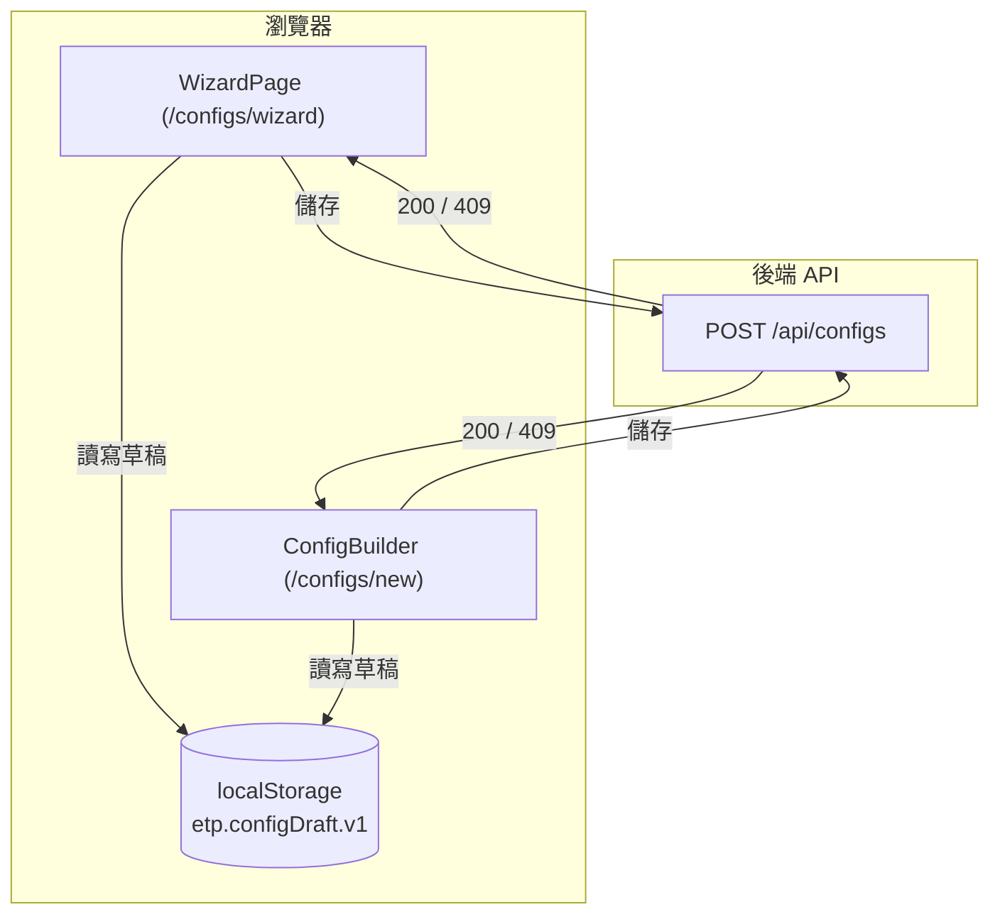

# Spec: create-project-wizard

新增一個全頁精靈 `/configs/wizard`，作為既有三欄式工作台（`ConfigBuilder`，
`/configs/new`）之外的第二個建立設定入口，服務第一次使用、無背景知識的使用者。
兩個入口最終都產出同一份設定 JSON。

## System context

精靈與工作台共用同一個瀏覽器端狀態層與同一組後端 API；本次變更沒有新增系統
邊界，只是新增一個消費既有邊界的前端頁面。下圖標示這個邊界（瀏覽器
`localStorage` 與 `POST /api/configs`），純粹是描述性上下文，不帶 `S-XX`、
不對應測試。

## Domain Language

| Term | Exact meaning | Do not use | 首次定義步驟 | 亦顯示（echoed） |
|---|---|---|---|---|
| 目標範本（target template） | 使用者最後要交出去的 Excel 格式；決定輸出檔的欄位與樣式 | 來源檔、範本檔（不加「目標」易與來源混淆） | `target` | `save` |
| 工作表（sheet） | 一個 Excel 檔案裡的其中一個分頁 | 頁籤、表單 | `target` | `sources`, `save` |
| 標題列（header row） | 欄位名稱所在的那一列，例如「訂單編號」「客戶名稱」所在列 | 表頭（單獨使用時語意不夠精確，須連用「標題列」全稱） | `target` | `sources`, `save` |
| 來源檔（source file） | 資料實際從哪個檔案來的那一份輸入檔 | 目標範本、範本檔 | `sources` | — |
| alias | 使用者自訂的簡短代號，之後 join、mapping 都用這個代號指這份來源檔 | 別名（保留原詞 alias，避免與程式碼識別字脫鉤） | `sources` | `save` |
| primary / 主檔 | 要被逐筆處理的那份主要來源檔；其餘來源檔是輔助查找用（lookup） | 主要檔案（含糊，須用「主檔」搭配 primary） | `sources` | — |
| role | 來源檔的身分標記：`primary`（主檔）或 `lookup`（輔助查找檔） | 類型、種類 | `sources` | `save` |
| join / 串接 | 告訴系統兩份來源檔裡哪一欄代表同一件事，用來把資料對起來 | 合併、關聯（與資料庫慣用語不同，此處固定用「串接」） | `joins` | `save` |
| 對應 / mapping | 輸出檔的每一欄，值要從哪個來源欄位或固定值來 | 轉換、對照 | `mappings` | `save` |
| 來源欄位（source） | mapping 三種填值模式之一：這一欄的值逐列抓自指定的來源欄位 | 欄位來源（語序易誤讀成別的意思） | `mappings` | `save` |
| 固定值（literal） | mapping 三種填值模式之一：不管來源長怎樣，這一欄一律填這個值 | 常數、預設值（`default` 在 schema 中另有精確含義，不可混用） | `mappings` | `save` |
| 固定儲存格（source_cell） | mapping 三種填值模式之一：不是逐列取值，而是直接指定來源檔某一格（例如 B2） | 固定位置、絕對位置 | `mappings` | `save` |
| 輸出欄位（output column） | `target_template.columns` 陣列中的一個元素；由 mapping 的 `target` 與範本標題列共同決定，見 `toConfig()`（`frontend/src/pages/ConfigBuilder.tsx:111-114`） | 目標欄位（易與「目標範本」混淆）——本規格全文統一用「輸出欄位」指稱這個概念，UI 上目前沒有獨立畫面承載這個名詞，靠 `mappings` 步驟的說明文案帶出 | `mappings` | `target` |
| 精靈（wizard） | 本次新增的全頁線性引導介面，路由 `/configs/wizard`，服務無背景知識的新手 | 精靈模式、引導模式（避免與既有 `ConfigBuilder` 內任何未來功能同名） | N/A | N/A |
| 工作台（workbench） | 既有三欄式介面 `ConfigBuilder`，路由 `/configs`、`/configs/new`，服務業務/顧問；本次變更不改動其版面 | 精靈、wizard（兩者是不同表層，命名須明確區分） | N/A | N/A |

> 「首次定義步驟」「亦顯示（echoed）」兩欄逐字取自 `design-ux.md` 的 Glossary
> 對照表（含輸出欄位：首次定義在 `mappings`，`target` 只是概念先被觸及、亦顯示，
> 不是首次定義步驟）；「精靈」「工作台」是本規格用來區分兩個表層的寫作用語，
> 不是步驟畫面文案要教使用者的網域概念，故兩欄皆標記 N/A、不受 REQ-04 拘束。
> 「首次定義步驟」欄是 REQ-04／S-04 判定「該步驟要定義哪些名詞」的唯一依據；
> 「亦顯示（echoed）」欄列出的步驟只需顯示該名詞，不需要重新定義。

## Capability: 建立設定精靈（create-project-wizard）

### REQ-01: 精靈沿用既有 STEP_IDS 五步驟

系統 SHALL 讓精靈的步驟集合等於 `STEP_IDS`（`frontend/src/lib/
previewHelpers.ts:19`：`target → sources → joins → mappings → save`），不得
新增第三套步驟枚舉。此需求是結構性常數，透過 S-01、S-03、S-08 等場景在使用
精靈時間接驗證（精靈的步驟導覽、跳轉、摘要一律以這五個 id 運作）；
`STEP_IDS` 本身的既有回歸測試（`previewHelpers.test.ts`）不在本次變更範圍。

### REQ-02: 步驟導覽不封鎖，未完成顯示空狀態

系統 SHALL 讓使用者在任何時間跳到任何步驟，包含跳過尚未完成的前置步驟；任何
步驟 SHALL NOT 因為前置步驟未完成而變得不可抵達。未滿足的前置條件 SHALL 顯示
資訊性空狀態，SHALL NOT 出現「請先完成上一步」式的阻擋。

此需求的範圍限定於**步驟導覽本身**：步驟導覽項目、上一步/下一步、以及「進入
或操作某個步驟」用的控制項（例如 mappings 步驟的「+ 新增映射」）SHALL NOT
因為某個步驟尚未完成而帶有 `disabled` 屬性。以下兩種情形不算步驟閘門、不受
本需求禁止：

- 一個按鈕因為**自身動作沒有輸入可執行**而 disabled——例如既有預覽按鈕的
  `disabled={!previewEnabled || preview.isPending}`（`ConfigBuilder.tsx:515`，
  `previewEnabled` 的完整性判斷見 `ConfigBuilder.tsx:211-215`）：這是對「有
  沒有東西可預覽」的判斷，不是對「某個步驟是否完成」的判斷；
- 一個按鈕因為**請求進行中**而 disabled（例如 `save.isPending`）。

#### S-01: 跳過未完成步驟直接前往下一步，畫面顯示空狀態而非阻擋

- **GIVEN** 使用者位於 `target` 步驟，尚未上傳範本（`target` 步驟未完成）
- **WHEN** 使用者點擊左側步驟導覽的 `mappings` 項目，直接跳過 `sources`
  與 `joins`
- **THEN** 系統 SHALL：
  - 成功導覽到 `mappings` 步驟（畫面確實切換，不停留在 `target`）
  - 顯示 `mappings` 步驟的資訊性空狀態文案（「尚未上傳範本，看不到可對應的
    欄位，先去 Step 1，或直接手動新增一列」）
  - 讓「+ 新增映射」按鈕與所有步驟導覽項目維持可點擊（非 `disabled`），
    也不出現任何「請先完成上一步」文字
  - 這個斷言必須以「跳轉後仍可操作、無 disabled 屬性」為判定依據，SHALL NOT
    僅檢查「畫面有變化」就視為通過——若實作為此路徑加入任何步驟閘門
    （例如導覽項目變成 `disabled`、或彈出攔截對話框），本測試 SHALL 判為失敗

**Test mapping**: `frontend/src/pages/WizardPage.test.tsx::skipsToMappingsShowsEmptyStateNotBlocked`
**Verification command**: `cd frontend && npm test -- src/pages/WizardPage.test.tsx`

#### S-02: disabled 僅限請求進行中或動作本身無輸入，不因步驟未完成而套用

- **GIVEN** 使用者位於 `save` 步驟，`joins`、`mappings` 皆未完成
- **WHEN** 使用者尚未觸發任何存檔請求
- **THEN** 「儲存並下載」按鈕與所有步驟導覽項目 SHALL NOT 帶有 `disabled`
  屬性——這條斷言只涵蓋步驟導覽控制項與「儲存並下載」，不涵蓋預覽按鈕（預覽
  按鈕依 REQ-02 的完整性判斷例外，不在本場景檢查範圍內）
- **WHEN** 使用者點擊「儲存並下載」，存檔請求進入 pending 狀態
  （`save.isPending`）
- **THEN** 僅「儲存並下載」按鈕 SHALL 呈現 `disabled`，步驟導覽項目 SHALL
  維持可點擊

**Test mapping**: `frontend/src/pages/WizardPage.test.tsx::disabledOnlyDuringPendingSaveNotIncompleteSteps`
**Verification command**: `cd frontend && npm test -- src/pages/WizardPage.test.tsx`

#### S-03: 空的 joins 清單視為完成，不阻擋抵達 save

- **GIVEN** 使用者只設定了一個來源檔（`sources` 長度為 1），`joins` 清單
  為空
- **WHEN** 精靈計算 `joins` 步驟狀態並讓使用者導覽到 `save` 步驟
- **THEN** 系統 SHALL：
  - 將 `joins` 步驟狀態顯示為完成（沿用 `deriveStepStates`，
    `previewHelpers.ts:67-81` 對空 `joins` 的既有判定，不另加精靈層級的
    「缺漏」標記）
  - 允許直接抵達並操作 `save` 步驟，不因 `joins` 為空而顯示任何警示或阻擋

**Test mapping**: `frontend/src/pages/WizardPage.test.tsx::treatsEmptyJoinsAsCompleteReachesSave`
**Verification command**: `cd frontend && npm test -- src/pages/WizardPage.test.tsx`

### REQ-03: 每步驟常駐顯示說明 + 一個具體範例

系統 SHALL 讓每個步驟卡片標題下方固定顯示一段說明句（恰一句）與一個以
「例如：」開頭的範例句（恰一句），合計兩句，且不得放在需要額外互動（如展開、
hover、tooltip）才看得到的容器內。（不以「不超過兩行」計算——jsdom 不執行版面
排版，渲染出的行數不可由測試斷言；改以「句數」作為可驗證的量測方式。）

### REQ-04: 每步驟就地定義其使用到的受控名詞

系統 SHALL 讓每個步驟的說明/範例文案，對 Domain Language 表「首次定義步驟」欄
指定給該步驟的每一個受控名詞，至少提供一次 inline 定義，使用者不需離開精靈
即可理解。一個名詞只在其「首次定義步驟」欠這個義務；該名詞若同時出現在同一表
「亦顯示（echoed）」欄指定的其他步驟，那些步驟只需顯示該名詞，不構成需要重新
定義的義務。

此需求的判定依據是 Domain Language 表的「首次定義步驟」欄，而不是實作當下的
文案恰好用了哪些字——一個步驟要定義的名詞集合是固定的（由該表決定），不會因為
撰寫文案時刻意迴避某個受控名詞就縮小。同時，這個義務只及於該步驟**自己的
說明/範例文案要教使用者的概念**：`save` 步驟摘要區塊裡單純把先前步驟的資料
印出來當標籤或當作使用者自訂資料值巧合撞名（例如某個來源檔的 alias 剛好被
使用者取名為 "primary"）不算「使用了這個受控名詞」，不會被計入需要重新定義。

#### S-04: 每步驟都依 Domain Language 表指定的名詞給出 inline 定義

- **GIVEN** 精靈依序渲染 `target`、`sources`、`joins`、`mappings`、`save`
  五個步驟（`STEP_IDS`）
- **WHEN** 對每一個步驟分別渲染其內容區
- **THEN** 對每一個步驟，系統 SHALL：
  - 渲染出一段說明文字與一個以「例如：」開頭的範例句，兩者合計顯示於畫面
    上（不藏在摺疊區塊或需要點擊才展開的元素內）
  - 對 Domain Language 表「首次定義步驟」欄指定給該步驟的每一個受控名詞，
    渲染出對應的 inline 定義文字，至少出現一次；缺一個名詞在其首次定義步驟
    的定義即判定該步驟未達成——本斷言 SHALL NOT 從實作的文案內容反推「這步驟
    該定義哪些名詞」，要定義的名詞集合固定來自 Domain Language 表「首次定義
    步驟」欄，不受實作文案影響（若實作文案刻意迴避某個受控名詞的字面用字，
    本測試 SHALL 仍判為未達成）；一個名詞只在「亦顯示（echoed）」欄列出的
    步驟被顯示、未給出重新定義，SHALL NOT 被判定為該步驟未達成

**Test mapping**: `frontend/src/features/config-wizard/WizardStepShell.test.tsx::rendersDescriptionExampleAndInlineTermDefinitionsPerAssignedTerm`
**Verification command**: `cd frontend && npm test -- src/features/config-wizard/WizardStepShell.test.tsx`

### REQ-05: 輸出欄位由範本標題列與 mapping targets 共同決定

系統 SHALL 讓輸出欄位集合等於 `[...mappingTargets, ...orphanTemplateCols]`
（`toConfig()`，`frontend/src/pages/ConfigBuilder.tsx:107-137`，欄位計算
於 111-114 行），且此行為 SHALL 在 `target` 與 `mappings` 步驟文案中明說；
精靈 SHALL NOT 新增獨立的「輸出欄位」步驟。

#### S-05: 上傳範本並選定工作表與標題列，自動灌出對應的 mapping 列

- **GIVEN** 使用者位於 `target` 步驟，尚未上傳任何檔案，`mappings` 目前為
  空清單
- **WHEN** 使用者上傳一個 `.xlsx` 範本、選定工作表、並點選某一列設為
  `header_row`，解析出的範本欄位為 `["客戶名稱", "訂單編號"]`
- **THEN** 系統 SHALL 透過 `mergeMappingsWithColumns`
  （`frontend/src/lib/configHelpers.ts:9-24`，呼叫點對照
  `ConfigBuilder.tsx:583`）灌出剛好 2 列 mapping（與範本欄位數量相同，因為
  呼叫當下 `mappings` 是空清單，沒有既有手動列會被附加在後）：第 1 列
  `target` 為 `"客戶名稱"`，第 2 列 `target` 為 `"訂單編號"`，順序與範本
  欄位原始順序一致

**Test mapping**: `frontend/src/lib/configForm.test.ts::seedsMappingRowsFromTemplateHeaderSelection`
**Verification command**: `cd frontend && npm test -- src/lib/configForm.test.ts`

#### S-06: 重新選定標題列時，既有 mapping 列原樣保留、不在範本中的手動列掛在最後

- **GIVEN** 已上傳範本，`target.columns` 為 `["客戶名稱", "訂單編號"]`；
  `mappings` 目前有兩列：第一列 `target="客戶名稱"`、`source` 已手動設定為
  `"orders.customer_name"`；第二列 `target="備註"`（使用者先前手動新增、
  不在範本欄位中）
- **WHEN** 使用者重新選定 `header_row`，觸發 `onTargetMeta`
  （`ConfigBuilder.tsx:577-585`）以新欄位清單 `["客戶名稱", "訂單編號"]`
  呼叫 `mergeMappingsWithColumns`
- **THEN** 回傳的 `mappings` SHALL 為 3 列，依序為：`"客戶名稱"`
  （`source="orders.customer_name"` 原樣保留、不被重置為空白列）、
  `"訂單編號"`（全新空白列）、`"備註"`（原本的手動列，原樣保留、掛在最後）
  ——SHALL NOT 是「灌出與範本欄位數量相同的 mapping 列」：範本只有 2 欄，
  但因為有 1 筆既有手動列不在範本中而總數是 3，不等於範本欄位數

**Test mapping**: `frontend/src/lib/configForm.test.ts::mergePreservesExistingRowsAndAppendsLeftoverManualRowsAtEnd`
**Verification command**: `cd frontend && npm test -- src/lib/configForm.test.ts`

#### S-07: 新增一列不在範本中的 mapping target，成為真正的輸出欄位，且排在未被引用的範本欄位之前

- **GIVEN** 已上傳範本，`target.columns` 為 `["客戶名稱", "訂單編號"]`；
  `mappings` 目前只有一列，`target="客戶名稱"`——`"訂單編號"` 目前沒有任何
  mapping 列指向它，是一個 orphan template column
- **WHEN** 使用者在 `mappings` 步驟手動新增一列（`MappingsList.tsx:48-52`
  的 `add()`，新列附加在陣列末端），`target` 填入範本中不存在的欄名
  `"備註"`，並填好一種填值模式
- **THEN** `toConfig()` 產出的 `target_template.columns` SHALL 為
  `["客戶名稱", "備註", "訂單編號"]`：`mappingTargets` 依 `state.mappings`
  陣列順序為 `["客戶名稱", "備註"]`，排在前面；`"訂單編號"` 因為沒有任何
  mapping 引用它而成為 `orphanTemplateCols`，排在所有 `mappingTargets`
  之後——即使它在範本原始欄位順序中排在「客戶名稱」之後，輸出順序仍然是
  「先所有 mapping targets，再未被引用的範本欄位」

**Test mapping**: `frontend/src/lib/configForm.test.ts::addsOrphanMappingTargetAsColumnPrecedingUnreferencedTemplateColumns`
**Verification command**: `cd frontend && npm test -- src/lib/configForm.test.ts`

### REQ-06: 終點提供唯讀全貌摘要與逐段修改連結

系統 SHALL 在 `save` 步驟顯示整份設定的唯讀摘要（目標範本、來源清單、
串接、對應四段），每段 SHALL 提供一個「修改」連結，點擊後 SHALL 導覽回
對應步驟且該步驟先前輸入的狀態 SHALL 保持不變。

#### S-08: 摘要列出每個已設定的區段，且每個修改連結能跳回對應步驟並保留狀態

- **GIVEN** 使用者已完成 `target`、`sources`、`mappings` 三步驟的輸入
  （`joins` 為空），並抵達 `save` 步驟
- **WHEN** 系統渲染 `save` 步驟的摘要
- **THEN** 摘要 SHALL 列出四段內容：目標範本（檔名、sheet、header_row、
  欄位數）、來源清單（每筆 alias/role/檔名）、串接（顯示「無串接」）、
  對應（每筆 target ← source/literal/source_cell 摘要）
- **WHEN** 使用者點擊「來源清單」段落的「修改」連結
- **THEN** 系統 SHALL 導覽回 `sources` 步驟，且該步驟先前輸入的 alias、
  role、檔名 SHALL 原樣顯示（不被重置為空狀態）

**Test mapping**: `frontend/src/pages/WizardPage.test.tsx::summaryListsSectionsAndEditLinkPreservesSourceState`
**Verification command**: `cd frontend && npm test -- src/pages/WizardPage.test.tsx`

### REQ-07: 存檔行為與現況一致

系統 SHALL 讓精靈的存檔流程與現況相同：`toConfig()` zod 驗證 →
`POST /api/configs` → 清除草稿 → 前端下載 JSON；遇 409（重名）SHALL 顯示
既有的覆寫確認對話框，確認後 SHALL 以 `overwrite=true` 重送請求。

#### S-09: 成功存檔——驗證通過、呼叫 API、清草稿、下載檔案

- **GIVEN** 使用者在 `save` 步驟輸入了一個合法名稱，其餘設定通過
  `toConfig()` 的 zod 驗證
- **WHEN** 使用者點擊「儲存並下載」
- **THEN** 系統 SHALL：
  - 呼叫 `POST /api/configs`，帶入 `toConfig()` 產出的 config
  - 成功後清除 `localStorage` 中 `etp.configDraft.v1` 對應的草稿
  - 觸發瀏覽器下載該 config 的 JSON 檔案

**Test mapping**: `frontend/src/pages/WizardPage.test.tsx::savesConfigClearsDraftAndDownloadsFile`
**Verification command**: `cd frontend && npm test -- src/pages/WizardPage.test.tsx`

#### S-10: 重複名稱——409 觸發既有覆寫對話框，確認後重新計算 config 並帶 overwrite=true 重送

- **GIVEN** 使用者輸入的名稱在後端已存在
- **WHEN** 使用者點擊「儲存並下載」，`POST /api/configs` 回傳 409
- **THEN** 系統 SHALL 顯示既有的覆寫確認對話框（沿用
  `ConfigBuilder.tsx:417-437` 的邏輯），不將 409 當成一般錯誤顯示
- **WHEN** 使用者在對話框中點擊「確認覆寫」
- **THEN** 系統 SHALL 呼叫 `handleSave(true)`（沿用 `ConfigBuilder.tsx:430`
  的既有邏輯），該呼叫會從**當前** `state` 重新呼叫 `toConfig(state)`
  （`ConfigBuilder.tsx:318`）產生一個新的 config，並以這個新 config、
  `overwrite=true` 重新呼叫 `POST /api/configs`——SHALL NOT 斷言「重送的是
  第一次呼叫時同一個 config 物件」：`pendingOverwrite`
  （`ConfigBuilder.tsx:330`）只用來控制對話框開關狀態，它的值不會被當成
  第二次請求的 payload 使用

**Test mapping**: `frontend/src/pages/WizardPage.test.tsx::reshowsOverwriteDialogOn409AndResendsRecomputedConfigWithOverwriteTrue`
**Verification command**: `cd frontend && npm test -- src/pages/WizardPage.test.tsx`

#### S-11: 名稱不符 NAME_PATTERN——就地錯誤，不送出請求

- **GIVEN** 使用者在 `save` 步驟的名稱欄位輸入不符合 `NAME_PATTERN`
  （`frontend/src/lib/schemas.ts:93`：`/^[\p{L}\p{N}_\- ]{1,80}$/u`）的字串
  （例如含有 `/` 的名稱，或長度為 0）
- **WHEN** 使用者點擊「儲存並下載」
- **THEN** 系統 SHALL 在名稱欄位旁顯示就地錯誤訊息，SHALL NOT 呼叫
  `POST /api/configs`

**Test mapping**: `frontend/src/pages/WizardPage.test.tsx::blocksSaveWithInlineErrorOnInvalidName`
**Verification command**: `cd frontend && npm test -- src/pages/WizardPage.test.tsx`

#### S-12: 非 409 存檔失敗——一律顯示非空的可操作錯誤訊息

- **GIVEN** `POST /api/configs` 回傳一個非 409 的失敗（例如 500，或 fetch
  拋出的網路層錯誤），且該次回應沒有可用的 JSON 錯誤訊息、`resp.statusText`
  為空字串（`frontend/src/lib/api.ts:36` 的 fallback 值即為這個空字串）
- **WHEN** `handleSave` 的 catch 分支處理這個錯誤（`ConfigBuilder.tsx:328-334`
  現行邏輯：`setSaveError(e instanceof Error ? e.message : String(e))`，
  未防範空字串）
- **THEN** 系統 SHALL 透過一個純函式（`formatSaveError()`，新增於
  `frontend/src/lib/configForm.ts`，隨 REQ-11 一併抽出）把空字串正規化成
  一個非空、可操作的預設訊息（例如「儲存失敗，請重試」）；`saveError`
  SHALL NOT 被設為空字串，畫面 SHALL 顯示這則訊息（不得因為空字串是
  falsy 而讓 `ConfigBuilder.tsx:528` 一類的條件式渲染完全不顯示任何東西）
- 本場景至少涵蓋一種非 409 失敗（500 或網路層 `TypeError`）

**Test mapping**: `frontend/src/lib/configForm.test.ts::formatSaveErrorNeverReturnsEmptyString`
**Verification command**: `cd frontend && npm test -- src/lib/configForm.test.ts`

### REQ-08: 草稿沿用既有 localStorage key，與工作台共用

系統 SHALL 讓精靈的草稿讀寫使用與工作台相同的 `localStorage` key
`etp.configDraft.v1`（`frontend/src/pages/ConfigBuilder.tsx:43`），SHALL NOT
另開第二把 key。系統 SHALL 讓草稿寫入路徑在當下狀態為 pristine
（`isPristineState(state)` 為真）時略過寫入，SHALL NOT 因為某次掛載恰好是
pristine 狀態而覆蓋或清除 `localStorage[DRAFT_KEY]` 中已存在的草稿；這個判斷
要放在共用寫入 helper 內部、還是放在呼叫方（精靈/工作台）呼叫 helper 之前，
由實作決定，本規格不指定。這個不變量與 S-16「payload 不得加入精靈專屬欄位」
是正交的兩件事——前者管「pristine 狀態下該不該寫」，後者管「寫入時 payload
裡有哪些鍵」，不得被合併成同一個判準（見 S-20）。

#### S-13: 精靈開始的草稿可被工作台讀回、反之亦然——除 File 物件外逐欄位相等

草稿讀寫是刻意有損的：`toPersistable()`（`ConfigBuilder.tsx:82-88`）在
autosave 前把 `target.file`、每個 `sources[i].file` 設成 `undefined`
（`JSON.stringify` 會省略該鍵），因為 `File` 物件無法被序列化；讀取路徑
（`restoreDraft`，`ConfigBuilder.tsx:290-307`）在還原時把 `target.file`、
每個 `sources[i].file` 硬編成 `null`，其餘欄位用 `parsed.xxx ?? 預設值`
補齊缺漏鍵。本場景把這個既有行為固定成一份可預期的契約，不再斷言「完全
等價、不遺漏」：

- **GIVEN** 一個經過填寫的 `FormState`（`name`、`target`（含已上傳的
  `File`）、`sources`（每筆含已上傳的 `File`）、`joins`、`mappings` 皆非
  預設值），透過共用的草稿寫入 helper（隨 REQ-11 抽到
  `frontend/src/lib/configForm.ts`）寫入一次，寫入方是精靈
- **WHEN** 以同一個模組的草稿讀取 helper（模擬工作台掛載時的讀取路徑）
  讀取該 key
- **THEN** 讀出的 `FormState` SHALL 在以下欄位上與寫入前的值深層相等：
  `name`、`target.sheet`、`target.header_row`、`target.columns`、
  `target.sample_filename`、每筆 `sources[i]` 的 `alias`/`role`/`sheet`/
  `header_row`/`columns`/`sample_filename`、`joins`、`mappings`
- **AND** `target.file` 與每筆 `sources[i].file` SHALL 一律變成 `null`
  （這是刻意的欄位遺失，不是缺陷；`File` 物件本來就不可能透過 `localStorage`
  存活）
- **AND** 反向（工作台寫入、精靈讀取）SHALL 同樣成立

**Test mapping**: `frontend/src/lib/configForm.test.ts::roundTripsDraftFieldsExceptFileObjectsBetweenWizardAndWorkbench`
**Verification command**: `cd frontend && npm test -- src/lib/configForm.test.ts`

#### S-14: 兩個介面各自寫草稿時，後寫入者覆蓋前者；每次寫入帶版本與寫入者標記

`ConfigBuilder.tsx:222-228` 只在掛載時讀一次草稿，`:270-279` 的 autosave
在狀態非 pristine 時、於變更後約 1 秒寫入（pristine 狀態依 REQ-08 新增的
anti-clobber 不變量略過寫入，見 S-20），沒有 `storage` 事件監聽——精靈與
工作台若同時開在兩個分頁、且兩邊寫入的都是非 pristine 狀態，後寫入者會
覆蓋前者，沒有仲裁機制。這是既有行為（兩個工作台分頁同時開著，今天就會
互相覆蓋）；本次變更讓可能發生覆蓋的場景變多（精靈 + 工作台），因此把
「接受 last-writer-wins，但要能事後看出是誰寫的」固定成契約：

- **GIVEN** 精靈已有一個非 pristine 的狀態（例如已填入 `name` 或至少一筆
  `mappings`——若狀態是 pristine，依 REQ-08 的 anti-clobber 不變量根本不會
  寫入，本場景無從觀察 `_draftMeta`），以純模組（REQ-11，`frontend/src/lib/
  configForm.ts`）的草稿寫入 helper 寫入一次草稿
- **WHEN** 工作台接著（模擬另一個分頁）以同一個 helper、同樣是非 pristine
  的狀態，寫入一次草稿
- **THEN** 每一次寫入 SHALL 在 payload 中附加一個版本/形狀標記與寫入者標記
  （例如 `_draftMeta: { version: number, writer: "wizard" | "workbench" }`）
- **AND** 最終存於 `localStorage["etp.configDraft.v1"]` 的內容 SHALL 是
  後寫入者（工作台）的內容——這是既有 last-writer-wins 行為的延續，不是
  本次新增的仲裁機制
- **AND** 模組 SHALL 提供一個純函式（例如 `draftWriterLabel(writer)`）把
  寫入者標記轉成可顯示於還原提示的文字（"精靈" 或 "工作台"），讓呼叫方在
  還原提示中指出「這份草稿是哪個介面寫的」
- **AND** `_draftMeta` SHALL 是 persistable 欄位的**同層 sibling 鍵**
  （`{ ...persistableState, _draftMeta: {...} }`），不是包一層新的 envelope
  ——讀取端與寫入端都以這個扁平形狀為準
- **AND** 在此變更之前寫入、尚未帶 `_draftMeta` 的既有草稿 SHALL 仍可被
  讀取 helper 正常讀出（`meta` 回傳 `null`），不需要任何遷移步驟

**Test mapping**: `frontend/src/lib/configForm.test.ts::attachesVersionAndWriterMetaOnDraftWrite`
**Verification command**: `cd frontend && npm test -- src/lib/configForm.test.ts`

#### S-15: 草稿格式錯誤時不得靜默消失——讀取失敗回傳可辨識的失敗結果

現行 `restoreDraft`（`ConfigBuilder.tsx:290-307`）把 `JSON.parse` 包在一個
`try` 裡、`catch {}` 是空的：解析失敗時 `setState` 不會被呼叫，但
`setDraftFound(false)` 與 `draftSnapshotRef.current = null` 仍然執行
（`:306-307`）——畫面上「還原草稿」按鈕看起來像什麼都沒發生、提示橫幅直接
消失，使用者不會知道還原失敗；之後只要使用者做了任何一個編輯，autosave
就會用新內容覆蓋掉這份從未真正被看過的草稿字串，永久遺失。

- **GIVEN** `localStorage["etp.configDraft.v1"]` 存放的是無法被
  `JSON.parse` 解析的字串
- **WHEN** 呼叫 REQ-11 抽出的草稿讀取 helper（`frontend/src/lib/
  configForm.ts` 的 `readDraft()`）
- **THEN** 回傳值 SHALL 是一個可辨識的失敗結果（例如
  `{ ok: false, raw: string }`），SHALL NOT 是 `undefined`、SHALL NOT 拋出
  未被呼叫方捕捉的例外——呼叫方（精靈與工作台）可依此顯示「草稿格式無法
  讀取，已略過」一類的錯誤提示，而不是讓提示橫幅悄悄消失又什麼都不說
- **AND** 讀取本身 SHALL NOT 清除 `localStorage` 中的草稿——是否捨棄由
  使用者透過既有的「捨棄草稿」動作決定

**Test mapping**: `frontend/src/lib/configForm.test.ts::returnsFailureResultOnMalformedDraftInsteadOfSwallowing`
**Verification command**: `cd frontend && npm test -- src/lib/configForm.test.ts`

#### S-16: 精靈不得在 persisted payload 中加入自己專屬的欄位

`EMPTY_PERSISTABLE_JSON`（`ConfigBuilder.tsx:82-94`）是拿 `toPersistable
(emptyState())` 的序列化結果做逐字元比對，`:273` 的 autosave 用它判斷「這份
狀態算不算沒被碰過」。如果精靈為了記住使用者停在第幾步而多存一個欄位
（例如目前步驟指標），會讓精靈的每次掛載都寫出一份「非 pristine」的草稿，
使得之後任何一次工作台掛載都會顯示「有草稿待還原」的提示，但還原後其實是
一份空白設定。

- **GIVEN** 精靈已有一個非 pristine 的狀態（例如 `name` 非空、且至少有一筆
  `mappings`——依 REQ-08 的 anti-clobber 不變量，pristine 狀態的寫入路徑
  根本不會執行寫入，本場景要檢查的是「寫入真的發生時 payload 裡有哪些鍵」，
  因此 GIVEN 必須是非 pristine 狀態，這與 S-14 GIVEN 的理由相同），且元件
  內部另外持有一個精靈專屬的步驟指標（例如目前在第幾步），這個指標不屬於
  `FormState`/persistable 欄位
- **WHEN** 系統執行等同於 debounced autosave 的寫入路徑（`configForm.ts`
  的寫入 helper；因狀態非 pristine，這次寫入確實會執行、並依 S-14 附加
  `_draftMeta`）
- **THEN** 系統 SHALL：把這次寫入產生的字串以 `JSON.parse` 還原成物件、
  移除其中的 `_draftMeta` 鍵，剩餘鍵的集合 SHALL 恰好等於
  `toPersistable(state)` 的鍵集合，不多也不少——即使精靈為了呈現「目前在
  第幾步」而在元件內部持有一個步驟指標，該指標 SHALL NOT 被序列化進這份
  共用的草稿 payload 裡
- **AND** `_draftMeta` SHALL 以 `{ ...toPersistable(state), _draftMeta: {...}
  }` 的展開順序寫入：物件鍵的插入順序（決定 `JSON.stringify` 的輸出順序）
  固定是「persistable 欄位維持原始順序在前，`_draftMeta` 附加在最後一個
  鍵」，移除 `_draftMeta` 後剩餘鍵的順序必然與 `toPersistable(state)` 本身
  的鍵順序相同

**Test mapping**: `frontend/src/lib/configForm.test.ts::pristineStateSerializesToExactEmptyPersistableJson`
**Verification command**: `cd frontend && npm test -- src/lib/configForm.test.ts`

#### S-17: 還原草稿後，File 物件與檔名皆遺失，target 步驟停留在待處理

`target.file` 還原後恆為 `null`（`ConfigBuilder.tsx:295`），而
`target.sample_filename` 在使用者上傳真實 `File` 時從未被寫回 `FormState`
——它只在存檔當下由 `toConfig()` 從 `state.target.file?.name ??
state.target.sample_filename` 臨時推導（`ConfigBuilder.tsx:123`），從未
持久化到 autosave 的 payload 裡。因此草稿還原後兩者都不見；同時
`deriveStepStates` 對 `target` 步驟的完成判定需要 `hasFile` 為真
（`previewHelpers.ts:73`），還原後 `hasFile` 恆為 `false`，即使
`target.columns` 已經非空，`target` 步驟狀態也會一直停在 `pending`。

- **GIVEN** 使用者已上傳範本、選定 `header_row`，`state.target.columns`
  非空，草稿已因 autosave 寫入（此時 `target.sample_filename` 缺席，
  `target.file` 依 `toPersistable()` 被拿掉）
- **WHEN** 使用者重新整理頁面並點擊「還原草稿」
- **THEN** 還原後 `state.target.file` SHALL 為 `null`、
  `state.target.sample_filename` SHALL 為 `undefined`——摘要畫面「目標
  範本」段落的檔名欄位 SHALL 顯示為空/未知，而不是拋錯或顯示過期檔名
- **AND** `deriveStepStates` 對 `target` 步驟的完成判定
  （`previewHelpers.ts:73`）SHALL 因 `hasFile` 恆為 `false` 而回傳
  `pending`，即使 `target.columns` 已經非空——這是已知、接受的限制；精靈
  SHALL 在 `target` 步驟的空狀態文案中提示使用者「還原草稿後請重新上傳
  範本檔案以完成這一步」

**Test mapping**: `frontend/src/lib/configForm.test.ts::restoredDraftHasNullFileAndUndefinedSampleFilename`
**Verification command**: `cd frontend && npm test -- src/lib/configForm.test.ts`

### REQ-09: 新增路由 /configs/wizard，與既有 /configs/new 並存且產出相同設定

系統 SHALL 新增路由 `/configs/wizard`，不影響既有 `/configs`、`/configs/new`
路由（`frontend/src/App.tsx:41-42`）；兩個入口 SHALL 透過同一個共用的
`toConfig()`（REQ-11 新增的 `frontend/src/lib/configForm.ts` 匯出，取代
兩個頁面各自維護一份邏輯）計算設定，對相同輸入產出相同的設定 JSON。此需求
沒有獨立場景：其一致性由 S-05、S-06、S-07、S-09、S-10（都呼叫同一個
`toConfig()`/`mergeMappingsWithColumns`）與 REQ-11 的抽取本身間接驗證，不需
要一個逐位元組比較兩份 config 的場景——兩條路徑呼叫的是同一份程式碼，這種
比較對任何實作都必然為真，不構成有意義的測試。

### REQ-10: 空狀態、錯誤狀態、載入狀態逐步驟定義

系統 SHALL 為每個步驟定義空狀態、錯誤狀態、載入狀態的畫面呈現（見
`design-ux.md` 的 States 表），且互動狀態（hover/focus/active/disabled）
SHALL 依既有 token 補齊，包含既有元件 `FileDropzone` 目前缺少的鍵盤
focus 樣式；精靈的線性導覽 SHALL NOT 引入不必要的重複載入成本（見 S-19）。

#### S-18: FileDropzone 可視根元素的鍵盤 focus 樣式（既有缺口，須由本次變更補上）

- **GIVEN** `FileDropzone`（`frontend/src/components/FileDropzone.tsx`）
  目前的可視根元素（42-49 行的 `
`）沒有定義任何
  `focus-visible` 或 `focus-within` 樣式類別（已於本次規格撰寫時讀取原始
  檔案確認，屬 RED 起點，非假設）；此根元素透過 `getRootProps()` 帶有
  `tabIndex: 0`（`react-dropzone` 原始碼，`node_modules/react-dropzone/
  dist/index.js` 對根 props 賦值處），是鍵盤 Tab 可直接停留的焦點目標；
  `getInputProps()`（50 行）產生的隱藏 `<input>` 帶有 `tabIndex: -1`
  （同一份原始碼），Tab 鍵不會停在它上面
- **WHEN** 鍵盤使用者以 Tab 移動焦點到 `FileDropzone` 的**可視根元素**
  （不是隱藏 `<input>`——隱藏 input 因 `tabIndex: -1` 永遠不會透過 Tab
  取得焦點）
- **THEN** 變更前（本次變更之前的程式碼）此斷言 SHALL 為 RED：可視的根
  容器 SHALL NOT 帶有任何 focus 相關的 ring/outline class
- **AND** 變更後（本次變更完成後）此斷言 SHALL 為 GREEN：可視的根容器
  SHALL 帶有一個可視的 focus 樣式（例如 `focus-visible:ring-2
  focus-visible:ring-ring`，沿用 `index.css:23` 的 `--ring` token）——
  SHALL NOT 使用 `focus-within`：該 class 只在容器內部某元素取得焦點時
  觸發，但唯一的內部可聚焦元素（隱藏 input）因 `tabIndex: -1` 永遠不會
  透過 Tab 取得焦點，`focus-within` 在這裡語意上不成立

**Test mapping**: `frontend/src/components/FileDropzone.test.tsx::appliesFocusVisibleRingToRootOnTabFocus`
**Verification command**: `cd frontend && npm test -- src/components/FileDropzone.test.tsx`

#### S-19: 步驟內容跨導覽維持掛載，不重複呼叫解析 API

`SheetHeaderPicker` 在一個以 `[file]` 為 key 的 effect 裡把整個檔案 POST 到
解析端點（`frontend/src/components/SheetHeaderPicker.tsx:32-57`），也就是
每次掛載都會呼叫一次。既有工作台三欄同時渲染沒有這個問題；精靈是新增的
線性導覽介面，如果每次切換步驟都卸載/重新掛載步驟內容，加上摘要頁的
「修改」連結會誘發使用者反覆跳回 `target`，可能對同一個（可能很大的）
xlsx 檔重複發送解析請求。

- **GIVEN** 使用者已在 `target` 步驟上傳範本並完成 `SheetHeaderPicker` 的
  初次解析（`POST /api/templates/parse` 已呼叫一次）
- **WHEN** 使用者導覽離開 `target` 步驟前往其他步驟，再導覽回 `target`
- **THEN** 精靈 SHALL 讓 `target` 步驟的內容（含 `SheetHeaderPicker`）在
  導覽期間維持掛載狀態（例如以顯示/隱藏取代卸載/重新掛載五個步驟的 DOM
  樹），SHALL NOT 因為重新導覽回 `target` 而讓 `SheetHeaderPicker` 對同一個
  已選定的 `File` 重複呼叫 `POST /api/templates/parse`

**Test mapping**: `frontend/src/pages/WizardPage.test.tsx::keepsStepContentMountedAcrossNavigationNoDuplicateParseCall`
**Verification command**: `cd frontend && npm test -- src/pages/WizardPage.test.tsx`

#### S-20: pristine 狀態掛載時不得覆蓋既有草稿（write-side anti-clobber 不變量）

本場景鎖死 REQ-08 新增的不變量，與 S-16 正交：S-16 管「寫入真的發生時
payload 裡有哪些鍵」，本場景管「pristine 狀態下該不該寫」。這個不變量今天
已經存在於 `ConfigBuilder.tsx:270-279`（`if (json === EMPTY_PERSISTABLE_JSON)
return;`，`:273`）——一份把「pristine 序列化恰好等於 EMPTY_PERSISTABLE_JSON」
與「pristine 狀態不該寫入」耦合在一起的舊版規格文字，曾導致兩份各自獨立的
實作把這個 guard 當成規格要移除的實作細節而刪除：使用者建立一份設定、離開，
下次造訪時精靈或工作台以 pristine 狀態掛載，約 1 秒後 debounced autosave
以 pristine payload 覆蓋掉原本的草稿；使用者若沒有點擊「還原草稿」就重新整
理或離開，草稿即永久遺失且不再出現還原提示，沒有任何錯誤或警告。本場景
明訂：**移除這個 guard 的實作下 SHALL 為 RED，本次規格修訂後、guard 以任何
等效形式（helper 內部或呼叫方）存在的實作下 SHALL 為 GREEN**——這正是既有
測試箱缺少、導致兩次獨立走查都放行這個資料遺失缺陷的檢查。

- **GIVEN** `localStorage["etp.configDraft.v1"]` 已存放一份真實的、非
  pristine 的草稿字串（例如工作台先前寫入、`name`/`mappings` 皆非預設值，
  且帶有合法的 `_draftMeta`）
- **WHEN** 精靈（或工作台）以 pristine 狀態（`emptyState()`）掛載，觸發
  等同於 debounced autosave 的寫入路徑，測試以 fake timers 快轉超過
  `DEBOUNCE_MS` 的時間，過程中沒有任何欄位被使用者變更
- **THEN** `localStorage["etp.configDraft.v1"]` 的內容 SHALL 與掛載前種入
  的字串逐字元相同——草稿 SHALL NOT 被覆蓋，也 SHALL NOT 被清除
- **AND** 若呼叫方依儲存內容顯示「有草稿待還原」的提示，該提示 SHALL 仍然
  顯示——草稿存在的事實不因這次 pristine 掛載而改變

**Test mapping**: `frontend/src/lib/configForm.test.ts::pristineWriteAttemptDoesNotClobberExistingStoredDraft`
**Verification command**: `cd frontend && npm test -- src/lib/configForm.test.ts`

### REQ-11: 抽出共用純模組 frontend/src/lib/configForm.ts

系統 SHALL 將目前定義在 `ConfigBuilder.tsx` 內、精靈與工作台都需要的邏輯
抽成一個不依賴 React 的純模組 `frontend/src/lib/configForm.ts`（behavior-
preserving extraction，行為不變），匯出：`FormState` 型別、`emptyState()`、
`toPersistable()`、`isPristineState()`、`toConfig()`、`DRAFT_KEY` 常數，
以及草稿讀寫 helper（讀取 `localStorage[DRAFT_KEY]` 並嘗試還原成
`FormState` 的函式、寫入 helper）。現行定義位置：`FormState` 型別於
`ConfigBuilder.tsx:56`；`emptyState`/`toPersistable`/`isPristineState` 於
`ConfigBuilder.tsx:70-101`；`toConfig` 於 `ConfigBuilder.tsx:107-137`；
`DRAFT_KEY` 於 `:43`；草稿讀取（`restoreDraft`）於 `:290-307`，草稿偵測
（掛載時讀取一次）於 `:222-228`，草稿寫入（autosave）於 `:270-279`。

**理由**：本專案已有同樣的先例——`frontend/src/lib/previewHelpers.ts:1-3`
的檔頭註解明說這些是「為了能被單元測試、特意不依賴 React 而從
`ConfigBuilder` 抽出來的純 helper」；`ConfigBuilder.test.ts:3` 也已經在從
頁面元件匯入一個純函式（`isPristineState`）做單元測試。本次抽出的模組沿用
同一個既有模式，不是新發明的架構決定。

系統 SHALL NOT 把這份邏輯做成 React hook（例如 `useConfigForm`）——精靈與
工作台各自的 React 掛載細節不同，做成 hook 會強迫兩邊共用同一種生命週期
假設。

**誠實的成本**：兩處 React 特定的接線——debounced autosave effect
（`ConfigBuilder.tsx:270-279`）與 debounced 即時驗證 memo
（`ConfigBuilder.tsx:189-195`）——各約 15 行，SHALL 在精靈與工作台各自重寫
一份（各自呼叫共用的 `configForm.ts` 匯出函式），不強行共用這兩段 React
特定的接線；這是本次抽取刻意接受的重複，換取兩邊各自控制自己的 render
週期。

## Rejected options

- 硬性 gating(上一步未完成不能進下一步)——使用者裁決不採;會推翻 decisions_log #11 的明文禁令。
- 精靈取代「建立新專案」下拉選項成為唯一建立入口——使用者裁決不採,選擇兩條路徑並存。
- 精靈交棒到三欄工作台預填、由使用者自行存檔——不採,終點直接存檔以維持與現況 handleSave 一致。
- 精靈使用自己的 localStorage 草稿 key——不採,會造成兩份半成品。
- 精靈不存草稿——不採,建立流程可能跨越數分鐘的檔案準備時間。
- 精靈自帶一份編排層(複製 FormState/toConfig/草稿邏輯)——否決,違反 D2 單一真相來源。
- 精靈做成 ConfigBuilder 內的 overlay 共用 state——否決,與「另加獨立入口」語意不合,且 625 行頁面會再長。
- 新增第四個「輸出欄位」步驟——否決,會讓同一份資料有第三種表示法,違背 decisions_log #19 的雙向同步設計。
- 把 FormState/toConfig/草稿邏輯做成 React hook（`useConfigForm`）——否決，見 REQ-11：兩邊 React 掛載細節不同，hook 會強迫共用同一種生命週期假設；改做成不依賴 React 的純模組（`configForm.ts`），沿用 `previewHelpers.ts` 的既有先例。

## Adjudications

三個獨立審查視角（正確性 / 失效模式 / 簡化）各自回報 REFUTED，逐 REQ 裁決如下。

- REQ-01: SURVIVED（附已知限制）— 目前沒有任何場景能直接鎖死這條規則：一個
  精靈就算自行宣告一套步驟常數、每個場景仍會通過，卻已經違反「不得新增第
  三套步驟枚舉」。之所以接受，是因為這條限制由結構本身保障——精靈直接匯入
  `STEP_IDS`（`frontend/src/lib/previewHelpers.ts:19`），而不是靠某個測試斷言。
- REQ-02: REFUTED → 收斂範圍。原本的絕對禁令「不得有 disabled 按鈕」與兩個
  真實存在的控制項衝突：既有預覽按鈕在沒有東西可預覽時會 disabled，以及
  第一步的「上一步」控制項。規則現在只管步驟導覽本身；「動作本身無輸入而
  disabled」與「請求進行中而 disabled」不算步驟閘門。
- REQ-03: REFUTED → 改寫判準。「不超過兩行」無法由任何單元測試斷言，因為
  jsdom 不執行版面排版。現在改以句數為量測依據：一句說明句加一句範例句。
- REQ-04: REFUTED → 限定範圍並反轉判準。原本的驗收方式可被規避：文案只要
  刻意迴避每個受控名詞就能空洞地通過。現在義務限定在每個名詞的「首次定義
  步驟」，場景改為對照 Domain Language 表逐項檢查，而不是看文案剛好寫了
  什麼字。
- REQ-05: REFUTED → 場景的期望值本身算錯了。其 GIVEN 沒有留下任何未被
  mapping 引用的範本欄位，導致它想示範的排序規則根本沒有機會被觸發。GIVEN
  現在放入一個真正的 orphan 欄位，期望輸出也已依 `toConfig()`
  （`frontend/src/pages/ConfigBuilder.tsx:111-114`）重新校正。
- REQ-06: SURVIVED（缺口已補上）— 摘要原本承諾的檔名在重新整理頁面後其實
  無法存活，因為已上傳的 `File` 物件在 persist 時被拿掉、還原時又被強制設為
  `null`。已新增針對「還原草稿後」路徑的場景。誠實揭露：摘要的四段之中，
  目前只有其中一段的「修改」連結被場景實際驗證過。
- REQ-07: REFUTED → 原本的 409 場景描述了一個不存在的機制，誤以為會重送
  第一次呼叫時捕捉的同一份 config 物件；實際上確認覆寫的 handler 是從當下
  的 state 重新計算 config 後才送出。已更正，並新增一個「非 409 存檔失敗」
  場景，因為這類失敗過去可能讓錯誤訊息框顯示成空白。
- REQ-08: REFUTED → 「完整往返、不遺漏」的說法是假的。草稿讀寫本來就是
  刻意有損的。契約現在改為「有損但可預期」，並新增三個場景：兩個介面同時
  寫入時後寫入者覆蓋前者、草稿格式錯誤時的靜默失效、以及精靈不得在
  persisted payload 中新增任何自己專屬的欄位。
- REQ-09: REFUTED → 原場景是套套邏輯。兩條路徑呼叫的是同一個
  `toConfig()`，斷言在任何實作下都必然成立、無法失敗，因此已刪除該場景；
  REQ-09 本身的文字保留。
- REQ-10: REFUTED → 設計文件宣稱 `FileDropzone` 已有的載入提示其實不存在，
  已移除這個錯誤主張，並新增一個場景涵蓋「步驟內容每次重新掛載都會重複
  呼叫解析 API」的成本，因為導覽回同一步驟目前會重新上傳整份 Excel 檔。
- REQ-11: NEW，由本次審查新增。四個場景都倚賴一個共用模組，但先前沒有任何
  需求授權建立這個模組。抽取本身現在成為一項需求，且明訂為不依賴 React 的
  純模組，沿用既有先例 `frontend/src/lib/previewHelpers.ts`。

### 追加審查（2026-09-10）：write-side anti-clobber 不變量的遺漏

本規格先前版本的 S-16 把「精靈不得加入自己專屬欄位」的驗證方式，建立在
「pristine 狀態下寫入路徑會確實執行寫入」這個未言明的前提上；同一時間，
S-14 的敘述文字也把既有 autosave 描述成「無條件寫入」。基於本規格獨立進行
的兩份實作，各自的三視角對抗性審查、fresh-context 計畫驗證者、`/stdd-lint`
都沒有攔下這個問題——兩份實作各自的走查都把 `ConfigBuilder.tsx:270-279`
現行的 pristine-skip guard（`:273` 的 `if (json === EMPTY_PERSISTABLE_JSON)
return;`，用來防止掛載時以空白狀態覆蓋既有草稿）當成規格要求必須移除的
實作細節而刪除，各自獨立重現了同一個資料遺失缺陷：使用者的既有草稿在下一次
以 pristine 狀態掛載、debounce 逾時後被靜默覆蓋，且草稿一旦變成 pristine，
還原提示也不會再出現。兩份獨立產出的走查都各自命中同一個缺陷，代表缺陷可
追溯到規格本身的措辭，不是單一實作的疏漏。已修正：S-14 移除「無條件寫入」
的敘述，改為只在非 pristine 狀態下才寫入；REQ-08 新增 write-side
anti-clobber 不變量為明文需求，與 S-16 的欄位判準脫鉤（正交）；S-16 的驗證
改用非 pristine 狀態的寫入結果比對鍵集合，不再依賴「pristine 寫入必然
發生」；新增 S-20 專門鎖死這個不變量，明訂 fail-then-pass：移除 guard 的
實作下 RED，本次修訂後的正確實作下 GREEN。

本次審查有三點跨場景的結論。第一，設計原本站在對
`docs/decisions_log.md` #11 的一種原文不支持的再解讀上；已在
`docs/decisions_log.md`（第五部分）新增一筆決策記錄，記載「兩個入口 /
服務首次使用者」這個決定，本規格立基於這筆新記錄；#11 仍然對兩個表層都
成立的部分，是「禁止硬性步驟閘門」。第二，有兩處刪減提案被否決：S-01、
S-02、S-03 各自獨立驗證過都正確、且都在守一條本專案已經爭論過三次的界線，
因此保留成三個獨立場景而不合併；S-18 的鍵盤 focus 場景也保留在本次變更
範圍內，因為精靈明訂服務的對象包含第一次使用鍵盤操作的新手。第三，本次
審查由三個獨立視角分別進行，不是單一審查者的意見；以上每一項結論都在
審查紀錄中附有證據，沒有任何裁決只憑審查者的個人偏好。

## Requirements Checklist

- [ ] REQ-01: 精靈沿用既有 `STEP_IDS` 五步驟，不新增第三套步驟枚舉
- [ ] REQ-02: 步驟導覽任何時間皆可自由跳轉、不封鎖；未完成前置條件顯示空狀態而非阻擋；disabled 僅限請求進行中或動作本身無輸入
- [ ] REQ-03: 每步驟常駐顯示說明句 + 一個範例句，合計兩句
- [ ] REQ-04: 每步驟就地定義 Domain Language 表指定給它的每一個受控名詞
- [ ] REQ-05: 輸出欄位由範本標題列與 mapping targets 共同決定，此行為在文案中明說
- [ ] REQ-06: 終點提供唯讀全貌摘要，每段有「修改」連結跳回對應步驟且狀態保留
- [ ] REQ-07: 存檔行為與現況一致（驗證 → POST → 清草稿 → 下載）；重名走既有 409 覆寫對話框；非 409 失敗一律顯示非空訊息
- [ ] REQ-08: 草稿沿用既有 `localStorage` key `etp.configDraft.v1`，與工作台共用；pristine 狀態的寫入路徑 SHALL 略過寫入、不得覆蓋既有草稿（write-side anti-clobber 不變量）；草稿讀寫的邊界情形（並發覆寫、格式錯誤、不得夾帶精靈專屬欄位、File 遺失）有明確契約
- [ ] REQ-09: 新增路由 `/configs/wizard`，與既有 `/configs/new` 並存，兩入口透過同一個共用 `toConfig()` 產出相同設定
- [ ] REQ-10: 空狀態、錯誤狀態、載入狀態逐步驟定義；`FileDropzone` 補上鍵盤 focus 樣式；步驟內容跨導覽不重複呼叫解析 API
- [ ] REQ-11: 抽出共用純模組 `frontend/src/lib/configForm.ts`，不做成 React hook
- [ ] S-01: 跳過未完成步驟直接前往下一步，顯示空狀態而非阻擋
- [ ] S-02: disabled 僅限請求進行中或動作本身無輸入，不因步驟未完成而套用
- [ ] S-03: 空的 joins 清單視為完成，不阻擋抵達 save
- [ ] S-04: 每步驟都依 Domain Language 表指定的名詞給出 inline 定義
- [ ] S-05: 上傳範本並選定工作表/標題列，自動灌出對應 mapping 列
- [ ] S-06: 重新選定標題列時，既有 mapping 列原樣保留、不在範本中的手動列掛在最後
- [ ] S-07: 新增一列不在範本中的 mapping target，成為真正輸出欄位，排在未被引用的範本欄位之前
- [ ] S-08: 摘要列出每個已設定區段，修改連結跳回對應步驟並保留狀態
- [ ] S-09: 成功存檔——驗證通過、呼叫 API、清草稿、下載檔案
- [ ] S-10: 重複名稱——409 觸發既有覆寫對話框，確認後重新計算 config 並帶 overwrite=true 重送
- [ ] S-11: 名稱不符 NAME_PATTERN——就地錯誤，不送出請求
- [ ] S-12: 非 409 存檔失敗——一律顯示非空的可操作錯誤訊息
- [ ] S-13: 精靈開始的草稿可被工作台讀回、反之亦然——除 File 物件外逐欄位相等
- [ ] S-14: 兩個介面各自寫草稿時，後寫入者覆蓋前者；每次寫入帶版本與寫入者標記
- [ ] S-15: 草稿格式錯誤時不得靜默消失——讀取失敗回傳可辨識的失敗結果
- [ ] S-16: 精靈不得在 persisted payload 中加入自己專屬的欄位
- [ ] S-17: 還原草稿後，File 物件與檔名皆遺失，target 步驟停留在待處理
- [ ] S-18: `FileDropzone` 可視根元素的鍵盤 focus 樣式（fail-then-pass）
- [ ] S-19: 步驟內容跨導覽維持掛載，不重複呼叫解析 API
- [ ] S-20: pristine 狀態掛載時不得覆蓋既有草稿（write-side anti-clobber 不變量，fail-then-pass）
