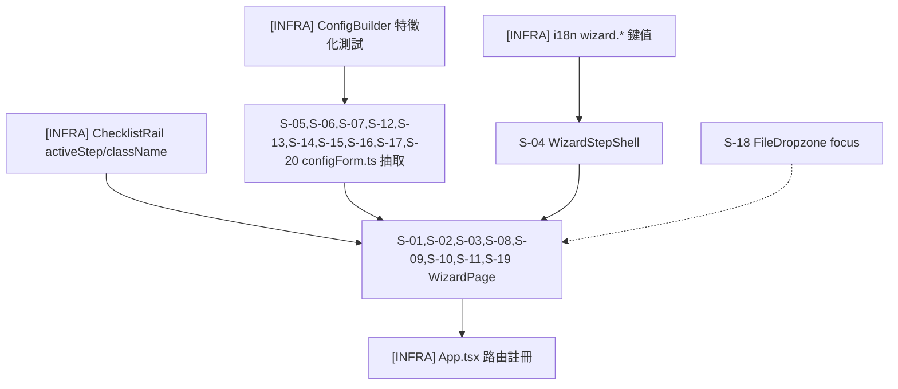

# tasks: create-project-wizard

本次變更純前端，無 `design-be.md`、無 `api.yml`，任務清單不含後端工作。分組依
「Module-convergence rule」逐 `Test mapping` 檔案彙總：20 個場景對映到剛好 4 個
測試檔（`WizardPage.test.tsx` 8 個、`configForm.test.ts` 10 個、
`WizardStepShell.test.tsx` 1 個、`FileDropzone.test.tsx` 1 個），故收斂為 4 個
TDD 任務，各自對應一個測試檔、一次 RED 寫齊該檔全部場景。

## Requirements Checklist

- [ ] REQ-01: 精靈沿用既有 `STEP_IDS` 五步驟，不新增第三套步驟枚舉
- [ ] REQ-02: 步驟導覽任何時間皆可自由跳轉、不封鎖；未完成前置條件顯示空狀態而非阻擋；disabled 僅限請求進行中或動作本身無輸入
- [ ] REQ-03: 每步驟常駐顯示說明句 + 一個範例句，合計兩句
- [ ] REQ-04: 每步驟就地定義 Domain Language 表指定給它的每一個受控名詞
- [ ] REQ-05: 輸出欄位由範本標題列與 mapping targets 共同決定，此行為在文案中明說
- [ ] REQ-06: 終點提供唯讀全貌摘要，每段有「修改」連結跳回對應步驟且狀態保留
- [ ] REQ-07: 存檔行為與現況一致（驗證 → POST → 清草稿 → 下載）；重名走既有 409 覆寫對話框；非 409 失敗一律顯示非空訊息
- [ ] REQ-08: 草稿沿用既有 `localStorage` key `etp.configDraft.v1`，與工作台共用；pristine 狀態的寫入路徑 SHALL 略過寫入、不得覆蓋既有草稿（write-side anti-clobber 不變量）；草稿讀寫的邊界情形（並發覆寫、格式錯誤、不得夾帶精靈專屬欄位、File 遺失）有明確契約
- [ ] REQ-09: 新增路由 `/configs/wizard`，與既有 `/configs/new` 並存，兩入口透過同一個共用 `toConfig()` 產出相同設定
- [ ] REQ-10: 空狀態、錯誤狀態、載入狀態逐步驟定義；`FileDropzone` 補上鍵盤 focus 樣式；步驟內容跨導覽不重複呼叫解析 API
- [ ] REQ-11: 抽出共用純模組 `frontend/src/lib/configForm.ts`，不做成 React hook
- [ ] S-01: 跳過未完成步驟直接前往下一步，顯示空狀態而非阻擋
- [ ] S-02: disabled 僅限請求進行中或動作本身無輸入，不因步驟未完成而套用
- [ ] S-03: 空的 joins 清單視為完成，不阻擋抵達 save
- [ ] S-04: 每步驟都依 Domain Language 表指定的名詞給出 inline 定義
- [ ] S-05: 上傳範本並選定工作表/標題列，自動灌出對應 mapping 列
- [ ] S-06: 重新選定標題列時，既有 mapping 列原樣保留、不在範本中的手動列掛在最後
- [ ] S-07: 新增一列不在範本中的 mapping target，成為真正輸出欄位，排在未被引用的範本欄位之前
- [ ] S-08: 摘要列出每個已設定區段，修改連結跳回對應步驟並保留狀態
- [ ] S-09: 成功存檔——驗證通過、呼叫 API、清草稿、下載檔案
- [ ] S-10: 重複名稱——409 觸發既有覆寫對話框，確認後重新計算 config 並帶 overwrite=true 重送
- [ ] S-11: 名稱不符 NAME_PATTERN——就地錯誤，不送出請求
- [ ] S-12: 非 409 存檔失敗——一律顯示非空的可操作錯誤訊息
- [ ] S-13: 精靈開始的草稿可被工作台讀回、反之亦然——除 File 物件外逐欄位相等
- [ ] S-14: 兩個介面各自寫草稿時，後寫入者覆蓋前者；每次寫入帶版本與寫入者標記
- [ ] S-15: 草稿格式錯誤時不得靜默消失——讀取失敗回傳可辨識的失敗結果
- [ ] S-16: 精靈不得在 persisted payload 中加入自己專屬的欄位
- [ ] S-17: 還原草稿後，File 物件與檔名皆遺失，target 步驟停留在待處理
- [ ] S-18: `FileDropzone` 可視根元素的鍵盤 focus 樣式（fail-then-pass）
- [ ] S-19: 步驟內容跨導覽維持掛載，不重複呼叫解析 API
- [ ] S-20: pristine 狀態掛載時不得覆蓋既有草稿（write-side anti-clobber 不變量，fail-then-pass）

## Scenario → Task 對照表

| Scenario | Test 檔 | Task |
|---|---|---|
| S-05, S-06, S-07, S-12, S-13, S-14, S-15, S-16, S-17, S-20 | `frontend/src/lib/configForm.test.ts` | Task 2 (`` `S-05,S-06,S-07,S-12,S-13,S-14,S-15,S-16,S-17,S-20` ``) |
| S-04 | `frontend/src/features/config-wizard/WizardStepShell.test.tsx` | Task 3 (`S-04`) |
| S-18 | `frontend/src/components/FileDropzone.test.tsx` | Task 4 (`S-18`) |
| S-01, S-02, S-03, S-08, S-09, S-10, S-11, S-19 | `frontend/src/pages/WizardPage.test.tsx` | Task 6 (`` `S-01,S-02,S-03,S-08,S-09,S-10,S-11,S-19` ``) |

## Tasks

- [x] `[INFRA]` 新增 `wizard.*` i18n 命名空間
  - Reason: 純資料鍵值新增，沒有自己的場景 id；是 Task 3、Task 6 文案渲染測試
    的前置資料，本身不構成可獨立斷言的行為。
  - 內容：在 `frontend/src/i18n/zh-TW.json` 與 `frontend/src/i18n/en.json`
    新增 `wizard.*` 命名空間鍵值，涵蓋五步驟的說明句/範例句/inline 名詞定義、
    摘要標籤、草稿還原提示的「精靈／工作台」寫入者字串（`design-fe.md` 第 33-34
    行所列範圍；`zh-TW.json` 全文照抄 `design-ux.md`「Layout」節與「Glossary
    機制」表的五步驟文案與名詞定義，`en.json` 補齊對應英文翻譯）。
  - 依賴：無。此任務先行，因為 Task 3、Task 6 的斷言會 `getByText` 實際渲染字串，
    字串必須先存在。
  - 驗證：`cd frontend && npm test -- src/lib/i18nGuard.test.ts`（既有守門測試，
    `frontend/src/lib/i18nGuard.test.ts` 已存在，比對兩份 JSON 的 key 集合是否
    一致；本次新增的 `wizard.*` key 必須兩份檔案都有，否則此測試會 fail）

- [x] `[INFRA]` `ChecklistRail` 新增可選 prop `activeStep`／`className`
  - Reason: 新增純呈現用的可選 prop，沒有專屬場景 id 驗證高亮效果（spec.md
    S-01~S-19 沒有任何場景斷言 `activeStep` 的視覺高亮）；既有唯一呼叫端
    `ConfigBuilder.tsx:533` 不需修改（`design-fe.md:29` 已核對 `grep -rn
    "ChecklistRail" src/` 只命中 `ChecklistRail.tsx` 自身與
    `ConfigBuilder.tsx:28,533`）。
  - Existing target: `frontend/src/features/config-builder/ChecklistRail.tsx:9`
    的 `Props` type 與 `:15` 的 `ChecklistRail` 函式簽名（已讀取全文確認：
    9-13 行定義 `Props`，15 行為函式簽名）。
  - 內容：`Props` 新增 `activeStep?: StepId` 與 `className?: string`
    （均為可選）；`activeStep === id` 時該列 `<button>` 加上高亮 class
    （例如 `bg-accent font-medium`）；`className` 覆蓋 `<nav>` 根元素既有的
    `"flex w-28 shrink-0 flex-col gap-1 self-start rounded-lg border p-2"`
    class（`ChecklistRail.tsx:20` 一行）。
  - 依賴：無，可與 i18n 任務平行進行（不同檔、無資料依賴）。是 Task 6
    （`WizardPage.tsx`）的前置：`WizardPage` 會傳入 `activeStep`。
  - 驗證：`cd frontend && npm run build`（本任務無專屬場景，以既有 TypeScript
    型別檢查與既有 `ConfigBuilder` 測試不迴歸作為驗證；`cd frontend && npm test
    -- src/pages/ConfigBuilder.test.ts` 需持續通過，確認可選 prop 未破壞既有
    呼叫端）

- [x] `[INFRA]` `ConfigBuilder` 抽取前特徵化測試（`toConfig`／`toPersistable`／`restoreDraft` 契約鎖定）
  - Reason: 這是抽取重構的安全網，沒有自己的場景 id——它鎖定的是「現行實作的
    確切輸出」，不是 spec.md 的行為條款本身；沒有它，下一個任務把
    `toConfig()`/`toPersistable()`/`restoreDraft()` 搬進 `configForm.ts`
    時，唯一會重跑的既有測試 `ConfigBuilder.test.ts` 只覆蓋
    `isPristineState`（已開檔確認，`ConfigBuilder.test.ts:1-57` 全文
    只有 `describe("isPristineState", ...)` 一組案例，完全不觸及
    `toConfig`/`toPersistable`/`restoreDraft`），移動過程中三者任何一個
    的欄位順序、預設值、xor 分支或序列化格式被打散都不會讓任何測試變紅。
  - Existing target（皆為 `ConfigBuilder.tsx` 內、目前未匯出的定義，已開檔
    確認行號）：`emptyState()`（`:70-78`，`:70` 無 `export`）、
    `toPersistable()`（`:82-88`，`:82` 無 `export`）、`toConfig()`
    （`:107-137`，`:107` 無 `export`）、`restoreDraft()`（`:287-308`，
    是 `ConfigBuilder()` 元件內的 closure，依賴 `draftSnapshotRef`/
    `setState`，不是模組頂層函式，無法直接加 `export`）、autosave 的
    pristine 略過寫入 guard（`:273`，`if (json === EMPTY_PERSISTABLE_JSON)
    return;`，同樣是元件內 `useEffect` closure，無法直接匯出）。
  - 內容：
    1. 對 `emptyState`、`toPersistable`、`toConfig` 三個模組頂層函式加上
       `export` 關鍵字（暫時匯出）。這是暫時性動作：下一個任務（`configForm.ts`
       抽取）的 GREEN 步驟會把這三個函式整個搬到 `configForm.ts`，屆時
       `ConfigBuilder.tsx` 不再自行定義它們，此處的暫時 `export` 隨著整段
       定義一起被刪除，不需要額外還原步驟。
    2. `restoreDraft()` 因為是元件內 closure 無法直接匯出：新增一個模組頂層
       暫時函式 `export function parseDraftForCharacterization(raw: string):
       FormState | null`，把 `restoreDraft()` try 區塊（`:291-304`）內
       「`JSON.parse` + 欄位補齊（`target.file`/`sources[].file` 恆為
       `null`，其餘欄位 `parsed.xxx ?? 預設值`）」那段邏輯原樣搬進去，解析
       失敗回傳 `null`；`restoreDraft()` 本體改呼叫這個函式取代原本 inline
       的 try 區塊，行為不變。這個函式與其 `export` 同樣是暫時性的：下一個
       任務的 GREEN 步驟會把這段邏輯改寫成 `configForm.ts` 的 `readDraft()`
       （含 `DraftReadResult`/`_draftMeta` 語意），本函式隨之刪除——本任務
       不得假設它長期存在。
    3. 新增 `frontend/src/pages/ConfigBuilder.characterization.test.ts`，
       `import { emptyState, toPersistable, toConfig,
       parseDraftForCharacterization } from "./ConfigBuilder"`，針對現行
       行為記錄「輸出」（不是實作細節），七組案例（挑選理由：覆蓋
       `toConfig` 的成功/失敗兩種回傳形狀、column 排序規則、三種 mapping
       填值模式的 xor 分支、`toPersistable` 的 File 欄位剝離、
       `restoreDraft` 的欄位補齊與缺鍵預設、autosave 的 pristine 略過寫入
       guard，這些正是搬移時最容易被無意改掉、但現有測試完全不觸及的分支）：
       - `toConfigOnEmptyStateReturnsExactIssuesSnapshot`：對
         `emptyState()` 呼叫 `toConfig()`，斷言回傳 `{ ok: false, issues
         }`，`issues` 逐筆比對 `code`/`path`/`message`（不是只斷言
         `issues.length`）。
       - `toConfigOnMinimalValidStateReturnsExactConfigShape`：建構一個
         最小合法 `FormState`（`name` 合法、`target.sheet`/`header_row`/
         `columns` 各一筆、一個 primary `source`、一筆 `source` 模式
         mapping），斷言 `toConfig()` 回傳 `{ ok: true, config }`，
         `config` 與手寫的期望物件逐欄位 `toEqual`。
       - `toConfigOrdersOrphanTemplateColumnAfterMappingTargets`：
         `target.columns` 內放一個不被任何 mapping `target` 引用的欄位，
         斷言 `config.target_template.columns` 陣列順序為「mapping
         targets 在前、該 orphan 欄位在後」，逐字元比對陣列內容。
       - `toConfigHandlesEachOfTheThreeMappingFillModes`：三筆 mapping
         分別只設 `source`、只設 `literal`、只設 `source_cell`（對照
         `frontend/src/lib/schemas.ts:63-83` 的 xor `superRefine`），斷言
         `toConfig()` 回傳 `ok: true` 且 `config.mappings` 三筆逐欄位與
         輸入一致（未被其中一個分支誤吃掉另一個欄位）。
       - `toPersistableStripsFileFieldsToUndefinedInSerializedJson`：
         `target.file`/`sources[0].file` 帶真實 `File` 實例，斷言
         `JSON.stringify(toPersistable(state))` 產出的字串內不含該
         `File` 的任何內容、`target`/`sources[0]` 物件內沒有 `file` 鍵
         （`JSON.stringify` 對 `undefined` 值的既有行為）。
       - `restoreDraftMergesPresentFieldsDefaultsMissingKeysAndNullsFileFields`：
         輸入一段刻意缺 `sources`、缺 `target.header_row` 的原始草稿
         JSON 字串，斷言 `parseDraftForCharacterization(raw)` 回傳的
         `FormState` 中 `sources` 為 `[]`、`target.header_row` 為 `1`
         （既有預設值）、`target.file`/`sources[].file` 恆為 `null`
         （即使原始字串本來就不含 file 欄位）。
       - `autosaveSkipsWritingPristineStateOverExistingStoredDraft`：用
         `@testing-library/react` 的 `render` 掛載真實 `ConfigBuilder`
         元件（本案例需額外 `import { render } from
         "@testing-library/react"` 與 `import ConfigBuilder from
         "./ConfigBuilder"`），先在 `localStorage["etp.configDraft.v1"]`
         種入一份非 pristine 的既有草稿字串，掛載後以 fake timers
         （`vi.useFakeTimers()` + `vi.advanceTimersByTime`）快轉超過
         `DEBOUNCE_MS`，斷言 `localStorage.getItem(DRAFT_KEY)` 與掛載前
         種入的字串逐字元相同——這正是 `:273` 的 pristine 略過寫入 guard，
         也是下一個任務要搬進 `writeDraft()`、且 S-20 要在抽取後鎖死的
         同一個不變量；此案例把它在抽取前就先鎖一次，避免抽取步驟把
         `:273` 這行判斷式當成可以捨棄的實作細節。
  - 依賴：無，此任務為下一個 `configForm.ts` 抽取任務的直接前置，必須排在
    它之前執行。
  - 驗證：`cd frontend && npm test -- src/pages/ConfigBuilder.characterization.test.ts`
    passes（此測試鎖定的是「現行」行為，抽取前就應該通過，不是 RED）。
  - 判別力（discriminating property）：本測試 SHALL 在抽取前（現行
    `ConfigBuilder.tsx` 邏輯）與抽取後（`configForm.ts` 邏輯，見下一任務
    Behaviour-preserving 步驟）皆須通過；七組斷言比對的都是從真實輸出讀出的
    精確值（config 物件逐欄位、issues 陣列逐筆 code/path/message、JSON
    字串逐字元、陣列順序、pristine 掛載後 `localStorage` 內容是否被覆寫），
    不是憑空編的期望值——搬移邏輯時若欄位順序、預設值、xor 分支、序列化
    格式或 pristine 略過寫入的判斷任一處被打散，至少一組斷言會變成不相等
    而 fail，這正是它與現有只覆蓋 `isPristineState` 的
    `ConfigBuilder.test.ts` 的差異所在。

- [x] `` `S-05,S-06,S-07,S-12,S-13,S-14,S-15,S-16,S-17,S-20` `` `[NEW]` 抽出共用純模組 `configForm.ts`（REQ-11）並重接 `ConfigBuilder.tsx`
  - Merged-task form：十個場景的 `Test mapping` 皆指向同一個檔案
    `frontend/src/lib/configForm.test.ts`，依 module-convergence rule 合併為
    一個任務，RED 一次寫齊十個測試函式。
  - 依賴：上方 `[INFRA]` `ConfigBuilder` 抽取前特徵化測試任務必須先完成——
    本任務的 Behaviour-preserving 步驟要重跑它，且本任務 GREEN 步驟要把
    `parseDraftForCharacterization` 暫時函式改寫為 `configForm.ts` 的
    `readDraft()`。
  - Existing target（`[MODIFY]`，抽取來源，逐一已開檔確認）：
    `frontend/src/pages/ConfigBuilder.tsx:43`（`DRAFT_KEY` 常數）、
    `:56-68`（`FormState` type）、`:70-78`（`emptyState()`）、
    `:82-88`（`toPersistable()`）、`EMPTY_PERSISTABLE_JSON` sentinel（同檔
    `toPersistable` 定義之後一行）、`:99-101`（`isPristineState()`，目前已
    `export`）、`:103-105`（`ToConfigResult` type）、`:107-137`（`toConfig()`）。
  - RED: 在新檔 `frontend/src/lib/configForm.test.ts` 一次寫齊：
    `seedsMappingRowsFromTemplateHeaderSelection`（S-05）、
    `mergePreservesExistingRowsAndAppendsLeftoverManualRowsAtEnd`（S-06）、
    `addsOrphanMappingTargetAsColumnPrecedingUnreferencedTemplateColumns`（S-07）、
    `formatSaveErrorNeverReturnsEmptyString`（S-12）、
    `roundTripsDraftFieldsExceptFileObjectsBetweenWizardAndWorkbench`（S-13）、
    `attachesVersionAndWriterMetaOnDraftWrite`（S-14）、
    `returnsFailureResultOnMalformedDraftInsteadOfSwallowing`（S-15）、
    `pristineStateSerializesToExactEmptyPersistableJson`（S-16）、
    `restoredDraftHasNullFileAndUndefinedSampleFilename`（S-17）、
    `pristineWriteAttemptDoesNotClobberExistingStoredDraft`（S-20——本測試
    SHALL 對「移除 `:273` guard 之後的等效實作」為 RED、對「保留（或以
    呼叫端等效形式存在）guard 的實作」為 GREEN，這正是本場景存在的理由
    ——把驗收條件寫死成 fail-then-pass，不是單純新增一個會通過的測試）
  - Verify RED: `cd frontend && npm test -- src/lib/configForm.test.ts`
    fails（`configForm.ts` 尚不存在，十個測試皆因找不到模組而失敗）
  - GREEN: 新增 `frontend/src/lib/configForm.ts`，依 `design-fe.md`
    「純模組 `frontend/src/lib/configForm.ts`（REQ-11）」節列出的完整匯出
    介面實作：`FormState`/`PersistableFormState`/`ToConfigResult`/
    `DraftWriter`/`DraftMeta`/`DraftReadResult` 型別、
    `DRAFT_KEY`/`DRAFT_META_VERSION`/`EMPTY_PERSISTABLE_JSON`/
    `DEFAULT_SAVE_ERROR_KEY` 常數、`emptyState`/`toPersistable`/
    `isPristineState`/`toConfig`/`formatSaveError`/`readDraft`/`writeDraft`/
    `draftWriterLabel` 函式（行為規格見 `design-fe.md` 第 122-181 行「行為說明」
    段落，`writeDraft` 的 pristine 略過寫入 guard（REQ-08 anti-clobber
    不變量，S-20）與 `_draftMeta` sibling-鍵語意、S-14/S-16 的關係亦已在該節
    寫死，不另行設計）。再修改
    `frontend/src/pages/ConfigBuilder.tsx`：刪除上方「Existing target」列出的
    自有定義，改為從 `@/lib/configForm` import（清單同 `design-fe.md` 第
    177-189 行）；草稿偵測 effect（`:222-228`）改呼叫 `readDraft()`——**重要**：
    判斷「要不要顯示還原橫幅」改用 `readDraft()` 的回傳結果（`ok: true` 或
    `ok: false` 皆視為「有草稿」），這是讀取端的互補保護，不是 anti-clobber
    不變量本身；`writeDraft` 對 pristine 狀態的寫入請求一律在 helper 內部
    直接略過（`design-fe.md` 第 140-149 行的步驟 2），不寫入也不清除
    `localStorage[DRAFT_KEY]`——這是把 `ConfigBuilder.tsx:273`
    （`if (json === EMPTY_PERSISTABLE_JSON) return;`）既有 guard 原樣搬進
    `writeDraft()` 內部，SHALL NOT 在抽取過程中把這行判斷式當成可以刪除的
    實作細節，S-20 的測試就是為了鎖死這一點；
    `restoreDraft()`（`:287-308`）改寫為 `design-fe.md` 第 209-216 行給出的
    版本；autosave effect（`:270-279`）改呼叫
    `writeDraft(state, "workbench")`（`DEBOUNCE_MS` 的 `setTimeout` 包裹本身
    不搬動）；`handleSave` 的 catch 分支（`:328-334`）改為
    `setSaveError(formatSaveError(e instanceof Error ? e.message :
    String(e)))`。同步修改
    `frontend/src/pages/ConfigBuilder.test.ts:3`：
    `import { isPristineState } from "./ConfigBuilder"` 改為
    `import { isPristineState } from "@/lib/configForm"`。同步修改
    `frontend/src/pages/ConfigBuilder.characterization.test.ts`（上一個
    `[INFRA]` 任務新增的檔案）：`import` 來源從 `"./ConfigBuilder"` 改為
    `"@/lib/configForm"`；刪除 `ConfigBuilder.tsx` 內暫時的
    `parseDraftForCharacterization` 定義與其 `export`，測試改為呼叫
    `readDraft()`——原本組出「原始草稿字串」再呼叫
    `parseDraftForCharacterization(raw)` 的案例，改為先
    `localStorage.setItem(DRAFT_KEY, raw)` 再呼叫 `readDraft()`，斷言
    `result.ok === true` 且 `result.state` 與原本比對的 `FormState` 逐欄位
    相同；其餘五組案例（`toConfig`/`toPersistable` 相關）維持原斷言內容
    不變，只改 import 路徑。
  - Verify GREEN: `cd frontend && npm test -- src/lib/configForm.test.ts`
    passes
  - Behaviour-preserving 確認：抽取後，覆蓋被搬移邏輯的既有測試 SHALL 全部
    重跑且 SHALL 繼續通過，兩份檔案缺一不可——
    `frontend/src/pages/ConfigBuilder.test.ts`（只覆蓋 `isPristineState`，
    原本 import 抽取後改指向 `@/lib/configForm`，其餘測試內容不變）與
    `frontend/src/pages/ConfigBuilder.characterization.test.ts`（覆蓋
    `toConfig`/`toPersistable`/`readDraft` 的精確輸出，抽取後改指向
    `@/lib/configForm`，見上方 GREEN 步驟的 import 調整）：
    `cd frontend && npm test -- src/pages/ConfigBuilder.test.ts` passes，
    `cd frontend && npm test -- src/pages/ConfigBuilder.characterization.test.ts`
    passes。特徵化測試的任何一筆斷言值與抽取前不同，即視為此步驟 FAIL，
    SHALL 阻擋本任務關閉，不得為了讓測試通過而反過來調整期望值——期望值
    是抽取前就鎖死的既有行為，不是抽取後可以重新協商的目標。
  - REFACTOR: 檢查 `configForm.ts` 是否符合 SOLID（單一職責：純資料轉換與
    草稿序列化，不含 React／DOM 依賴）+ DRY（`toConfig()`/`emptyState()`/
    `toPersistable()`/`isPristineState()` 邏輯與原 `ConfigBuilder.tsx`
    逐行相同、未重寫第二份；`readDraft()` 沿用同一套欄位補齊規則，不另建
    一份還原邏輯）
  - Spec re-check: 重讀 `spec.md` S-05、S-06、S-07、S-12、S-13、S-14、S-15、
    S-16、S-17、S-20，確認實作仍符合各自的 GIVEN/WHEN/THEN

- [x] `S-04` `[NEW]` `WizardStepShell` 常駐說明/範例句與 inline 名詞定義（REQ-03, REQ-04）
  - 依賴：i18n 任務（文案來源）。不依賴 `configForm.ts`（`WizardStepShell`
    只讀 `STEP_IDS`/`StepId`，`import { STEP_IDS, type StepId } from
    "@/lib/previewHelpers"`，`previewHelpers.ts:19`）。
  - RED: 寫 `frontend/src/features/config-wizard/WizardStepShell.test.tsx::rendersDescriptionExampleAndInlineTermDefinitionsPerAssignedTerm`
    —— 對 `target`/`sources`/`joins`/`mappings`/`save` 五個 `stepId` 逐一渲染
    `WizardStepShell`，斷言：(1) 說明句與「例如：」開頭範例句兩者皆
    `getByText` 可見，且不在 `hidden`/`display:none` 祖先內；(2) 對照
    `spec.md` Domain Language 表「首次定義步驟」欄，逐名詞核對該步驟的
    `terms` 陣列有對應項目、`definition` 非空字串
  - Verify RED: `cd frontend && npm test -- src/features/config-wizard/WizardStepShell.test.tsx`
    fails（`WizardStepShell.tsx`、`wizardCopy.ts` 尚不存在）
  - GREEN: 新增 `frontend/src/features/config-wizard/wizardCopy.ts`（純資料
    模組，`Record<StepId, { descriptionKey: string; exampleKey: string;
    terms: TermDefinition[] }>`，內容依 `design-ux.md`「Glossary 機制」表
    逐步驟名詞×定義填入，字串接 i18n key，見 `design-fe.md:333-357`）；新增
    `frontend/src/features/config-wizard/WizardStepShell.tsx`（`Props`：
    `stepId`/`description`/`example`/`terms`/`children`，`design-fe.md:319-330`
    完整簽名），渲染規則：`description`/`example` 各一個 `
`，不放入
    `
`/`Popover`/`Tooltip`；`terms` 逐項渲染 `<dfn
    title={definition} className="underline decoration-dotted">{term}</dfn>`，
    並附上可見文字定義（不彈窗、不用 tooltip 藏起來，滑鼠移開也看得到，見
    `design-ux.md:122`），`title` 屬性保留為次要輔助，不作為定義的唯一呈現
  - Verify GREEN: `cd frontend && npm test -- src/features/config-wizard/WizardStepShell.test.tsx`
    passes
  - REFACTOR: 檢查 `WizardStepShell` 是否符合 SOLID（單一職責：只負責
    說明/範例/名詞定義的呈現外殼，不含步驟自身表單邏輯）+ DRY（`terms` 資料
    來源集中於 `wizardCopy.ts` 一份，不在元件內重複硬編）
  - Spec re-check: 重讀 `spec.md` S-04，確認五步驟名詞定義覆蓋範圍與
    Domain Language 表「首次定義步驟」欄一致

- [x] `S-18` `[MODIFY]` `FileDropzone` 可視根元素鍵盤 focus 樣式（REQ-10）
  - Existing target: `frontend/src/components/FileDropzone.tsx:42-49`
    的 `
` 根元素（已開檔確認：目前的 `cn(...)`
    呼叫，第一個字串參數為
    `"flex flex-col items-center justify-center rounded-lg border-2
    border-dashed p-6 text-center cursor-pointer transition-colors"`，
    不含任何 `focus-visible`/`focus-within` class；`components/
    FileDropzone.test.tsx` 目前不存在）。
  - 依賴：無，可與其他任務平行進行（獨立檔案、獨立測試檔）。
  - RED: 新增 `frontend/src/components/FileDropzone.test.tsx::appliesFocusVisibleRingToRootOnTabFocus`
    —— render `FileDropzone`，取得可視根元素（`getRootProps()` 產生、帶
    `tabIndex: 0` 的容器，非隱藏 `<input>`），斷言變更前它不帶任何
    focus-visible/ring class（本斷言即為 RED 起點，`spec.md` S-18 已載明這是
    既有缺口）
  - Verify RED: `cd frontend && npm test -- src/components/FileDropzone.test.tsx`
    fails（根元素目前確實沒有 focus 樣式，斷言「有 ring class」不成立）
  - GREEN: 在 `FileDropzone.tsx:42-49` 的 `cn(...)` 第一個字串參數追加
    `focus-visible:outline-none focus-visible:ring-2 focus-visible:ring-ring`
    （`--ring` token 見 `frontend/src/index.css:23`）；不使用
    `focus-within`（`spec.md` S-18 明訂理由：隱藏 `<input>` 帶
    `tabIndex: -1`，永遠不會透過 Tab 取得焦點）
  - Verify GREEN: `cd frontend && npm test -- src/components/FileDropzone.test.tsx`
    passes
  - REFACTOR: 確認新增的 class 字串沿用既有 `--ring` token 與 `button.tsx:8`
    的既有 focus-visible 寫法（DRY：不另創一組新的 focus 視覺語意）；SOLID
    不受影響（單一元件、單一職責不變）
  - Spec re-check: 重讀 `spec.md` S-18，確認斷言目標為可視根元素而非隱藏
    `<input>`，且變更後 fail-then-pass 皆成立

- [x] `` `S-01,S-02,S-03,S-08,S-09,S-10,S-11,S-19` `` `[NEW]` `WizardPage` 主體：步驟導覽、摘要、存檔流程（REQ-01, REQ-02, REQ-06, REQ-07, REQ-08, REQ-09, REQ-10）
  - Merged-task form：八個場景的 `Test mapping` 皆指向同一個檔案
    `frontend/src/pages/WizardPage.test.tsx`，依 module-convergence rule
    合併為一個任務，RED 一次寫齊八個測試函式。
  - 依賴：前置 `configForm.ts`（Task 2，`WizardPage` 的 state 型別與存檔/
    草稿邏輯依賴它）、`WizardStepShell.tsx`（Task 3，五步驟外殼）、
    `ChecklistRail` 的 `activeStep` prop（`[INFRA]` 任務 2）皆須先完成，
    本任務才能被實作（import 對象必須先存在）。不依賴 S-18 任務（`FileDropzone`
    本身介面不變，只是視覺樣式，無型別/行為變更）。
  - RED: 在新檔 `frontend/src/pages/WizardPage.test.tsx` 一次寫齊：
    `skipsToMappingsShowsEmptyStateNotBlocked`（S-01）、
    `disabledOnlyDuringPendingSaveNotIncompleteSteps`（S-02）、
    `treatsEmptyJoinsAsCompleteReachesSave`（S-03）、
    `summaryListsSectionsAndEditLinkPreservesSourceState`（S-08）、
    `savesConfigClearsDraftAndDownloadsFile`（S-09）、
    `reshowsOverwriteDialogOn409AndResendsRecomputedConfigWithOverwriteTrue`（S-10）、
    `blocksSaveWithInlineErrorOnInvalidName`（S-11）、
    `keepsStepContentMountedAcrossNavigationNoDuplicateParseCall`（S-19）
  - Verify RED: `cd frontend && npm test -- src/pages/WizardPage.test.tsx`
    fails（`WizardPage.tsx` 尚不存在，八個測試皆因找不到模組而失敗）
  - GREEN: 新增 `frontend/src/pages/WizardPage.tsx`，依 `design-fe.md`
    「`WizardPage` 狀態擁有與導覽」節（第 267-315 行）與「元件結構」節（第
    217-240 行）實作：
    - state：`useState<FormState>(emptyState)`、
      `useState<StepId>("target")`（純 UI 狀態，不進入草稿 payload）、
      `saveError`/`pendingOverwrite`/`draftSnapshot`/`draftParseError`/
      `name` 對照 `design-fe.md:274-280`
    - 步驟選擇直接匯入 `STEP_IDS`（`@/lib/previewHelpers`），不建第二套列舉
    - 導覽：`ChecklistRail` 的 `onStepClick` 直接 `setCurrentStep(id)`，
      無前置條件檢查；「上一步」/「下一步」為 `STEP_IDS` 陣列純索引位移，
      邊界 no-op（不 `disabled`）
    - 跨導覽維持掛載（S-19）：五個步驟內容同時渲染，用
      `currentStep === id ? "block" : "hidden"` 切換可見性，不做條件式
      卸載/重新掛載
    - `mappings` 空狀態（S-01）：`state.target.columns.length === 0` 時顯示
      空狀態文案 +「+ 新增映射」按鈕（`MappingsList.tsx` 既有 `add()`
      按鈕，`:92-95`）維持可點擊，兩者非互斥
    - 存檔流程（S-09/S-10/S-11/S-12）：`handleSave` 依 `design-fe.md`
      「錯誤 / 載入狀態」節（第 439-483 行）實作，`toConfig(state)` →
      `save.mutateAsync` → 成功清 `DRAFT_KEY` + `downloadJson`；409 走
      `pendingOverwrite`；`NAME_PATTERN` 錯誤走 `formatIssues`；非 409 走
      `setSaveError(formatSaveError(...))`
    - 新增 `frontend/src/features/config-wizard/WizardSummary.tsx`（S-08，
      `design-fe.md:359-392` 完整簽名與四段內容規則），供 `save` 步驟
      使用，`onEdit` callback 呼叫 `setCurrentStep`
    - `SourcesTree` 新增可選 prop `showTarget?: boolean`（預設 `true`）；
      `sources` 步驟呼叫 `SourcesTree` 時傳入 `showTarget={false}`，避免
      目標範本上傳 UI 與 `target` 步驟重複顯示；工作台呼叫端維持不變
  - Verify GREEN: `cd frontend && npm test -- src/pages/WizardPage.test.tsx`
    passes
  - REFACTOR: 檢查 `WizardPage` 是否符合 SOLID（狀態擁有與導覽邏輯集中於
    此頁面，步驟內容委派給既有元件與 `WizardStepShell`/`WizardSummary`，
    不把子元件邏輯搬進來重寫）+ DRY（存檔/草稿邏輯全部呼叫
    `configForm.ts` 匯出函式，不在 `WizardPage.tsx` 內重寫任何一份
    `toConfig`/`emptyState`/草稿讀寫邏輯）
  - Spec re-check: 重讀 `spec.md` S-01、S-02、S-03、S-08、S-09、S-10、
    S-11、S-19，確認實作仍符合各自的 GIVEN/WHEN/THEN，特別是 S-01/S-02
    的「無 disabled 步驟閘門」與 S-19 的「不重複呼叫解析 API」

- [x] `[INFRA]` 新增路由 `/configs/wizard`
  - Reason: `App.tsx` 路由註冊是接線工作，沒有專屬場景 id 直接斷言路由本身
    （`spec.md` REQ-09 明訂「此需求沒有獨立場景」）；`WizardPage.test.tsx`
    的 8 個場景都直接 render `<WizardPage />`，不經過 router 斷言路徑可達性。
  - Existing target: `frontend/src/App.tsx:39-46` 的 `<Routes>` 區塊（已讀
    全文確認：`:41` 為 `/configs`、`:42` 為 `/configs/new`，之間即
    `design-fe.md:32` 指定的插入點）。
  - 內容：新增 `import { WizardPage } from "@/pages/WizardPage";`，於
    `:41` 與 `:42` 之間新增
    `<Route path="/configs/wizard" element={<WizardPage />} />`。
  - 依賴：上一個任務（`WizardPage.tsx` 必須先存在，此任務才能 import
    成功）之後執行——本任務在文件中的位置已排在 `WizardPage` 任務之後，
    與此依賴一致。
  - 驗證：`cd frontend && npm run build`（路由本身無專屬場景測試；以
    TypeScript 編譯通過 + 手動核對 `App.tsx` 的 `<Routes>` 清單新增一行
    作為驗證依據，不新增測試斷言）

## Manual verification checklist

無。`spec.md` 的 20 個場景全數對映到單元/元件測試（`Test mapping` 欄逐一
指向具體測試檔與測試函式，無一個場景缺此欄位），未發現需要人工判斷、無法
自動化驗證的場景。

## Task dependency

`T4`（`FileDropzone` focus 樣式）與 `T6` 之間為虛線：兩者不共用型別或介面，
`FileDropzone` 的 props 簽名不變，`T6` 不需要等待 `T4` 完成即可實作，此虛線
僅表示兩者在同一份變更範圍內、無強制先後順序。
