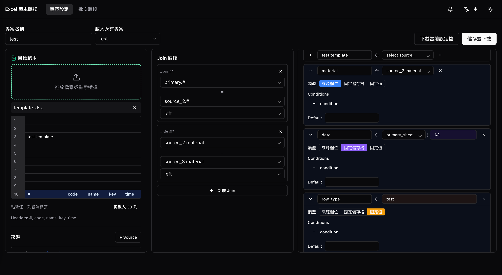
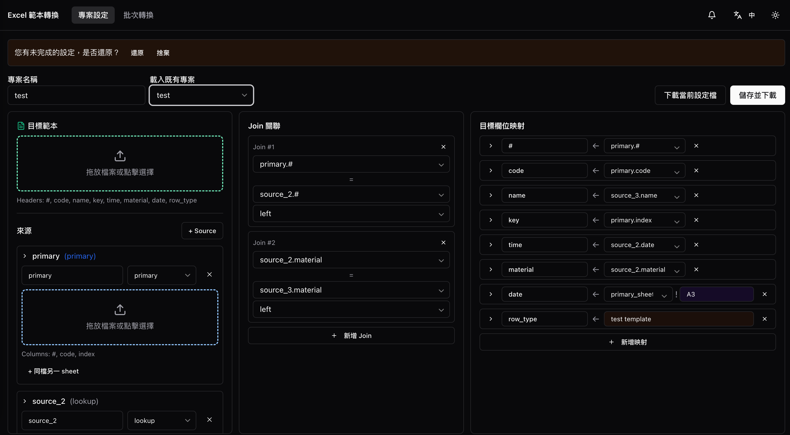
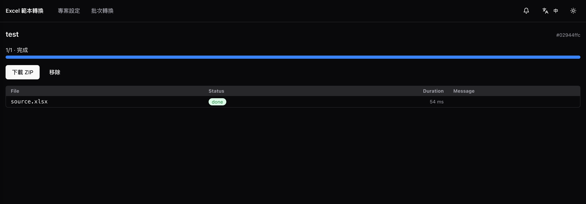
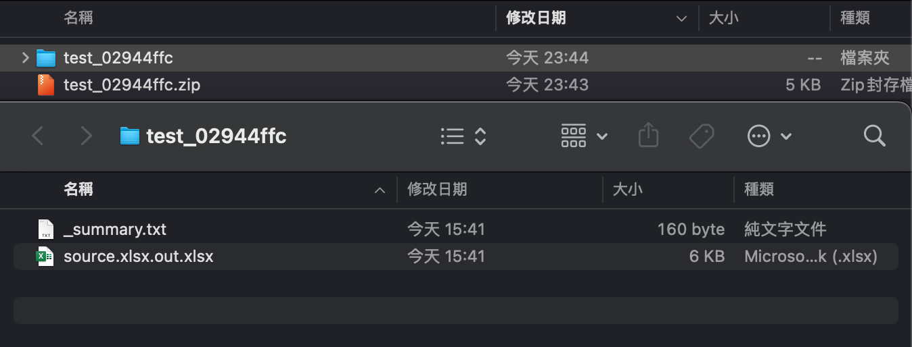

# Walkthrough — three-pane workbench

[繁體中文](walkthrough-workbench.zh-TW.md)

This is the alternative to the Setup Wizard for users who want everything on one screen.

End-to-end flow in six steps:

### 1. Author the config

Three-pane workbench: left = sources tree (target template + each source's xlsx with sheet & header-row picker). Middle = join rules. Right = mappings with inline condition chips and the source / source_cell / literal toggle. Save → download `{name}.json`.

### 2. Restore unsaved draft

On revisit, if a previous-session draft exists, a non-intrusive banner offers Restore / Discard. The banner only goes away on explicit choice; autosave never touches an empty form, so first-time visitors don't see it.

### 3. Batch convert — upload inline config

If the config isn't saved on the server, upload `{name}.json` directly. The form parses the JSON, dynamically expands upload slots by source alias, and shows the last-used sample filename as a hint per slot.

### 4. Pick saved config + live progress

For configs already saved on the server (from Project Settings → Save), the dropdown lists them by name (loaded from Redis / `/data/configs/`). Subtask-level progress streams via SSE; the top-bar badge tracks running jobs across page reloads, and the right-rail pulls recent jobs from localStorage so you can revisit any past job.

### 5. Job detail

Stable URL `/jobs/:id` for sharing. Shows per-subtask status, errors with `request_id` for grep-from-logs, a Cancel button for in-flight jobs, and a Download button that streams the result ZIP (supports HTTP Range / resume).

### 6. Result ZIP

The ZIP contains one xlsx per primary input (`{source_filename}.out.xlsx`, style preserved from the target template) plus `_summary.txt` — a per-job manifest listing each subtask's status, duration, and any errors. The manifest doubles as a quick audit trail when batching dozens of files.
